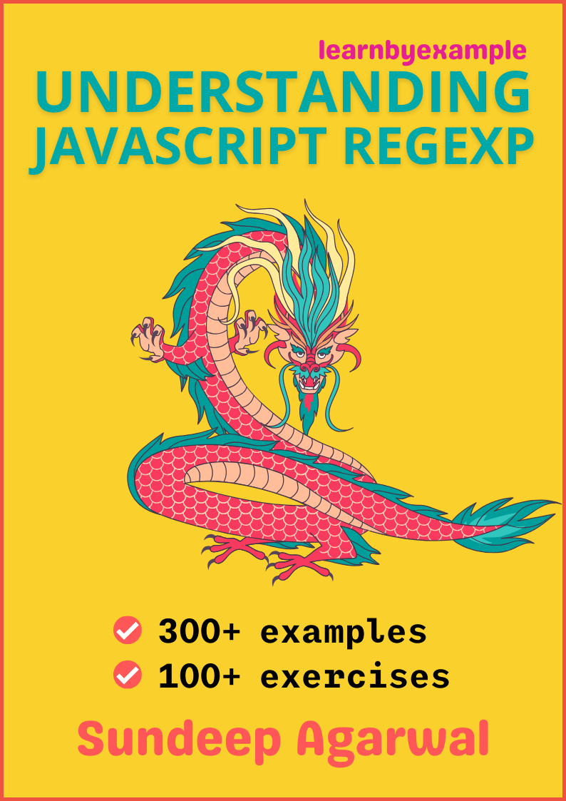

# JavaScript RegExp

Example based guide to mastering JavaScript regexp.

    

The book also includes exercises to test your understanding, which is presented together as a single file in this repo - [Exercises.md](./Exercises.md)

For solutions to the exercises, see [Exercise_solutions.md](./Exercise_solutions.md).

See [Version_changes.md](./Version_changes.md) to keep track of changes made to the book.

 

# E-book

You can purchase the pdf/epub versions of the book using these links:

* https://learnbyexample.gumroad.com/l/js_regexp
* https://leanpub.com/js_regexp

You can also get the book as part of these bundles:

* **Awesome Regex** bundle from https://learnbyexample.gumroad.com/l/regex or https://leanpub.com/b/regex
* **All books bundle** bundle from https://learnbyexample.gumroad.com/l/all-books
    * Includes all my programming books

See https://learnbyexample.github.io/books/ for list of other books

For a preview of the book, see [sample chapters](https://github.com/learnbyexample/learn_js_regexp/blob/master/sample_chapters/js_regexp_sample.pdf)

The book can also be [viewed as a single markdown file in this repo](./js_regexp.md). See my blogpost on [generating pdf from markdown using pandoc](https://learnbyexample.github.io/tutorial/ebook-generation/customizing-pandoc/) if you are interested in the ebook creation process.

For web version of the book, visit https://learnbyexample.github.io/learn_js_regexp/

 

# Feedback

[Open an issue](https://github.com/learnbyexample/learn_js_regexp/issues) if you spot any typo/errors.

:warning: :warning: Please DO NOT submit pull requests. Main reason being any modification requires changes in multiple places.

I'd also highly appreciate your feedback about the book.

Twitter: https://twitter.com/learn_byexample

 

# Table of Contents

1. Preface
2. What's so special about Regular Expressions?
3. RegExp introduction
4. Anchors
5. Alternation and Grouping
6. Escaping metacharacters
7. Dot metacharacter and Quantifiers
8. Interlude: Tools for debugging and visualization
9. Working with matched portions
10. Character class
11. Groupings and backreferences
12. Interlude: Common tasks
13. Lookarounds
14. Unicode
15. Further Reading

 

# Acknowledgements

* [MDN: Regular Expressions](https://developer.mozilla.org/en-US/docs/Web/JavaScript/Guide/Regular_Expressions) — documentation and examples
* [/r/learnjavascript/](https://www.reddit.com/r/learnjavascript/) and [/r/regex/](https://www.reddit.com/r/regex/) — helpful forums for beginners and experienced programmers alike
* [stackoverflow](https://stackoverflow.com/) — for getting answers to pertinent questions on JavaScript and regular expressions
* [tex.stackexchange](https://tex.stackexchange.com/) — for help on [pandoc](https://github.com/jgm/pandoc/) and `tex` related questions
* Cover image: [LibreOffice Draw](https://www.libreoffice.org/discover/draw/) and [regulex](https://jex.im/regulex)
* [Warning](https://commons.wikimedia.org/wiki/File:Warning_icon.svg) and [Info](https://commons.wikimedia.org/wiki/File:Info_icon_002.svg) icons by [Amada44](https://commons.wikimedia.org/wiki/User:Amada44) under public domain
* [pngquant](https://pngquant.org/) and [svgcleaner](https://github.com/RazrFalcon/svgcleaner) for optimizing images
* [mdBook](https://github.com/rust-lang/mdBook) — for web version of the book
    * [mdBook-pagetoc](https://github.com/JorelAli/mdBook-pagetoc) — for adding table of contents for each chapter
    * [minify-html](https://github.com/wilsonzlin/minify-html) — for minifying html files

 

# License

The book is licensed under a [Creative Commons Attribution-NonCommercial-ShareAlike 4.0 International License](https://creativecommons.org/licenses/by-nc-sa/4.0/)

The code snippets are licensed under MIT, see [LICENSE](./LICENSE) file
