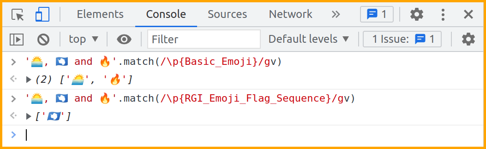

# Preface

Scripting and automation tasks often need to extract particular portions of text from input data or modify them from one format to another. This book will help you understand Regular Expressions, a mini-programming language for all sorts of text processing needs.

This book heavily leans on examples to present features of regular expressions one by one. It is recommended that you manually type each example and experiment with them. Make an effort to understand the sample input as well as the solution presented and check if the output changes (or not!) when you alter some part of the input and the code. As an analogy, consider learning to drive a car — no matter how much you read about them or listen to explanations, you'd need practical experience to become proficient.

## Prerequisites

You should be familiar with programming basics. You should also have a working knowledge of JavaScript syntax and functional programming concepts like `map` and `filter`.

You are also expected to get comfortable with reading documentation, searching online, visiting external links provided for further reading, tinkering with illustrated examples, asking for help when you are stuck and so on. In other words, be proactive and curious instead of just consuming the content passively.

## Conventions

* The examples presented here have been tested on the Chrome/Chromium console and includes features not available in other browsers and platforms.
* Code snippets shown are copy pasted from the console and modified for presentation purposes. Some of the commands are preceded by comments to provide context and explanations. Blank lines have been added to improve readability and output is skipped when it is `undefined` or otherwise unnecessary to be shown.
* Unless otherwise noted, all examples and explanations are meant for **ASCII** characters.
* External links are provided throughout the book for you to explore certain topics in more depth.
* The [learn_js_regexp repo](https://github.com/learnbyexample/learn_js_regexp) has all the code snippets, exercises and other details related to the book. If you are not familiar with the `git` command, click the **Code** button on the webpage to get the files.

## Acknowledgements

* [MDN: Regular Expressions](https://developer.mozilla.org/en-US/docs/Web/JavaScript/Reference/Regular_expressions) — documentation and examples
* [/r/learnjavascript/](https://old.reddit.com/r/learnjavascript/) and [/r/regex/](https://old.reddit.com/r/regex/) — helpful forums for beginners and experienced programmers alike
* [stackoverflow](https://stackoverflow.com/) — for getting answers to pertinent questions on JavaScript and regular expressions
* [tex.stackexchange](https://tex.stackexchange.com/) — for help on [pandoc](https://github.com/jgm/pandoc/) and `tex` related questions
* [canva](https://www.canva.com/) — cover image
* [Warning](https://commons.wikimedia.org/wiki/File:Warning_icon.svg) and [Info](https://commons.wikimedia.org/wiki/File:Info_icon_002.svg) icons by [Amada44](https://commons.wikimedia.org/wiki/User:Amada44) under public domain
* [oxipng](https://github.com/shssoichiro/oxipng), [pngquant](https://pngquant.org/) and [svgcleaner](https://github.com/RazrFalcon/svgcleaner) — optimizing images

## Feedback and Errata

I would highly appreciate it if you'd let me know how you felt about this book. It could be anything from a simple thank you, pointing out a typo, mistakes in code snippets, which aspects of the book worked for you (or didn't!) and so on. Reader feedback is essential and especially so for self-published authors.

You can reach me via:

* Issue Manager: [https://github.com/learnbyexample/learn_js_regexp/issues](https://github.com/learnbyexample/learn_js_regexp/issues)
* E-mail: learnbyexample.net@gmail.com
* Twitter: [https://twitter.com/learn_byexample](https://twitter.com/learn_byexample)

## Author info

Sundeep Agarwal is a lazy being who prefers to work just enough to support his modest lifestyle. He accumulated vast wealth working as a Design Engineer at Analog Devices and retired from the corporate world at the ripe age of twenty-eight. Unfortunately, he squandered his savings within a few years and had to scramble trying to earn a living. Against all odds, selling programming ebooks saved his lazy self from having to look for a job again. He can now afford all the fantasy ebooks he wants to read and spends unhealthy amount of time browsing the internet.

When the creative muse strikes, he can be found working on yet another programming ebook (which invariably ends up having at least one example with regular expressions). Researching materials for his ebooks and everyday social media usage drowned his bookmarks, so he maintains curated resource lists for sanity sake. He is thankful for free learning resources and open source tools. His own contributions can be found at [https://github.com/learnbyexample](https://github.com/learnbyexample).

**List of books:** https://learnbyexample.github.io/books/

## License

This work is licensed under a [Creative Commons Attribution-NonCommercial-ShareAlike 4.0 International License](https://creativecommons.org/licenses/by-nc-sa/4.0/).

Code snippets are available under [MIT License](https://github.com/learnbyexample/learn_js_regexp/blob/master/LICENSE).

Resources mentioned in the Acknowledgements section are available under original licenses.

## Book version

2.0

See [Version_changes.md](https://github.com/learnbyexample/learn_js_regexp/blob/master/Version_changes.md) to track changes across book versions.

# Why is it needed?

Regular Expressions is a versatile tool for text processing. You'll find them included as part of the standard library of most programming languages that are used for scripting purposes. If not, you can usually find a third-party library. Syntax and features of regular expressions vary from language to language. JavaScript's syntax is similar to that of Perl language, but there are significant feature differences.

The [String object](https://developer.mozilla.org/en-US/docs/Web/JavaScript/Reference/Global_Objects/String) in JavaScript supports variety of methods to deal with text. So, what's so special about regular expressions and why would you need it? For learning and understanding purposes, one can view regular expressions as a mini-programming language specialized for text processing. Parts of a regular expression can be saved for future use, analogous to variables. There are ways to perform AND, OR, NOT conditionals. Operations similar to range, repetition and so on.

Here are some common use cases:

* Sanitizing a string to ensure that it satisfies a known set of rules. For example, to check if a given string matches password rules.
* Filtering or extracting portions on an abstract level like alphabets, digits, punctuation and so on.
* Qualified string replacement. For example, at the start or the end of a string, only whole words, based on surrounding text, etc.

You are likely to be familiar with graphical search and replace tools, like the screenshot shown below from LibreOffice Writer. **Match case**, **Whole words only**, **Replace** and **Replace All** are some of the basic features supported by regular expressions.


Another real world use case is password validation. The screenshot below is from GitHub sign up page. Performing multiple checks like **string length** and the **type of characters allowed** is another core feature of regular expressions.


Here are some articles on regular expressions to know about its history and the type of problems it is suited for.

* [The true power of regular expressions](https://www.npopov.com/2012/06/15/The-true-power-of-regular-expressions.html) — it also includes a nice explanation of what *regular* means in this context
* [softwareengineering: Is it a must for every programmer to learn regular expressions?](https://softwareengineering.stackexchange.com/questions/133968/is-it-a-must-for-every-programmer-to-learn-regular-expressions)
* [softwareengineering: When you should NOT use Regular Expressions?](https://softwareengineering.stackexchange.com/questions/113237/when-you-should-not-use-regular-expressions)
* [codinghorror: Now You Have Two Problems](https://blog.codinghorror.com/regular-expressions-now-you-have-two-problems/) — demystifies the often (mis)quoted meme
* [wikipedia: Regular expression](https://en.wikipedia.org/wiki/Regular_expression) — this article includes discussion on regular expressions as a formal language as well as details about various implementations

## How this book is organized

This book introduces concepts one by one and exercises at the end of chapters will require only the features introduced until that chapter. Each concept is accompanied by plenty of examples to cover multiple problems and corner cases. As mentioned before, it is highly recommended that you follow along the examples by typing out the code snippets manually. It is important to understand both the nature of the sample input string as well as the actual programming command used. There are two interlude chapters that give an overview of useful tools and some more resources are collated in the final chapter.

* [RegExp introduction](#regexp-introduction)
* [Anchors](#anchors)
* [Alternation and Grouping](#alternation-and-grouping)
* [Escaping metacharacters](#escaping-metacharacters)
* [Dot metacharacter and Quantifiers](#dot-metacharacter-and-quantifiers)
* [Interlude: Tools for debugging and visualization](#interlude-tools-for-debugging-and-visualization)
* [Working with matched portions](#working-with-matched-portions)
* [Character class](#character-class)
* [Groupings and backreferences](#groupings-and-backreferences)
* [Interlude: Common tasks](#interlude-common-tasks)
* [Lookarounds](#lookarounds)
* [Unicode](#unicode)
* [Further Reading](#further-reading)

By the end of the book, you should be comfortable with both writing and reading regular expressions, how to debug them and know when to *avoid* them.

# RegExp introduction

This chapter will get you started with defining RegExp objects and using them inside string methods. To keep it simple, the examples will not use special characters related to regular expressions. The main focus will be to get you comfortable with the syntax and text processing examples. Two methods will be introduced in this chapter. The `test()` method to search if the input contains a string and the `replace()` method to substitute a portion of the input with something else.

> This book will use the terms **regular expressions** and **regexp** interchangeably. When specifically referring to a JavaScript object, **RegExp** will be used.

## Console and documentation

As mentioned in the [Preface](#preface) chapter, examples presented in this book have been tested on the Chrome/Chromium console. Other browsers based on Chromium may also work. Use `Ctrl+Shift+J` shortcut from a new tab to open a console. Some variable names are reused across different chapters — open another tab in such cases to avoid errors.

See [MDN: Regular Expressions Guide](https://developer.mozilla.org/en-US/docs/Web/JavaScript/Guide/Regular_Expressions) and [MDN: Regular Expressions Reference](https://developer.mozilla.org/en-US/docs/Web/JavaScript/Reference/Regular_expressions) for examples, documentation and browser compatibility details.

## test() method

First up, a simple example to test whether a string is part of another string or not. Normally, you'd use the `includes()` method and pass a string as argument. For regular expressions, use the `test()` method on a RegExp object, which is defined by the search string enclosed within `//` delimiters.

```js
> let sentence = 'This is a sample string'

// check if 'sentence' contains the given string argument
> sentence.includes('is')
< true
> sentence.includes('z')
< false

// check if 'sentence' matches the pattern as described by the RegExp object
> /is/.test(sentence)
< true
> /z/.test(sentence)
< false
```

Here are some examples of using the `test()` method in conditional expressions.

```js
> let report = 'string theory'

> if (/ring/.test(report)) {
      console.log('mission success')
  }
< mission success

> if (!/fire/.test(report)) {
      console.log('mission failed')
  }
< mission failed
```

And here are some array processing examples.

```js
> let words = ['cat', 'attempt', 'tattle']

// get all elements that contain 'tt'
> words.filter(w => /tt/.test(w))
< ['attempt', 'tattle']

// check if all the elements contain 'at'
> words.every(w => /at/.test(w))
< true

// check if any of the elements contain 'stat'
> words.some(w => /stat/.test(w))
< false
```

## Flags

Some of the regular expressions functionality is enabled by passing flags, represented by a lowercase letter. Flags are similar to command line options, for example `grep -i` performs case insensitive matching.

In this chapter, the following flags will be discussed:

* `i` flag to ignore case while matching alphabets (default is case sensitive matching)
* `g` flag to match all occurrences (only the first one is matched by default)

Examples for the `i` flag are shown below. `g` flag will be discussed in the [replace() method](#replace-method) section later in this chapter.

```js
> /cat/.test('CaT')
< false
> /cat/i.test('CaT')
< true

> ['Cat', 'cot', 'CATER', 'SCat', 'ScUtTLe'].filter(w => /cat/i.test(w))
< ['Cat', 'CATER', 'SCat']
```

## RegExp constructor and reuse

The RegExp object can be saved in a variable. This helps to improve code clarity, enables reuse, etc.

```js
> const pet = /dog/

> pet.test('They bought a dog')
< true
> pet.test('A cat crossed their path')
< false
```

RegExp objects can also be constructed using the `RegExp()` constructor. The first argument is a string or a RegExp object. The second argument is used to specify one or more flags.

```js
> const pat = new RegExp('dog')
> pat
< /dog/

// if flags are needed, specify them as the second argument
> new RegExp('dog', 'i')
< /dog/i
```

The main advantage of the constructor over the `//` format is the ability to dynamically construct the regexp. For example, to insert the content of other variables or the result of an expression.

```js
> let greeting = 'hi'

> const pat1 = new RegExp(`${greeting} there`)
> pat1
< /hi there/
> new RegExp(`${greeting.toUpperCase()} there`)
< /HI there/
```

## replace() method

The `replace()` string method is used for search and replace operations.

```js
// change only the first match
> '1,2,3,4'.replace(/,/, '-')
< '1-2,3,4'

// change all the matches by adding 'g' flag
> '1,2,3,4'.replace(/,/g, '-')
< '1-2-3-4'

// multiple flags can be combined
> 'cArT PART tart mArt'.replace(/art/ig, '2')
< 'c2 P2 t2 m2'
```

 A common mistake is forgetting that strings are immutable. If you want to save the changes to the same variable, you need to explicitly assign the result back to that variable.

```js
> let word = 'cater'

// this will return a string but won't modify the 'word' variable
> word.replace(/cat/, 'hack')
< 'hacker'
> word
< 'cater'

// need to explicitly assign the result if 'word' has to be changed
> word = word.replace(/cat/, 'hack')
< 'hacker'
> word
< 'hacker'
```

> The use of the `g` flag with the `test()` method allows some additional functionality. See [MDN: test](https://developer.mozilla.org/en-US/docs/Web/JavaScript/Reference/Global_Objects/RegExp/test#Examples) for examples. However, in my opinion, it is easy to fall into a habit of using `g` with `test()` and get undesired results. Instead, I'd suggest to use the [match() method](#match-method) and explicitly write the required logic instead of relying on the `g` flag.

## Cheatsheet and Summary

| Note    | Description |
| ------- | ----------- |
| [MDN: Regular Expressions](https://developer.mozilla.org/en-US/docs/Web/JavaScript/Reference/Regular_expressions) | MDN reference for JavaScript regular expressions |
| `/pat/` | a RegExp object |
| `const p1 = /pat/` | save regexp in a variable for reuse, clarity, etc |
| `/pat/.test(s)` | check if the pattern is present anywhere in the input string |
| | returns `true` or `false` |
| `i` | flag to ignore case when matching alphabets |
| `g` | flag to match all occurrences |
| `new RegExp('pat', 'i')` | construct RegExp from a string |
| | optional second argument specifies flags |
| | use backtick strings with `${}` for interpolation |
| `s.replace(/pat/, 'repl')` | method for search and replace |

This chapter introduced how to define RegExp objects and use them with the `test()` and `replace()` methods. You also learnt how to use flags to change the default behavior of regexps. The examples presented were more focused on introducing text processing concepts. From the next chapter onwards, you'll learn regular expression syntax and features.

## Exercises

> Try to solve the exercises in every chapter using only the features discussed until that chapter. Some of the exercises will be easier to solve with techniques presented in the later chapters, but the aim of these exercises is to explore the features presented so far.

> All the exercises are also collated together in one place at [Exercises.md](https://github.com/learnbyexample/learn_js_regexp/blob/master/Exercises.md). For solutions, see [Exercise_solutions.md](https://github.com/learnbyexample/learn_js_regexp/blob/master/Exercise_solutions.md).

**1)** Check if the given input strings contain `two` irrespective of case.

```js
> let s1 = 'Their artwork is exceptional'
> let s2 = 'one plus tw0 is not three'
> let s3 = 'TRUSTWORTHY'

> const pat1 =      // add your solution here

> pat1.test(s1)
< true
> pat1.test(s2)
< false
> pat1.test(s3)
< true
```

**2)** For the given array, filter all elements that do *not* contain `e`.

```js
> let items = ['goal', 'new', 'user', 'sit', 'eat', 'dinner']

> items.filter(w => test(w))       // add your solution here
< ['goal', 'sit']
```

**3)** Replace only the first occurrence of `5` with `five` for the given string.

```js
> let ip = 'They ate 5 apples and 5 oranges'

> ip.replace()       // add your solution here
< 'They ate five apples and 5 oranges'
```

**4)** Replace all occurrences of `5` with `five` for the given string.

```js
> let ip = 'They ate 5 apples and 5 oranges'

> ip.replace()      // add your solution here
< 'They ate five apples and five oranges'
```

**5)** Replace all occurrences of `note` irrespective of case with `X`.

```js
> let ip = 'This note should not be NoTeD'

> ip.replace()     // add your solution here
< 'This X should not be XD'
```

**6)** For the given multiline input string, filter all lines NOT containing the string `2`.

```js
> let purchases = `items qty
apple 24
mango 50
guava 42
onion 31
water 10`

> const num =       // add your solution here

> console.log(purchases.split('\n')
                       .filter(e => test(e))       // add your solution here
                       .join('\n'))
< items qty
  mango 50
  onion 31
  water 10
```

> You'd be able to solve this using just the `replace()` method by the end of the [Dot metacharacter and Quantifiers](#dot-metacharacter-and-quantifiers) chapter.

**7)** For the given array, filter all elements that contain either `a` or `w`.

```js
> let items = ['goal', 'new', 'user', 'sit', 'eat', 'dinner']

> items.filter(w => test(w) || test(w))     // add your solution here
< ['goal', 'new', 'eat']
```

**8)** For the given array, filter all elements that contain both `e` and `n`.

```js
> let items = ['goal', 'new', 'user', 'sit', 'eat', 'dinner']

> items.filter(w => test(w) && test(w))     // add your solution here
< ['new', 'dinner']
```

**9)** For the given string, replace `0xA0` with `0x7F` and `0xC0` with `0x1F`.

```js
> let ip = 'start address: 0xA0, func1 address: 0xC0'

> ip.replace()        // add your solution here
< 'start address: 0x7F, func1 address: 0x1F'
```

# Anchors

In this chapter, you'll be learning about qualifying a pattern. Instead of matching anywhere in the input string, restrictions can be specified. For now, you'll see the ones that are already part of regexp features. In later chapters, you'll learn how to define custom rules.

These restrictions are made possible by assigning special meaning to certain characters and escape sequences. The characters with special meaning are known as **metacharacters** in regexp parlance. In case you need to match those characters literally, you need to escape them with a `\` character (discussed in the [Escaping metacharacters](#escaping-metacharacters) chapter).

## String anchors

This restriction is about qualifying a regexp to match only at the start or end of an input string. These provide functionality similar to the string methods `startsWith()` and `endsWith()`. First up, the `^` metacharacter which restricts the matching to the start of string.

```js
// ^ is placed as a prefix to the search term
> /^cat/.test('cater')
< true
> /^cat/.test('concatenation')
< false

> /^hi/.test('hi hello\ntop spot')
< true
> /^top/.test('hi hello\ntop spot')
< false
```

To restrict the matching to the end of string, the `$` metacharacter is used.

```js
// $ is placed as a suffix to the search term
> /are$/.test('spare')
< true
> /are$/.test('nearest')
< false

> let words = ['surrender', 'unicorn', 'newer', 'door', 'empty', 'eel', 'pest']
> words.filter(w => /er$/.test(w))
< ['surrender', 'newer']
> words.filter(w => /t$/.test(w))
< ['pest']
```

Combining both the start and end string anchors, you can restrict the matching to the whole string. The effect is similar to comparing strings using the `==` operator.

```js
> /^cat$/.test('cat')
< true
> /^cat$/.test('cater')
< false
```

You can emulate string concatenation operations by using the anchors by themselves as a pattern.

```js
// insert text at the start of a string
> 'live'.replace(/^/, 're')
< 'relive'
> 'send'.replace(/^/, 're')
< 'resend'

// appending text
> 'cat'.replace(/$/, 'er')
< 'cater'
> 'hack'.replace(/$/, 'er')
< 'hacker'
```

## Line anchors

A string input may contain single or multiple lines. The characters `\r`, `\n`, `\u2028` (line separator) and `\u2029` (paragraph separator) are considered as line separators. When the `m` flag is used, the `^` and `$` anchors will match the start and end of every line respectively.

```js
// check if any line in the string starts with 'top'
> /^top/m.test('hi hello\ntop spot')
< true

// check if any line in the string ends with 'er'
> /er$/m.test('spare\npar\nera\ndare')
< false

// filter elements having lines ending with 'are'
> let elements = ['spare\ntool', 'par\n', 'dare', 'spared']
> elements.filter(e => /are$/m.test(e))
< ['spare\ntool', 'dare']

// check if any whole line in the string is 'par'
> /^par$/m.test('spare\npar\nera\ndare')
< true
```

Just like string anchors, you can use the line anchors by themselves as a pattern.

```js
> let items = 'catapults\nconcatenate\ncat'

> console.log(items.replace(/^/gm, '* '))
< * catapults
  * concatenate
  * cat

> console.log(items.replace(/$/gm, '.'))
< catapults.
  concatenate.
  cat.
```

>  If there is a line separator character at the end of string, there is an additional start/end of line match after the separator.
> 
> ```js
> // 'fig ' is inserted three times
> > console.log('1\n2\n'.replace(/^/mg, 'fig '))
> < fig 1
>   fig 2
>   fig 
> 
> > console.log('1\n2\n'.replace(/$/mg, ' apple'))
> < 1 apple
>   2 apple
>    apple
> ```

> If you are dealing with Windows OS based text files, you may have to convert `\r\n` line endings to `\n` first. Otherwise, you'll get end of line matches for both the `\r `and `\n` characters. You can also handle this case in regexp by making `\r` as an optional character with quantifiers (see the [Greedy quantifiers](#greedy-quantifiers) section for examples).

## Word anchors

The third type of restriction is word anchors. Alphabets (irrespective of case), digits and the underscore character qualify as word characters. You might wonder why there are digits and underscores as well, why not just alphabets? This comes from variable and function naming conventions — typically alphabets, digits and underscores are allowed. So, the definition is more oriented to programming languages than natural ones.

The escape sequence `\b` denotes a word boundary. This works for both the start and end of word anchoring. Start of word means either the character prior to the word is a non-word character or there is no character (start of string). Similarly, end of word means the character after the word is a non-word character or no character (end of string). This implies that you cannot have word boundary `\b` without a word character.

```js
> let words = 'par spar apparent spare part'

// replace 'par' irrespective of where it occurs
> words.replace(/par/g, 'X')
< 'X sX apXent sXe Xt'
// replace 'par' only at the start of word
> words.replace(/\bpar/g, 'X')
< 'X spar apparent spare Xt'
// replace 'par' only at the end of word
> words.replace(/par\b/g, 'X')
< 'X sX apparent spare part'
// replace 'par' only if it is not part of another word
> words.replace(/\bpar\b/g, 'X')
< 'X spar apparent spare part'
```

Using word boundary as a pattern by itself can yield creative solutions:

```js
// space separated words to double quoted csv
// note that the 'replace' method is used twice here
> let words = 'par spar apparent spare part'
> console.log(words.replace(/\b/g, '"').replace(/ /g, ','))
< "par","spar","apparent","spare","part"

// make a programming statement more readable
// shown for illustration purpose only, won't work for all cases
> 'output=num1+35*42/num2'.replace(/\b/g, ' ')
< ' output = num1 + 35 * 42 / num2 '
// excess space at the start/end of string can be trimmed off
// later you'll learn how to add a qualifier so that trim is not needed
> 'output=num1+35*42/num2'.replace(/\b/g, ' ').trim()
< 'output = num1 + 35 * 42 / num2'
```

## Opposite Word Anchor

The word boundary has an opposite anchor too. `\B` matches wherever `\b` doesn't match. This duality will be seen with some other escape sequences too. Negative logic is handy in many text processing situations. But use it with care, you might end up matching things you didn't intend!

```js
> let words = 'par spar apparent spare part'

// replace 'par' if it is not at the start of word
> words.replace(/\Bpar/g, 'X')
< 'par sX apXent sXe part'
// replace 'par' at the end of word but not the whole word 'par'
> words.replace(/\Bpar\b/g, 'X')
< 'par sX apparent spare part'
// replace 'par' if it is not at the end of word
> words.replace(/par\B/g, 'X')
< 'par spar apXent sXe Xt'
// replace 'par' if it is surrounded by word characters
> words.replace(/\Bpar\B/g, 'X')
< 'par spar apXent sXe part'
```

Here are some standalone pattern usage to compare and contrast the two word anchors.

```js
> 'copper'.replace(/\b/g, ':')
< ':copper:'
> 'copper'.replace(/\B/g, ':')
< 'c:o:p:p:e:r'

> '-----hello-----'.replace(/\b/g, ' ')
< '----- hello -----'
> '-----hello-----'.replace(/\B/g, ' ')
< ' - - - - -h e l l o- - - - - '
```

## Cheatsheet and Summary

| Note    | Description |
| ------- | ----------- |
| metacharacter | characters with special meaning in regexp |
| `^` | restricts the match to the start of string |
| `$` | restricts the match to the end of string |
| `m` | flag to match the start/end of line with `^` and `$` anchors |
| | `\r`, `\n`, `\u2028` and `\u2029` are line separators |
| | DOS-style files use `\r\n`, may need special attention |
| `\b` | restricts the match to the start and end of words |
|  | word characters: alphabets, digits, underscore |
| `\B` | matches wherever `\b` doesn't match |

In this chapter, you've begun to see building blocks of regular expressions and how they can be used in interesting ways. But at the same time, regular expression is but another tool in the land of text processing. Often, you'd get simpler solution by combining regular expressions with other string methods and expressions. Practice, experience and imagination would help you construct creative solutions. In the coming chapters, you'll see examples for anchors in combination with other regexp features.

## Exercises

**1)** Check if the given input strings contain `is` or `the` as whole words.

```js
> let str1 = 'is; (this)'
> let str2 = "The food isn't good"
> let str3 = 'the2 cats'
> let str4 = 'switch on the light'

> const pat1 =      // add your solution here
> const pat2 =      // add your solution here

> pat1.test(str1) || pat2.test(str1)
< true
> pat1.test(str2) || pat2.test(str2)
< false
> pat1.test(str3) || pat2.test(str3)
< false
> pat1.test(str4) || pat2.test(str4)
< true
```

**2)** For the given input string, change only the whole word `red` to `brown`.

```js
> let ip = 'bred red spread credible red;'

> ip.replace()       // add your solution here
< 'bred brown spread credible brown;'
```

**3)** For the given array, filter all elements that contain `42` surrounded by word characters.

```js
> let items = ['hi42bye', 'nice1423', 'bad42', 'cool_42a', 'fake4b']

> items.filter(e => test(e))       // add your solution here
< ['hi42bye', 'nice1423', 'cool_42a']
```

**4)** For the given input array, filter all elements that start with `den` or end with `ly`.

```js
> let items = ['lovely', '1\ndentist', '2 lonely', 'eden', 'fly\n', 'dent']

> items.filter(e => test(e) || test(e))        // add your solution here
< ['lovely', '2 lonely', 'dent']
```

**5)** For the given input string, change whole word `mall` to `1234` only if it is at the start of a line.

```js
> let para = `(mall) call ball pall
ball fall wall tall
mall call ball pall
wall mall ball fall
mallet wallet malls
mall:call:ball:pall`

> console.log(para.replace())        // add your solution here
< (mall) call ball pall
  ball fall wall tall
  1234 call ball pall
  wall mall ball fall
  mallet wallet malls
  1234:call:ball:pall
```

**6)** For the given array, filter all elements having a line starting with `den` or ending with `ly`.

```js
> let items = ['lovely', '1\ndentist', '2 lonely', 'eden', 'fly\nfar', 'dent']

> items.filter(e => test(e) || test(e))      // add your solution here
< ['lovely', '1\ndentist', '2 lonely', 'fly\nfar', 'dent']
```

**7)** For the given input array, filter all whole elements `12\nthree` irrespective of case.

```js
> let items = ['12\nthree\n', '12\nThree', '12\nthree\n4', '12\nthree']

> items.filter(e => test(e))     // add your solution here
< ['12\nThree', '12\nthree']
```

**8)** For the given input array, replace `hand` with `X` for all elements that start with `hand` followed by at least one word character.

```js
> let items = ['handed', 'hand', 'handy', 'un-handed', 'handle', 'hand-2']

> items.map(w => w.replace())        // add your solution here
< ['Xed', 'hand', 'Xy', 'un-handed', 'Xle', 'hand-2']
```

**9)** For the given input array, filter all elements starting with `h`. Additionally, replace `e` with `X` for these filtered elements.

```js
> let items = ['handed', 'hand', 'handy', 'unhanded', 'handle', 'hand-2']

> items.filter(w => test(w)).map(w => w.replace())        // add your solution here
< ['handXd', 'hand', 'handy', 'handlX', 'hand-2']
```

**10)** Why does the following code show `false` instead of `true`?

```js
> /end$/.test('bend it\nand send\n')
< false
```

# Alternation and Grouping

Many a times, you want to check if the input string matches multiple patterns. For example, whether a product's color is *green* or *blue* or *red*. This chapter will show how to use alternation for such cases. These patterns can have some common elements between them, in which case grouping helps to form terser regexps. This chapter will also discuss the precedence rules used to determine which alternation wins.

## Alternation

A conditional expression combined with logical OR evaluates to `true` if any of the conditions is satisfied. Similarly, in regular expressions, you can use the `|` metacharacter to combine multiple patterns to indicate logical OR. The matching will succeed if any of the alternate patterns is found in the input string. These alternatives have the full power of a regular expression, for example they can have their own independent anchors. Here are some examples.

```js
// match either 'cat' or 'dog'
> const pets = /cat|dog/
> pets.test('I like cats')
< true
> pets.test('I like dogs')
< true
> pets.test('I like parrots')
< false

// replace either 'cat' at the start of string or 'cat' at the end of word
> 'catapults concatenate cat scat cater'.replace(/^cat|cat\b/g, 'X')
< 'Xapults concatenate X sX cater'
// replace 'cat' or 'dog' or 'fox' with 'mammal'
> 'cat dog bee parrot fox'.replace(/cat|dog|fox/g, 'mammal')
< 'mammal mammal bee parrot mammal'
```

> You might infer from the above examples that there can be situations where many alternations are required. See the [Dynamically building alternation](#dynamically-building-alternation) section for examples and details.

## Grouping

Often, there are some common portions among the regexp alternatives. It could be common characters, qualifiers like the anchors and so on. In such cases, you can group them using a pair of parentheses metacharacters. Similar to `a(b+c)d = abd+acd` in maths, you get `a(b|c)d = abd|acd` in regular expressions.

```js
// without grouping
> 'red reform read arrest'.replace(/reform|rest/g, 'X')
< 'red X read arX'
// with grouping
> 'red reform read arrest'.replace(/re(form|st)/g, 'X')
< 'red X read arX'

// without grouping
> 'par spare part party'.replace(/\bpar\b|\bpart\b/g, 'X')
< 'X spare X party'
// taking out common anchors
> 'par spare part party'.replace(/\b(par|part)\b/g, 'X')
< 'X spare X party'
// taking out common characters as well
// you'll later learn a better technique instead of using empty alternates
> 'par spare part party'.replace(/\bpar(|t)\b/g, 'X')
< 'X spare X party'
```

> There are many more uses for grouping than just forming a terser regexp. They will be discussed as they become relevant in the coming chapters.

## Precedence rules

There are tricky situations when using alternation. There is no ambiguity if it is used to get a boolean result by testing a match against a string input. However, for cases like string replacement, it depends on a few factors. Say, you want to replace either `are` or `spared` — which one should get precedence? The bigger word `spared` or the substring `are` inside it or based on something else?

The regexp alternative which matches earliest in the input string gets precedence.

```js
> let words = 'lion elephant are rope not'

// starting index of 'on' < index of 'ant' for the given string input
// so 'on' will be replaced irrespective of the order of alternations
> words.replace(/on|ant/, 'X')
< 'liX elephant are rope not'
> words.replace(/ant|on/, 'X')
< 'liX elephant are rope not'
```

What happens if the alternatives have the same starting index? The precedence is left-to-right in the order of declaration.

```js
> let mood = 'best years'

// starting index for 'year' and 'years' will always be the same
// so, which one gets replaced depends on the order of alternations
> mood.replace(/year|years/, 'X')
< 'best Xs'
> mood.replace(/years|year/, 'X')
< 'best X'
```

Here's another example to drive home the issue.

```js
> let sample = 'ear xerox at mare part learn eye'

// this is going to be same as: replace(/ar/g, 'X')
> sample.replace(/ar|are|art/g, 'X')
< 'eX xerox at mXe pXt leXn eye'
// this is going to be same as: replace(/are|ar/g, 'X')
> sample.replace(/are|ar|art/g, 'X')
< 'eX xerox at mX pXt leXn eye'
// phew, finally this one works as needed
> sample.replace(/are|art|ar/g, 'X')
< 'eX xerox at mX pX leXn eye'
```

## Cheatsheet and Summary

| Note    | Description |
| ------- | ----------- |
| `pat1\|pat2\|pat3` | multiple regexp combined as conditional OR |
|   | each alternative can have independent anchors  |
| `()` | group pattern(s) |
| `a(b\|c)d` | same as `abd\|acd` |
| Alternation precedence | pattern which matches earliest in the input gets precedence |
|   | tie-breaker is left to right if matches have the same starting location |

So, this chapter was about specifying one or more alternate matches within the same regexp using the `|` metacharacter. Which can further be simplified using `()` grouping if the alternations have common portions. Among the alternations, the earliest matching pattern gets precedence. Left-to-right ordering is used as a tie-breaker if multiple alternations have the same starting location. In the next chapter, you'll learn how to construct an alternation pattern from an array of strings taking care of precedence rules. Grouping has various other uses too, which will be discussed in the coming chapters.

## Exercises

**1)** For the given input array, filter all elements that start with `den` or end with `ly`.

```js
> let items = ['lovely', '1\ndentist', '2 lonely', 'eden', 'fly\n', 'dent']

> items.filter()        // add your solution here
< ['lovely', '2 lonely', 'dent']
```

**2)** For the given array, filter all elements having a line starting with `den` or ending with `ly`.

```js
> let items = ['lovely', '1\ndentist', '2 lonely', 'eden', 'fly\nfar', 'dent']

> items.filter()        // add your solution here
< ['lovely', '1\ndentist', '2 lonely', 'fly\nfar', 'dent']
```

**3)** For the given input strings, replace all occurrences of `removed` or `reed` or `received` or `refused` with `X`.

```js
> let s1 = 'creed refuse removed read'
> let s2 = 'refused reed redo received'

> const pat1 =      // add your solution here

> s1.replace(pat1, 'X')
< 'cX refuse X read'
> s2.replace(pat1, 'X')
< 'X X redo X'
```

**4)** For the given input strings, replace `late` or `later` or `slated` with `A`.

```js
> let str1 = 'plate full of slate'
> let str2 = "slated for later, don't be late"

> const pat2 =      // add your solution here

> str1.replace(pat2, 'A')
< 'pA full of sA'
> str2.replace(pat2, 'A')
< "A for A, don't be A"
```

# Escaping metacharacters

You have seen a few metacharacters and escape sequences that help compose a RegExp literal. There's also the `/` character used as a delimiter for RegExp objects. This chapter will show how to remove the special meaning of such constructs. Also, you'll learn how to take care of these special characters when you are building a RegExp literal from normal strings.

## Escaping with backslash

To match the metacharacters literally, i.e. to remove their special meaning, prefix those characters with a `\` (backslash) character. To indicate a literal `\` character, use `\\`.

```js
// even though ^ is not being used as an anchor, it won't be matched literally
> /b^2/.test('a^2 + b^2 - C*3')
< false
// escaping will work
> /b\^2/.test('a^2 + b^2 - C*3')
< true

// match ( or ) literally
> '(a*b) + c'.replace(/\(|\)/g, '')
< 'a*b + c'

> '\\learn\\by\\example'.replace(/\\/g, '/')
< '/learn/by/example'
```

## Dynamically escaping metacharacters

When you are defining the regexp yourself, you can manually escape the metacharacters where needed. However, if you have strings obtained from elsewhere and need to match the contents literally, you'll have to somehow escape all the metacharacters while constructing the regexp. The solution of course is to use regular expressions! Usually, the programming language itself would provide a builtin method for such cases. JavaScript doesn't, but [MDN: Regular Expressions Guide](https://developer.mozilla.org/en-US/docs/Web/JavaScript/Guide/Regular_Expressions#escaping) has it covered in the form of a function as shown below.

```js
> function escapeRegExp(string) {
    return string.replace(/[.*+?^${}()|[\]\\]/g, '\\$&')
  }
```

There are many things in the above regexp that you haven't learnt yet. They'll be discussed in the coming chapters. For now, it is enough to know that this function will automatically escape all the metacharacters. Examples are shown below.

```js
// sample input on which the regexp will be applied
> let eqn = 'f*(a^b) - 3*(a^b)'
// sample string obtained from elsewhere which needs to be matched literally
> const usr_str = '(a^b)'

// case 1: replace all matches
// escaping metacharacters using the 'escapeRegExp' function
> const pat = new RegExp(escapeRegExp(usr_str), 'g')
> pat
< /\(a\^b\)/g
> eqn.replace(pat, 'c')
< 'f*c - 3*c'

// case 2: replace only at the end of the input string
> eqn.replace(new RegExp(escapeRegExp(usr_str) + '$'), 'c')
"f*(a^b) - 3*c"
```

> Note that the `/` delimiter character isn't escaped in the above function. You can use `[.*+?^${}()|[\]\\\/]` to escape the delimiter as well.

## Dynamically building alternation

Examples in the [previous chapter](#alternation-and-grouping) showed cases where a single regexp can contain multiple patterns combined using the `|` metacharacter. Often, you have an array of strings and the requirement is to match any of the elements literally. To do so, you need to escape all the metacharacters before combining the strings with the `|` metacharacter. The function shown below uses the `escapeRegExp()` function introduced in the previous section.

```js
> function unionRegExp(arr) {
    return arr.map(w => escapeRegExp(w)).join('|')
  }
```

And here are some examples with the `unionRegExp()` function used to construct the required regexp.

```js
// here, the order of alternation wouldn't matter
// and assume that other regexp features aren't needed
> let w1 = ['c^t', 'dog$', 'f|x']
> const p1 = new RegExp(unionRegExp(w1), 'g')
> p1
< /c\^t|dog\$|f\|x/g
> 'c^t dog$ bee parrot f|x'.replace(p1, 'mammal')
< 'mammal mammal bee parrot mammal'

// here, alternation precedence rules needs to be applied first
// and assume that the terms have to be matched as whole words
> let w2 = ['hand', 'handy', 'handful']
// sort by the string length, longest first
> w2.sort((a, b) => b.length - a.length)
< ['handful', 'handy', 'hand']
> const p2 = new RegExp(`\\b(${unionRegExp(w2)})\\b`, 'g')
> p2
< /\b(handful|handy|hand)\b/g
// note that 'hands' and 'handed' aren't replaced
> 'handful handed handy hands hand'.replace(p2, 'X')
< 'X handed X hands X'
```

> The [XRegExp](https://github.com/slevithan/xregexp) utility provides handy methods like [XRegExp.escape()](https://xregexp.com/api/#escape) and [XRegExp.union()](https://xregexp.com/api/#union). The union method has additional functionality of allowing a mix of string and RegExp literals and also takes care of renumbering [backreferences](#backreferences).

## source and flags properties

If you need the contents of a RegExp object, you can use the `source` and `flags` properties to get the pattern string and flags respectively. These methods will help you to build a RegExp object using the contents of another RegExp object.

```js
> const p3 = /\bpar\b/
> const p4 = new RegExp(p3.source + '|cat', 'g')

> p4
< /\bpar\b|cat/g
> console.log(p4.source)
< \bpar\b|cat
> p4.flags
< 'g'

> 'cater cat concatenate par spare'.replace(p4, 'X')
< 'Xer X conXenate X spare'
```

## Escaping the delimiter

Another character to keep track for escaping is the delimiter used to define the RegExp literal. Or depending upon the pattern, you can use the `new RegExp` constructor to avoid escaping.

```js
> let path = '/home/joe/report/sales/ip.txt'

// this is known as 'leaning toothpick syndrome'
> path.replace(/^\/home\/joe\//, '~/')
< '~/report/sales/ip.txt'

// using 'new RegExp' improves readability and can reduce typos
> path.replace(new RegExp(`^/home/joe/`), '~/')
< '~/report/sales/ip.txt'
```

## Escape sequences

Certain characters like tab and newline can be expressed using escape sequences as `\t` and `\n` respectively. These are similar to how they are treated in normal string literals. However, `\b` is for word boundaries as seen earlier, whereas it stands for the backspace character in normal string literals.

Additionally, there are several sequences that are specific to regexps. The full list is mentioned in the **Using special characters** section of [MDN documentation](https://developer.mozilla.org/en-US/docs/Web/JavaScript/Guide/Regular_Expressions#using_special_characters). These are `\b \B \cX \d \D \f \k<name> \n \p \P \r \s \S \t \uhhhh \u{hhhh} \v \w \W \xhh \0`. Here are some examples:

```js
> 'a\tb\tc'.replace(/\t/g, ':')
< 'a:b:c'

> '1\n2\n3'.replace(/\n/g, ' ')
< '1 2 3'

// use \\ instead of \ when constructing regexp from string literals
// when you need to represent a single backslash character literally
> new RegExp('123\tabc')
< /123    abc/
> new RegExp('123\\tabc')
< /123\tabc/
```

Here's a console screenshot of another example.


If an escape sequence is not defined, it will be treated as the character it escapes.

```js
// here \e is treated as e
> /\e/.test('hello')
< true
```

You can also represent a character using hexadecimal escape of the format `\xhh` where `hh` are exactly two hexadecimal characters. If you represent a metacharacter using escapes, it will be treated literally instead of its metacharacter feature. The [Codepoints](#codepoints) section will discuss escapes for unicode characters.

```js
// \x20 is the space character
> 'h e l l o'.replace(/\x20/g, '')
< 'hello'

// \x7c is the '|' character
// but it won't be treated as the alternation metacharacter
> '12|30'.replace(/2\x7c3/g, '5')
< '150'
> '12|30'.replace(/2|3/g, '5')
< '15|50'
```

> See [ASCII code table](https://ascii.cl/) for a handy cheatsheet with all the ASCII characters and their hexadecimal representations.

## Cheatsheet and Summary

| Note    | Description |
| ------- | ----------- |
| `\` | prefix metacharacters with `\` to match them literally |
| `\\` | to match `\` literally |
| `source` | property to convert a RegExp object to a string |
| | helps to insert a RegExp inside another RegExp |
| `flags` | property to get flags of a RegExp object |
| `` RegExp(`pat`) `` | helps to avoid or reduce escaping the `/` delimiter character |
| Alternation precedence | tie-breaker is left-to-right if matches have the same starting location |
|   | robust solution: sort the alternations based on length, longest first |
| `\t` | escape sequences like those supported in string literals |
| `\b` | word boundary in regexps but backspace in string literals |
| `\e` | undefined escapes will match the character it escapes |
| `\xhh` | represent a character using hexadecimal values |
| `\x7c` | matches `\|` literally |

## Exercises

**1)** Transform the given input strings to the expected output using the same logic on both strings.

```js
> let str1 = '(9-2)*5+qty/3-(9-2)*7'
> let str2 = '(qty+4)/2-(9-2)*5+pq/4'

> const pat1 =      // add your solution here
> str1.replace()        // add your solution here
< '35+qty/3-(9-2)*7'
> str2.replace()        // add your solution here
< '(qty+4)/2-35+pq/4'
```

**2)** Replace `(4)\|` with `2` only at the start or end of the given input strings.

```js
> let s1 = '2.3/(4)\\|6 fig 5.3-(4)\\|'
> let s2 = '(4)\\|42 - (4)\\|3'
> let s3 = 'two - (4)\\|\n'

> const pat2 =      // add your solution here

> s1.replace()      // add your solution here
< '2.3/(4)\\|6 fig 5.3-2'
> s2.replace()      // add your solution here
< '242 - (4)\\|3'
> s3.replace()      // add your solution here
< 'two - (4)\\|\n'
```

**3)** Replace any matching element from the array `items` with `X` for given the input strings. Match the elements from `items` literally. Assume no two elements of `items` will result in any matching conflict.

```js
> let items = ['a.b', '3+n', 'x\\y\\z', 'qty||price', '{n}']

// add your solution here
> const pat3 =      // add your solution here

> '0a.bcd'.replace(pat3, 'X')
< '0Xcd'
> 'E{n}AMPLE'.replace(pat3, 'X')
< 'EXAMPLE'
> '43+n2 ax\\y\\ze'.replace(pat3, 'X')
< '4X2 aXe'
```

**4)** Replace the backspace character `\b` with a single space character for the given input string.

```js
> let ip = '123\b456'

> ip.replace()      // add your solution here
< '123 456'
```

**5)** Replace all occurrences of `\e` with `e`.

```js
> let ip = 'th\\er\\e ar\\e common asp\\ects among th\\e alt\\ernations'

> ip.replace()      // add your solution here
< 'there are common aspects among the alternations'
```

**6)** Replace any matching item from the array `eqns` with `X` for given the string `ip`. Match the items from `eqns` literally.

```js
> let ip = '3-(a^b)+2*(a^b)-(a/b)+3'
> let eqns = ['(a^b)', '(a/b)', '(a^b)+2']

// add your solution here
> const pat4 =      // add your solution here

> ip.replace(pat4, 'X')
< '3-X*X-X+3'
```

# Dot metacharacter and Quantifiers

This chapter introduces the dot metacharacter and metacharacters related to quantifiers. Similar to the `repeat()` string method, quantifiers allows you to repeat a portion of the regular expression pattern and thus make it compact and improve readability. Quantifiers also provide a way to specify a range of repetition. This range has the flexibility of being bounded or unbounded with respect to the start and end values. Combined with the dot metacharacter (and alternation if needed), quantifiers allow you to construct conditional AND logic between patterns.

## Dot metacharacter

The dot metacharacter serves as a placeholder to match any character except the `\r`, `\n`, `\u2028` (line separator) and `\u2029` (paragraph separator) characters. These are the same characters seen earlier in the [Line anchors](#line-anchors) section.

```js
// matches character 'c', any character and then character 't'
> 'tac tin c.t abc;tuv acute'.replace(/c.t/g, 'X')
< 'taXin X abXuv aXe'

// matches character 'r', any two characters and then character 'd'
> 'breadth markedly reported overrides'.replace(/r..d/g, 'X')
< 'bXth maXly repoX oveXes'

// matches character '2', any character and then character '3'
> '42\t35'.replace(/2.3/, '8')
< '485'
```

The [s flag](#s-flag) section will show how to include the line separators as well. The [Character class](#character-class) chapter will discuss how to define your own custom placeholder for a limited set of characters.

> Some characters like `g̈` have more than one codepoint (numerical value of a character). You'll need to use multiple `.` metacharacters to match such characters (equal to the number of codepoints).
> 
> ```js
> > 'cag̈ed'.replace(/a.e/, 'o')
> < 'cag̈ed'
> 
> > 'cag̈ed'.replace(/a..e/, 'o')
> < 'cod'
> ```

## split() method

This chapter will additionally use the `split()` method to illustrate examples. The `split()` method separates the string based on the given regexp (or string) and returns an array of strings.

```js
> 'apple-85-mango-70'.split(/-/)
< ['apple', '85', 'mango', '70']

// use the optional 'limit' argument to specify max no. of output elements
> 'apple-85-mango-70'.split(/-/, 2)
< ['apple', '85']

// example with the dot metacharacter
> 'bus:3:car:-:van'.split(/:.:/)
< ['bus', 'car', 'van']
```

See the [split() with capture groups](#split-with-capture-groups) section for details of how capture groups affect the output of the `split()` method.

## Greedy quantifiers

Quantifiers helps you to repeat a portion of the regexp. They can be applied to literal characters, groupings and other features that you'll learn later. Apart from the ability to specify the exact quantity and bounded ranges, these can also match unbounded varying quantities. If the input string can satisfy a pattern with varying quantities in multiple ways, you can choose among two types of quantifiers to narrow down the possibilities. In this section, **greedy** type of quantifiers is covered.

First up, the `?` metacharacter which quantifies a character or group to match `0` or `1` times. In other words, you make that portion as something to be optionally matched. This leads to a terser regexp compared to alternation and grouping.

```js
// same as: /ear|ar/g
> 'far feat flare fear'.replace(/e?ar/g, 'X')
< 'fX feat flXe fX'

// same as: /\bpar(t|)\b/g
> 'par spare part party'.replace(/\bpart?\b/g, 'X')
< 'X spare X party'

// same as: /\b(re.d|red)\b/
> ['red', 'ready', 're;d', 'redo', 'reed'].filter(w => /\bre.?d\b/.test(w))
< ['red', 're;d', 'reed']

// same as: /part|parrot/g
> 'par part parrot parent'.replace(/par(ro)?t/g, 'X')
< 'par X X parent'
// same as: /part|parrot|parent/g
> 'par part parrot parent'.replace(/par(en|ro)?t/g, 'X')
< 'par X X X'
```

The `*` metacharacter quantifies a character or group to match `0` or more times. There is no upper bound.

```js
// match 't' followed by zero or more of 'a' followed by 'r'
> 'tr tear tare steer sitaara'.replace(/ta*r/g, 'X')
< 'X tear Xe steer siXa'

// match 't' followed by zero or more of 'e' or 'a' followed by 'r'
> 'tr tear tare steer sitaara'.replace(/t(e|a)*r/g, 'X')
< 'X X Xe sX siXa'

// match zero or more of '1' followed by '2'
> '3111111111125111142'.replace(/1*2/g, 'X')
< '3X511114X'
```

Here are some more examples with the `split()` method.

```js
// last element is empty because there is nothing after '2' at the end of string
> '3111111111125111142'.split(/1*2/)
< ['3', '511114', '']

// note how '25' and '42' gets split, there is '1' zero times in between them
> '3111111111125111142'.split(/1*/)
< ['3', '2', '5', '4', '2']
```

The `+` metacharacter quantifies a character or group to match `1` or more times. Similar to the `*` quantifier, there is no upper bound. More importantly, this doesn't have surprises like matching empty strings.

```js
> 'tr tear tare steer sitaara'.replace(/ta+r/g, 'X')
< 'tr tear Xe steer siXa'
> 'tr tear tare steer sitaara'.replace(/t(e|a)+r/g, 'X')
< 'tr X Xe sX siXa'

> '3111111111125111142'.replace(/1+2/g, 'X')
< '3X5111142'
> '3111111111125111142'.split(/1+/)
< ['3', '25', '42']
```

You can specify a range of integer numbers, both bounded and unbounded, using the `{}` metacharacters. There are three ways to use this quantifier as shown below.

| Quantifier | Description |
| ---------- | ----------- |
| `{m,n}`    | match `m` to `n` times |
| `{m,}`     | match at least `m` times |
| `{n}`      | match exactly `n` times |

```js
> let repeats = ['abc', 'ac', 'abbc', 'xabbbcz', 'bc', 'abbbbbc']

> repeats.filter(w => /ab{1,4}c/.test(w))
< ['abc', 'abbc', 'xabbbcz']
> repeats.filter(w => /ab{0,2}c/.test(w))
< ['abc', 'ac', 'abbc']

> repeats.filter(w => /ab{3,}c/.test(w))
< ['xabbbcz', 'abbbbbc']
> repeats.filter(w => /ab{3}c/.test(w))
< ['xabbbcz']
```

> The `{}` metacharacters have to be escaped to match them literally. However, unlike the `()` metacharacters, these have lot more leeway. For example, escaping `{` alone is enough, or if it doesn't conform strictly to any of the forms listed above, escaping is not needed at all.
> 
> ```js
> > 'a{5} = 10'.replace(/a\{5}/g, 'a{6}')
> < 'a{6} = 10'
> 
> > 'report_{a,b}.txt'.replace(/_{a,b}/g, '-{c,d}')
> < 'report-{c,d}.txt'
> ```

## AND Conditional

Next up, how to construct AND conditional using the dot metacharacter and quantifiers.

```js
// match 'Error' followed by zero or more characters followed by 'valid'
> /Error.*valid/.test('Error: not a valid input')
< true

> /Error.*valid/.test('Error: key not found')
< false
```

To allow matching in any order, you'll have to bring in alternation as well. That is somewhat manageable for 2 or 3 patterns. See the [AND conditional with lookarounds](#and-conditional-with-lookarounds) section for an easier approach.

```js
> /cat.*dog|dog.*cat/.test('cat and dog')
< true
> /cat.*dog|dog.*cat/.test('dog and cat')
< true

// if you just need a boolean result, this would be a scalable approach
> let patterns = [/cat/, /dog/]
> patterns.every(p => p.test('cat and dog'))
< true
> patterns.every(p => p.test('dog and cat'))
< true
```

## What does greedy mean?

When you are using the `?` quantifier, how does JavaScript decide to match `0` or `1` times, if both quantities can satisfy the regexp? For example, consider the expression `'foot'.replace(/f.?o/, 'X')` — should `foo` be replaced or `fo`? It will always replace `foo`, because these are **greedy** quantifiers, i.e. they try to match as much as possible.

```js
> 'foot'.replace(/f.?o/, 'X')
< 'Xt'

// a more practical example
// prefix '<' with '\' if it is not already prefixed
// both '<' and '\<' will get replaced with '\<'
> console.log('table < fig \\< bat < cake'.replace(/\\?</g, '\\<'))
< table \< fig \< bat \< cake

// say goodbye to /handful|handy|hand/ shenanigans
> 'hand handy handful'.replace(/hand(y|ful)?/g, 'X')
< 'X X X'
```

But wait, how did the `/Error.*valid/` example work? Shouldn't `.*` consume all the characters after `Error`? Good question. The regexp engine actually does consume all the characters. Then realizing that the regexp fails, it gives back one character from the end of string and checks again if the overall regexp is satisfied. This process is repeated until a match is found or failure is confirmed. In regular expression parlance, this is known as **backtracking**.

```js
> let sentence = 'that is quite a fabricated tale'

// t.*a will always match from the first 't' to the last 'a'
// which implies that there cannot be more than one match for such patterns
> sentence.replace(/t.*a/, 'X')
< 'Xle'
> 'star'.replace(/t.*a/, 'X')
< 'sXr'

// matching first 't' to last 'a' for t.*a won't work for these cases
// so, the regexp engine backtracks until the overall regexp can be matched
> sentence.replace(/t.*a.*q.*f/, 'X')
< 'Xabricated tale'
> sentence.replace(/t.*a.*u/, 'X')
< 'Xite a fabricated tale'
```

> Backtracking can become significantly time consuming for certain corner cases. Or even catastrophic — see [cloudflare: Details of the Cloudflare outage on July 2, 2019](https://blog.cloudflare.com/details-of-the-cloudflare-outage-on-july-2-2019/) for an example. See [this post](https://javascript.info/regexp-catastrophic-backtracking) for more examples and workarounds.

## Non-greedy quantifiers

As the name implies, these quantifiers will try to match as minimally as possible. Also known as **lazy** or **reluctant** quantifiers. Appending a `?` to greedy quantifiers makes them non-greedy.

```js
> 'foot'.replace(/f.??o/, 'X')
< 'Xot'

> 'frost'.replace(/f.??o/, 'X')
< 'Xst'

> '123456789'.replace(/.{2,5}?/, 'X')
< 'X3456789'
```

Like greedy quantifiers, lazy quantifiers will try to satisfy the overall regexp. For example, `.*?` will first start with an empty match and then move forward one character at a time until a match is found.

```js
// greedy will match from the first ':' to the last ':'
> 'green:3.14:teal::brown:oh!:blue'.split(/:.*:/)
< ['green', 'blue']

// non-greedy will match from ':' to the very next ':'
> 'green:3.14:teal::brown:oh!:blue'.split(/:.*?:/)
< ['green', 'teal', 'brown', 'blue']
```

## s flag

Use the `s` flag to allow the `.` metacharacter to match `\r`, `\n` and line/paragraph separator characters as well.

```js
// by default, the . metacharacter doesn't match the line separators
> console.log('Hi there\nHave a Nice Day'.replace(/the.*ice/, 'X'))
< Hi there
  Have a Nice Day

// 's' flag allows line separators to be matched as well
> console.log('Hi there\nHave a Nice Day'.replace(/the.*ice/s, 'X'))
< Hi X Day
```

## Cheatsheet and Summary

| Note    | Description |
| ------- | ----------- |
| `.` | match any character except the line separators |
| `s` | flag to match line separators as well with the `.` metacharacter |
| greedy | match as much as possible |
| `?` | greedy quantifier, match `0` or `1` times |
| `*` | greedy quantifier, match `0` or more times |
| `+` | greedy quantifier, match `1` or more times |
| `{m,n}` | greedy quantifier, match `m` to `n` times |
| `{m,}`  | greedy quantifier, match at least `m` times |
| `{n}`   | greedy quantifier, match exactly `n` times |
| `pat1.*pat2` | any number of characters between `pat1` and `pat2` |
| `pat1.*pat2\|pat2.*pat1` | match both `pat1` and `pat2` in any order |
| non-greedy | append `?` to greedy quantifier |
| | match as minimally as possible |
| `s.split(/pat/)` | split a string based on regexps |

This chapter introduced the concept of specifying a placeholder instead of fixed strings. When combined with quantifiers, you've seen a glimpse of how a simple regexp can match wide ranges of text. In the coming chapters, you'll learn how to create your own restricted set of placeholder characters.

## Exercises

> Use `s` flag for these exercises depending upon the contents of the input strings.

**1)** Replace `42//5` or `42/5` with `8` for the given input.

```js
> let ip = 'a+42//5-c pressure*3+42/5-14256'

// add your solution here
< 'a+8-c pressure*3+8-14256'
```

**2)** For the array `items`, filter all elements starting with `hand` and ending immediately with at most one more character or `le`.

```js
> let items = ['handed', 'hand', 'handled', 'handy', 'unhand', 'hands', 'handle']

// add your solution here
< ['hand', 'handy', 'hands', 'handle']
```

**3)** Use the `split()` method to get the output as shown for the given input strings.

```js
> let eqn1 = 'a+42//5-c'
> let eqn2 = 'pressure*3+42/5-14256'
> let eqn3 = 'r*42-5/3+42///5-42/53+a'

> const pat1 =      // add your solution here

> eqn1.split(pat1)
< ['a+', '-c']
> eqn2.split(pat1)
< ['pressure*3+', '-14256']
> eqn3.split(pat1)
< ['r*42-5/3+42///5-', '3+a']
```

**4)** For the given input strings, remove everything from the first occurrence of `i` till the end of the string.

```js
> let s1 = 'remove the special meaning of such constructs'
> let s2 = 'characters while constructing'
> let s3 = 'input output'

> const pat2 =      // add your solution here

> s1.replace(pat2, '')
< 'remove the spec'
> s2.replace(pat2, '')
< 'characters wh'
> s3.replace(pat2, '')
< ''
```

**5)** For the given strings, construct a regexp to get the output as shown.

```js
> let str1 = 'a+b(addition)'
> let str2 = 'a/b(division) + c%d(#modulo)'
> let str3 = 'Hi there(greeting). Nice day(a(b)'

> const remove_parentheses =        // add your solution here

> str1.replace(remove_parentheses, '')
< 'a+b'
> str2.replace(remove_parentheses, '')
< 'a/b + c%d'
> str3.replace(remove_parentheses, '')
< 'Hi there. Nice day'
```

**6)** Correct the given regexp to get the expected output.

```js
> let words = 'plink incoming tint winter in caution sentient'

// wrong output
> const w1 = /int|in|ion|ing|inco|inter|ink/g
> words.replace(w1, 'X')
"plXk XcomXg tX wXer X cautX sentient"

// expected output
> const w2 =        // add your solution here
> words.replace(w2, 'X')
"plX XmX tX wX X cautX sentient"
```

**7)** For the given greedy quantifiers, what would be the equivalent form using the `{m,n}` representation?

* `?` is same as
* `*` is same as
* `+` is same as

**8)** `(a*|b*)` is same as `(a|b)*` — true or false?

**9)** For the given input strings, remove everything from the first occurrence of `test` (irrespective of case) till the end of the string, provided `test` isn't at the end of the string.

```js
> let s1 = 'this is a Test'
> let s2 = 'always test your regexp for corner\ncases'
> let s3 = 'a TEST of skill tests?'

> let pat3 =        // add your solution here

> s1.replace(pat3, '')
< 'this is a Test'
> s2.replace(pat3, '')
< 'always '
> s3.replace(pat3, '')
< 'a '
```

**10)** For the input array `words`, filter all elements starting with `s` and containing `e` and `t` in any order.

```js
> let words = ['sequoia', 'subtle', 'exhibit', 'a set', 'sets', 'tests', 'site']

// add your solution here
< ['subtle', 'sets', 'site']
```

**11)** For the input array `words`, remove all elements having less than `6` characters.

```js
> let words = ['sequoia', 'subtle', 'exhibit', 'asset', 'sets', 'tests', 'site']

// add your solution here
< ['sequoia', 'subtle', 'exhibit']
```

**12)** For the input array `words`, filter all elements starting with `s` or `t` and having a maximum of `6` characters.

```js
> let words = ['sequoia', 'subtle', 'exhibit', 'asset', 'sets', 't set', 'site']

// add your solution here
< ['subtle', 'sets', 't set', 'site']
```

**13)** Delete from the string `start` if it is at the beginning of a line up to the next occurrence of the string `end` at the end of a line. Match these keywords irrespective of case.

```js
> let para = `good start
start working on that
project you always wanted
to, do not let it end
hi there
start and end the end
42
Start and try to
finish the End
bye`

> const mpat =      // add your solution here
> console.log(para.replace(mpat, ''))
< good start
  
  hi there
  
  42
  
  bye
```

**14)** Can you reason out why this code results in the output shown? The aim was to remove all `<characters>` patterns but not the `<>` ones. The expected result was `'a 1<> b 2<> c'`.

```js
> let ip = 'a<apple> 1<> b<bye> 2<> c<cat>'
> ip.replace(/<.+?>/g, '')
< 'a 1 2'
```

**15)** Use the `split()` method to get the output as shown below for the given input strings.

```js
> let s1 = 'go there  ::   this :: that'
> let s2 = 'a::b :: c::d e::f :: 4::5'
> let s3 = '42:: hi::bye::see :: carefully'

> const pat4 =      // add your solution here

> s1.split()        // add your solution here
< ['go there', 'this :: that']
> s2.split()        // add your solution here
< ['a::b', 'c::d e::f :: 4::5']
> s3.split()        // add your solution here
< ['42:: hi::bye::see', 'carefully']
```

# Interlude: Tools for debugging and visualization

As your regexp gets complicated, it can get difficult to debug when you run into issues. Building your regexp step by step from scratch and testing against input strings will go a long way in correcting the problem. To aid in such a process, you could use [various online regexp tools](https://news.ycombinator.com/item?id=20614847).

## regex101

[regex101](https://regex101.com/) is a popular site to test your regexp. You'll have to first choose the flavor as JavaScript. Then you can add your regexp, input strings, choose flags and an optional replacement string. Matching portions will be highlighted and explanation is offered in separate panes.

The below image is a screenshot from this link — [regex101: `/ab{0,2}c/g`](https://regex101.com/r/HSeO0z/1)


> Do explore all the features provided by the site. There's a quick reference and other features like link sharing, code generator, quiz, cheatsheet, etc. [regexr](https://regexr.com/) is another site that offers similar functionality.

## regulex

Another useful tool is [jex: regulex](https://jex.im/regulex/) which converts your regexp to a railroad diagram, thus providing a visual aid to understanding the pattern.

The below image is a screenshot from this link — [regulex: `/\bpar(en|ro)?t\b/`](https://jex.im/regulex/#!flags=&re=%5Cbpar(en%7Cro)%3Ft%5Cb)


> [debuggex](https://www.debuggex.com/) is another site that offers similar functionality.

## regexcrossword

For practice, [regexcrossword](https://regexcrossword.com/) is often recommended. This site only supports the JavaScript flavor. See [regexcrossword: howtoplay](https://regexcrossword.com/howtoplay) for help.

## Summary

This chapter briefly presented online tools that can help you with understanding and interactively solving/debugging regular expressions. Syntax and features can vary, sometimes significantly, between various tools and programming languages. So, ensure that the program you are using supports the flavor of regular expressions you are using.

# Working with matched portions

You have already seen a few features that can match varying text. In this chapter, you'll learn how to extract and work with those matching portions. Three new methods are introduced. You'll also learn a few tricks like using functions and dictionaries in the replacement section of the `replace()` method.

## match() method

The `match()` method can be used in different ways. When the `g` flag isn't used and the regexp succeeds, you get an array object containing various details of the first matching portion.

```js
// note that the 'g' flag isn't used
> 'too soon a song snatch'.match(/so+n/)
< ['soon', index: 4, input: 'too soon a song snatch', groups: undefined]

// to get only the matching portion
> 'too soon a song snatch'.match(/so+n/)[0]
< 'soon'

// non-regexp object will get processed as: RegExp(object)
> 'too soon a song snatch'.match('so+n')
< ['soon', index: 4, input: 'too soon a song snatch', groups: undefined]
```

The `index` property gives the starting location of the matched portion. The `input` property gives the input string on which the `match()` method was used. If the given regexp fails, the output is `null` and not an empty array. The `groups` property will be discussed in the [Named capture groups](#named-capture-groups) section. See [MDN: match](https://developer.mozilla.org/en-US/docs/Web/JavaScript/Reference/Global_Objects/String/match) for more details and examples.

```js
> let s1 = 'cat and dog'

> s1.match(/dog/).index
< 8
> s1.match(/dog/).input
< 'cat and dog'

> s1.match(/xyz/)
< null
```

## search() method

The `search()` method gives the index of the first matching portion. If the regexp fails, it returns `-1` as the output.

```js
// same as: match(/dog/).index
> 'cat and dog'.search(/dog/)
< 8

// cannot use match(/xyz/).index here
// as 'match' returns 'null' when the regexp doesn't match
> 'cat and dog'.search(/xyz/)
< -1
```

## Capture groups

The `()` grouping is also known as a **capture group**. It has multiple uses, one of which is the ability to work with matched portions of those groups. When capture groups are used with the `match()` method, the matched portions of those groups will also be part of the array output. The first element is always the entire matched portion followed by text captured by groups (if they are present).

```js
> let motivation = 'improve yourself.'

> motivation.match(/pr.*our/)
< ['prove your', index: 2, input: 'improve yourself.', groups: undefined]

// retrieving the entire matched portion
> motivation.match(/pr.*our/)[0]
< 'prove your'
```

Here's an example with capture groups. The leftmost `(` will get group number `1`, second leftmost `(` will get group number `2` and so on.

```js
> let purchase = 'coffee:100g tea:250g sugar:75g chocolate:50g'

// there are three capture groups used here
> let m = purchase.match(/:(.*?)g.*?:(.*?)g.*?chocolate:(.*?)g/)
> m
< [':100g tea:250g sugar:75g chocolate:50g', '100', '250', '50', index: 6,
   input: 'coffee:100g tea:250g sugar:75g chocolate:50g', groups: undefined]

// capture group portions
> m[1]
< '100'
> m[3]
< '50'
```

## d flag

You can use the `d` flag to get both the starting and ending locations of the matching portions. Ending location is calculated by adding the length of the matching portion to the starting index. Here's an example:

```js
// note the addition of the 'indices' property
> 'awesome'.match(/so/d)
< ['so', index: 3, input: 'awesome', groups: undefined, indices: Array(1)]

// start and end+1 location of the entire matching portion
> 'awesome'.match(/so/d).indices[0]
< [3, 5]
```

And here's an example when capture groups are used as well:

```js
> 'coffee:100g tea:250g'.match(/:(.*?)g/d)
< [':100g', '100', index: 6, input: 'coffee:100g tea:250g',
   groups: undefined, indices: Array(2)]

// locations for the entire match
> 'coffee:100g tea:250g'.match(/:(.*?)g/d).indices[0]
< [6, 11]

// locations for the first capture group
> 'coffee:100g tea:250g'.match(/:(.*?)g/d).indices[1]
< [7, 10]
```

## Getting all the matched portions

The `match()` method returns all the matched portions when the `g` flag is used. Capture group portions and the three properties won't be part of the output.

```js
> 'too soon a song snatch'.match(/so*n/g)
< ['soon', 'son', 'sn']

> 'too soon a song snatch'.match(/so+n/g)
< ['soon', 'son']

> 'PAR spar apparent SpArE part pare'.match(/\bs?pare?\b/ig)
< ['PAR', 'spar', 'SpArE', 'pare']

// entire matching portion is returned even if capture groups are used
> 'par spar apparent spare part'.match(/\bs?par(e|t)\b/g)
< ['spare', 'part']
```

It is useful for debugging purposes as well. For example, to see the potential matches before using the `replace()` method.

```js
> 'green:3.14:teal::brown:oh!:blue'.match(/:.*:/g)
< [':3.14:teal::brown:oh!:']

> 'green:3.14:teal::brown:oh!:blue'.match(/:.*?:/g)
< [':3.14:', '::', ':oh!:']
```

## matchAll() method

If you need the capture group portions and properties for every match with the `g` flag active, use the `matchAll()` method. An iterator will be returned as the output.

```js
> 'song too soon snatch'.matchAll(/so*n/g)
< RegExpStringIterator {}

// convert the iterator result to an array of arrays
> let arr = [...'song too soon snatch'.matchAll(/so*n/g)]
> arr
< (3) [Array(1), Array(1), Array(1)]
  0: ['son', index: 0, input: 'song too soon snatch', groups: undefined]
  1: ['soon', index: 9, input: 'song too soon snatch', groups: undefined]
  2: ['sn', index: 14, input: 'song too soon snatch', groups: undefined]
  length: 3
  [[Prototype]]: Array(0)

// get array with details for the first match
> arr[0]
< ['son', index: 0, input: 'song too soon snatch', groups: undefined]
// get starting index for the second match
> arr[1].index
< 9
```

You can also use [Array.from()](https://developer.mozilla.org/en-US/docs/Web/JavaScript/Reference/Global_Objects/Array/from) to convert the iterator to an array object. This allows you to provide a mapping function as the second argument.

```js
// same as: match(/so*n/g)
> Array.from('song too soon snatch'.matchAll(/so*n/g), m => m[0])
< ['son', 'soon', 'sn']
// get starting index for each match
> Array.from('song too soon snatch'.matchAll(/so*n/g), m => m.index)
< [0, 9, 14]

// get only the capture group portions as an array for each match
> Array.from('2023/04,1986/Mar,'.matchAll(/(.*?)\/(.*?),/g), m => m.slice(1))
< (2) [Array(2), Array(2)]
  0: (2) ['2023', '04']
  1: (2) ['1986', 'Mar']
  length: 2
  [[Prototype]]: Array(0)
```

> Before the introduction of the `matchAll()` method, the `exec()` method had to be used. See [MDN: exec](https://developer.mozilla.org/en-US/docs/Web/JavaScript/Reference/Global_Objects/RegExp/exec) for details and examples.

## split() with capture groups

Capture groups affect the `split()` method as well. If the pattern used to split contains capture groups, the portions matched by those groups will also be a part of the output array.

```js
// without capture group
> '31111111111251111426'.split(/1*4?2/)
< ['3', '5', '6']

// to include the matching portions of the pattern as well in the output
> '31111111111251111426'.split(/(1*4?2)/)
< ['3', '11111111112', '5', '111142', '6']
```

If part of the pattern is outside a capture group, the text thus matched won't be in the output. If a capture group didn't participate, it will be represented by `undefined` in the output array.

```js
// here 4?2 is outside the capture group, so that portion won't be in the output
> '31111111111251111426'.split(/(1*)4?2/)
< ['3', '1111111111', '5', '1111', '6']

// multiple capture groups example
// note that the portion matched by b+ isn't present in the output
> '3.14aabccc42'.split(/(a+)b+(c+)/)
< ['3.14', 'aa', 'ccc', '42']

// here (4)? matches zero times on the first occasion
> '31111111111251111426'.split(/(1*)(4)?2/)
< ['3', '1111111111', undefined, '5', '1111', '4', '6']
```

Use of capture groups and the optional `limit` argument can help you partition an input string into three parts:

* portion before the first match
* portion matched by the pattern itself
* portion after the pattern

```js
// use the 's' flag as well if needed
> '3.14aabccc42abc88'.split(/(a+b+c+)(.*)/, 3)
< ['3.14', 'aabccc', '42abc88']
```

## Using functions in the replacement section

Sometimes, a simple replacement string isn't enough and you need to do some processing on the matched portion. For such cases, you can use functions in the replacement section. The arguments available to the function are similar to the details provided by the `match()` method. The first one is the entire matched portion. If capture groups are used, the portions matched by those groups will be next. Then comes the index of the matched portion and finally the input string. Depending on the complexity, you can use fully defined functions or arrow function expressions.

```js
> function titleCase(m) {
      return m[0].toUpperCase() + m.substr(1).toLowerCase()
  }

// only the function name is enough as the second argument
// the matched portion details will be passed automatically to the function
// in this example, 'titleCase' is using only the entire matched portion
> 'aBc ac ADC aBbBC'.replace(/a.*?c/ig, titleCase)
< 'Abc Ac Adc Abbbc'

// can also use arrow function expressions for simple cases
> 'abc ac adc abbbc'.replace(/ab*c/g, m => m.toUpperCase())
< 'ABC AC adc ABBBC'

// \d will be covered later
// for now, it is enough to know that it will match all the digit characters
> '1 42 317'.replace(/\d+/g, m => m*2)
< '2 84 634'
```

Here's an example with capture groups. See also [MDN: replace](https://developer.mozilla.org/en-US/docs/Web/JavaScript/Reference/Global_Objects/String/replace) for more details.

```js
> function titleCase(m, g1, g2) {
        return g1.toUpperCase() + g2.toLowerCase()
  }
> 'aBc ac ADC aBbBC'.replace(/(a)(.*?c)/ig, titleCase)
< 'Abc Ac Adc Abbbc'
```

## Using dictionary in the replacement section

Sometimes, the functionality you need in the replacement section can be simplified by using a dictionary. The matched portion acts as the key to get the corresponding value from the dictionary.

```js
// one to one mappings
> let h = { '1': 'one', '2': 'two', '4': 'four' }

> '9234012'.replace(/1|2|4/g, k => h[k])
< '9two3four0onetwo'

// if the matched text doesn't exist as a key, the default value will be used
// recall that \d matches all the digit characters
> '9234012'.replace(/\d/g, k => k in h ? h[k] : 'X')
< 'XtwoXfourXonetwo'
```

For swapping two or more portions without using intermediate results, using a dictionary is recommended.

```js
> let swap = { 'cat': 'tiger', 'tiger': 'cat' }

> 'cat tiger dog tiger cat'.replace(/cat|tiger/g, k => swap[k])
< 'tiger cat dog cat tiger'
```

For a dictionary that has many entries and likely to undergo changes during development, building alternation list manually is not a good choice. Also, recall that as per precedence rules, the longest length string should come first. The `unionRegExp()` function, introduced in the [Dynamically building alternation](#dynamically-building-alternation) section, is helpful here.

```js
> let d = { 'hand': 1, 'handy': 2, 'handful': 3, 'a^b': 4 }

// sort the keys to handle precedence rules
// add anchors if needed
> const p = unionRegExp(Object.keys(d).sort((a, b) => b.length - a.length))
> console.log(p)
< handful|handy|hand|a\^b

> 'handful hand pin handy (a^b)'.replace(new RegExp(p, 'g'), k => d[k])
< '3 1 pin 2 (4)'
```

## Cheatsheet and Summary

| Note    | Description |
| ------- | ----------- |
| `m = s.match(/pat/)` | assuming the `g` flag isn't used and regexp succeeds, |
| | returns an array with the matched portion and 3 properties |
| | `index` property gives the starting location of the match |
| | `input` property gives the input string `s` |
| | `groups` property gives dictionary of [named capture groups](#named-capture-groups) |
| `m[0]` | for the above case, gives the entire matched portion |
| `m[1]` | matched portion of the first capture group |
| `m[2]` | matched portion of the second capture group and so on |
| `d` | flag to get the starting and ending locations |
|     | of the matching portions via the `indices` property |
| `s.match(/pat/g)` | returns only the matched portions, no properties |
| | capture groups don't affect the output |
| | `match` returns `null` if the regexp fails |
| `s.matchAll(/pat/g)` | returns an iterator containing details for |
| | each matched portion and its properties |
| | use `[...]` or `Array.from()` to convert to an array |
| | `Array.from()` also allows mapping function |
| `s.replace(/pat/, func)` | you can use a function to provide the replacement string |
| | each matched portion details gets passed as arguments |
| | similarly, dictionary can be used for replacement |
| `s.search(/pat/)` | gives the starting location of the first match if regexp succeeds |
| | `-1` if regexp fails |
| `split()` | capture groups affect the `split()` method too |
| | text matched by the groups will be part of the output |
| | portion matched by pattern outside groups won't be in output |
| | group that didn't match will be represented by `undefined` |

This chapter introduced the `match()` and `matchAll()` methods, which allow you to work with various matching portions of the input string. The `search()` method is handy if you just need the starting location of the first match. You can use the `d` flag if both the starting and ending locations are needed. The `replace()` method allows you to use a function in the replacement section, which helps to process the matching portions before being used as the replacement string. You can also use a dictionary to provide the replacement string based on the matched portion as keys. You learnt about capture groups and you'll see even more uses of groupings in the coming chapters.

## Exercises

**1)** For the given strings, extract the matching portion from the first `is` to the last `t`.

```js
> let str1 = 'What is the biggest fruit you have seen?'
> let str2 = 'Your mission is to read and practice consistently'

> const pat1 =      // add your solution here

// add your solution here for str1
< 'is the biggest fruit'
// add your solution here for str2
< 'ission is to read and practice consistent'
```

**2)** Find the starting index of the first occurrence of `is` or `the` or `was` or `to` for the given input strings. Assume that there will be at least one match for each input string.

```js
> let s1 = 'match after the last newline character'
> let s2 = 'and then you want to test'
> let s3 = 'this is good bye then'
> let s4 = 'who was there to see?'

> const pat2 =      // add your solution here

// add your solution here for s1
< 12
// add your solution here for s2
< 4
// add your solution here for s3
< 2
// add your solution here for s4
< 4
```

**3)** Find the starting index of the last occurrence of `is` or `the` or `was` or `to` for the given input strings. Assume that there will be at least one match for each input string.

```js
> let s1 = 'match after the last newline character'
> let s2 = 'and then you want to test'
> let s3 = 'this is good bye then'
> let s4 = 'who was there to see?'

> const pat3 =      // add your solution here

// add your solution here for s1
< 12
// add your solution here for s2
< 18
// add your solution here for s3
< 17
// add your solution here for s4
< 14
```

**4)** The given input string contains `:` exactly once. Extract all characters after the `:` as output.

```js
> let ip = 'fruits:apple, mango, guava, blueberry'

// add your solution here
< 'apple, mango, guava, blueberry'
```

**5)** Extract all words between `(` and `)` from the given input string as an array (including the parentheses). Assume that the input will not contain any broken parentheses.

```js
> let ip = 'another (way) to reuse (portion) matched (by) capture groups'

// add your solution here
< ['(way)', '(portion)', '(by)']
```

**6)** Extract all occurrences of `<` up to the next occurrence of `>`, provided there is at least one character in between `<` and `>`.

```js
> let ip = 'a<apple> 1<> b<bye> 2<> c<cat>'

// add your solution here
< ['<apple>', '<> b<bye>', '<> c<cat>']
```

**7)** Use `matchAll()` to get the output as shown below for the given input strings. Note the characters used in the input strings carefully.

```js
> let row1 = '-2,5 4,+3 +42,-53 4356246,-357532354 '
> let row2 = '1.32,-3.14 634,5.63 63.3e3,9907809345343.235 '

> const pat4 =      // add your solution here

// add your solution here for row1
< (4) [Array(2), Array(2), Array(2), Array(2)]
  0: (2) ['-2', '5']
  1: (2) ['4', '+3']
  2: (2) ['+42', '-53']
  3: (2) ['4356246', '-357532354']
  length: 4
  [[Prototype]]: Array(0)

// add your solution here for row2
< (3) [Array(2), Array(2), Array(2)]
  0: (2) ['1.32', '-3.14']
  1: (2) ['634', '5.63']
  2: (2) ['63.3e3', '9907809345343.235']
  length: 3
  [[Prototype]]: Array(0)
```

**8)** This is an extension to the previous question. Sum each pair of numbers that are separated by a comma.

* For `row1`, find the sum of integers. For example, sum of `-2` and `5` is `3`.
* For `row2`, find the sum of floating-point numbers. For example, sum of `1.32` and `-3.14` is `-1.82`.

```js
> let row1 = '-2,5 4,+3 +42,-53 4356246,-357532354 '
> let row2 = '1.32,-3.14 634,5.63 63.3e3,9907809345343.235 '

// should be same as the previous question
> const pat5 =      // add your solution here

// add your solution here for row1
< [3, 7, -11, -353176108]

// add your solution here for row2
< [-1.82, 639.63, 9907809408643.234]
```

**9)** Use the `split()` method to get the output as shown below.

```js
> let ip = '42:no-output;1000:car-tr:u-ck;SQEX49801'

// add your solution here
< ['42', 'output', '1000', 'tr:u-ck', 'SQEX49801']
```

**10)** Write a string function that changes the given input to alternate case. The first alphabet should be changed to lowercase, the next one to uppercase and then lowercase and so on. Characters other than alphabets should be left alone and not affect case changing.

```js
> function aLtErNaTeCaSe(ip) {
      // add your solution here
  }

> aLtErNaTeCaSe('HI THERE!')
< 'hI tHeRe!'
> aLtErNaTeCaSe('good morning')
< 'gOoD mOrNiNg'
> aLtErNaTeCaSe('Sample123string42with777numbers')
< 'sAmPlE123sTrInG42wItH777nUmBeRs'
```

**11)** Replace all occurrences of `par` with `spar`, `spare` with `extra` and `park` with `garden`.

```js
> let s1 = 'apartment has a park'
> let s2 = 'do you have a spare cable'
> let s3 = 'write a parser'

> let d1 =          // add your solution here
> const pat6 =      // add your solution here

> s1.replace(pat6, k => d1[k])
< 'aspartment has a garden'
> s2.replace(pat6, k => d1[k])
< 'do you have a extra cable'
> s3.replace(pat6, k => d1[k])
< 'write a sparser'
```

**12)** Name the flag and property you can use with the `match()` method to get both the starting and ending locations of the matched portions.

# Character class

This chapter will discuss how to create your own custom placeholders to match limited set of characters and various metacharacters applicable inside character classes. You'll also learn about escape sequences for predefined character sets.

## Custom character sets

Characters enclosed inside the `[]` metacharacters is a character class (or set). It will result in matching any one of those characters once. It is similar to using single character alternations inside a grouping, but terser and without the additional effects of a capture group. In addition, character classes have their own versions of metacharacters and provide special predefined sets for common use cases. Quantifiers are applicable to character classes as well.

```js
// same as: /cot|cut/ or /c(o|u)t/
> ['cute', 'cat', 'cot', 'coat', 'cost', 'scuttle'].filter(w => /c[ou]t/.test(w))
< ['cute', 'cot', 'scuttle']

// same as: /(a|e|o)+t/g
> 'meeting cute boat site foot'.replace(/[aeo]+t/g, 'X')
< 'mXing cute bX site fX'
```

## Range of characters

Character classes have their own metacharacters to help define the sets succinctly. Metacharacters outside of character classes like `^`, `$`, `()` etc either don't have special meaning or have a completely different one inside the character classes. First up, the `-` metacharacter that helps to define a range of characters instead of having to specify them all individually.

```js
// all digits
> 'Sample123string42with777numbers'.match(/[0-9]+/g)
< ['123', '42', '777']

// whole words made up of lowercase alphabets and digits only
> 'coat Bin food tar12 best Apple fig_42'.match(/\b[a-z0-9]+\b/g)
< ['coat', 'food', 'tar12', 'best']

// whole words starting with 'p' to 'z' and having lowercase alphabets only
> 'coat tin food put stoop best fig_42 Pet'.match(/\b[p-z][a-z]*\b/g)
< ['tin', 'put', 'stoop']

// whole words made up of only 'a' to 'f' and 'p' to 't' lowercase alphabets
> 'coat tin food put stoop best fig_42 Pet'.match(/\b[a-fp-t]+\b/g)
< ['best']
```

## Negating character sets

The next metacharacter is `^` which has to specified as the first character of the character class. It negates the set of characters, so all characters other than those specified will be matched. As highlighted earlier, handle negative logic with care, you might end up matching more than you wanted.

```js
// all non-digits
> 'Sample123string42with777numbers'.match(/[^0-9]+/g)
< ['Sample', 'string', 'with', 'numbers']

// remove the first two columns where : is delimiter
> 'apple:123:banana:cherry'.replace(/^([^:]+:){2}/, '')
< 'banana:cherry'

// deleting characters at the end of string based on a delimiter
> 'apple=42; cherry=123'.replace(/=[^=]+$/, '')
< 'apple=42; cherry'
```

Sometimes, it is easier to use positive character class and negate the test condition instead of using a negated character class.

```js
> let words = ['tryst', 'fun', 'glyph', 'pity', 'why']

// elements not containing vowel characters
> words.filter(w => /^[^aeiou]+$/.test(w))
< ['tryst', 'glyph', 'why']

// easier to write and maintain, note the use of '!' operator
// but this'll match empty strings too unlike the previous solution
> words.filter(w => !/[aeiou]/.test(w))
< ['tryst', 'glyph', 'why']
```

## Matching metacharacters literally

You can prefix a `\` to the metacharacters to match them literally. Some of them can be achieved by different placement as well.

`-` should be the first or the last character or escaped using `\`.

```js
> 'ab-cd gh-c 12-423'.match(/\b[a-z-]{2,}\b/g)
< ['ab-cd', 'gh-c']

> 'ab-cd gh-c 12-423'.match(/\b[a-z\-0-9]{2,}\b/g)
< ['ab-cd', 'gh-c', '12-423']
```

`^` should be other than the first character or escaped using `\`.

```js
> 'f*(a^b) - 3*(a+b)'.match(/a[+^]b/g)
< ['a^b', 'a+b']

> 'f*(a^b) - 3*(a+b)'.match(/a[\^+]b/g)
< ['a^b', 'a+b']
```

`[` doesn't need escaping, but you can escape it if you wish. `]` should be escaped with `\`.

```js
> 'words[5] = tea'.match(/[a-z[\]0-9]+/)[0]
< 'words[5]'
```

`\` should be escaped using `\`.

```js
> console.log('5ba\\babc2'.match(/[a\\b]+/)[0])
< ba\bab
```

## Escape sequence sets

Commonly used character sets have predefined escape sequences:

* `\w` is similar to `[A-Za-z0-9_]` for matching word characters (recall the definition for word boundaries)
* `\d` is similar to `[0-9]` for matching digit characters
* `\s` is similar to `[ \t\r\n\f\v]` for matching whitespace characters

These escape sequences can be used as a standalone sequence or inside a character class. As mentioned before, the examples and description will assume that the input is made up of ASCII characters only. Use `\W`, `\D` and `\S` respectively for their negated set.

```js
> 'Sample123string42with777numbers'.split(/\d+/)
< ['Sample', 'string', 'with', 'numbers']

> 'sea eat car rat eel tea'.match(/\b\w/g).join('')
< 'secret'

> 'tea sea-Pit Sit;(lean_2\tbean_3)'.match(/[\w\s]+/g)
< ['tea sea', 'Pit Sit', 'lean_2\tbean_3']

> 'Sample123string42with777numbers'.replace(/\D+/g, '-')
< '-123-42-777-'

> '   1..3  \v\f  fig_tea 42\tzzz   \r\n1-2-3  '.match(/\S+/g)
< ['1..3', 'fig_tea', '42', 'zzz', '1-2-3']
```

## Numeric ranges

Character classes can also be used to construct numeric ranges. However, it is easy to miss corner cases and some ranges are complicated to design.

```js
// numbers between 10 to 29
> '23 154 12 26 98234'.match(/\b[12]\d\b/g)
< ['23', '12', '26']

// numbers >= 100
> '23 154 12 26 98234'.match(/\b\d{3,}\b/g)
< ['154', '98234']

// numbers >= 100 if there are leading zeros
> '0501 035 154 12 26 98234'.match(/\b0*[1-9]\d{2,}\b/g)
< ['0501', '154', '98234']
```

If a numeric range is difficult to construct, one alternative is to match all the numbers and then add code to use actual numeric operations.

```js
// numbers < 350
> '45 349 651 593 4 204'.match(/\d+/g).filter(n => n < 350)
< ['45', '349', '4', '204']
> '45 349 651 593 4 204'.replace(/\d+/g, m => m < 350 ? 0 : 1)
< '0 0 1 1 0 0'

// numbers between 200 and 650
> '45 349 651 593 4 204'.match(/\d+/g).filter(n => n >= 200 && n <= 650)
< ['349', '593', '204']
```

> See [regular-expressions: matching numeric ranges](https://www.regular-expressions.info/numericranges.html) for more examples.

## Cheatsheet and Summary

| Note    | Description |
| ------- | ----------- |
| `[ae;o]` | match any of these characters once |
| | quantifiers are applicable to character classes too |
| `[3-7]` | range of characters from `3` to `7` |
| `[^=b2]` | negated set, match other than `=` or `b` or `2` |
| `[a-z-]` | `-` should be the first/last or escaped using `\` to match literally |
| `[+^]` | `^` shouldn't be the first character or escaped using `\` |
| `[\]\\]` | `]` and `\` should be escaped using `\` |
| | `[` doesn't need escaping, but `\[` can also be used |
| `\w` | similar to `[A-Za-z0-9_]` for matching word characters |
| `\d` | similar to `[0-9]` for matching digit characters |
| `\s` | similar to `[ \t\n\r\f\v]` for matching whitespace characters |
| | use `\W`, `\D`, and `\S` for their opposites respectively |

This chapter focused on how to create custom placeholders for a limited set of characters. Grouping and character classes can be considered as two levels of abstractions. On the one hand, you can have character sets inside `[]` and on the other, you can have multiple alternations grouped inside `()` including character classes. As anchoring and quantifiers can be applied to both these abstractions, you can begin to see how regular expressions is considered a mini-programming language. In coming chapters, you'll even see how to negate groupings similar to negated character class in certain scenarios.

## Exercises

**1)** For the array `items`, filter all elements starting with `hand` and ending with `s` or `y` or `le`. No other character in between, for example, `hands` should match but not `hand-has`.

```js
> let items = ['-handy', 'hand', 'handy', 'unhand', 'hands', 'hand-icy', 'handle']

// add your solution here
< ['handy', 'hands', 'handle']
```

**2)** Replace all whole words `reed` or `read` or `red` with `X`.

```js
> let ip = 'redo red credible :read: rod reed bred'

// add your solution here
< 'redo X credible :X: rod X bred'
```

**3)** For the array `words`, filter all elements containing `e` or `i` followed by `l` or `n`. Note that the order mentioned should be followed.

```js
> let words = ['surrender', 'unicorn', 'newer', 'door', 'empty', 'eel', 'pest']

// add your solution here
< ['surrender', 'unicorn', 'eel']
```

**4)** For the array `words`, filter all elements containing `e` or `i` and `l` or `n` in any order.

```js
> let words = ['surrender', 'unicorn', 'newer', 'door', 'empty', 'eel', 'pest']

// add your solution here
< ['surrender', 'unicorn', 'newer', 'eel']
```

**5)** Extract all hex character sequences, with `0x` optional prefix. Match the characters case insensitively, and the sequences shouldn't be surrounded by other word characters.

```js
> let str1 = '128A foo 0xfe32 34 0xbar'
> let str2 = '0XDEADBEEF place 0x0ff1ce bad'

> const hex_seq =       // add your solution here

> str1.match(hex_seq)
< ['128A', '0xfe32', '34']
> str2.match(hex_seq)
< ['0XDEADBEEF', '0x0ff1ce', 'bad']
```

**6)** Delete from `(` to the next occurrence of `)` unless they contain parentheses characters in between.

```js
> let str1 = 'def factorial()'
> let str2 = 'a/b(division) + c%d(#modulo) - (e+(j/k-3)*4)'
> let str3 = 'Hi there(greeting). Nice day(a(b)'

> const remove_parentheses =        // add your solution here

> str1.replace(remove_parentheses, '')
< 'def factorial'
> str2.replace(remove_parentheses, '')
< 'a/b + c%d - (e+*4)'
> str3.replace(remove_parentheses, '')
< 'Hi there. Nice day(a'
```

**7)** For the array `words`, filter all elements not starting with `e` or `p` or `u`.

```js
> let words = ['surrender', 'unicorn', 'newer', 'door', 'empty', 'eel', '(pest)']

// add your solution here
< ['surrender', 'newer', 'door', '(pest)']
```

**8)** For the array `words`, filter all elements not containing `u` or `w` or `ee` or `-`.

```js
> let words = ['p-t', 'you', 'tea', 'heel', 'owe', 'new', 'reed', 'ear']

// add your solution here
< ['tea', 'ear']
```

**9)** The given input strings contain fields separated by `,` and fields can be empty too. Replace the last three fields with `WHTSZ323`.

```js
> let row1 = '(2),kite,12,,D,C,,'
> let row2 = 'hi,bye,sun,moon'

> const pat1 =      // add your solution here

// add your solution here for row1
< '(2),kite,12,,D,WHTSZ323'
// add your solution here for row2
< 'hi,WHTSZ323'
```

**10)** Split the given strings based on consecutive sequence of digit or whitespace characters.

```js
> let s1 = 'lion \t Ink32onion Nice'
> let s2 = '**1\f2\n3star\t7 77\r**'

> const pat2 =      // add your solution here

> s1.split(pat2)
< ['lion', 'Ink', 'onion', 'Nice']
> s2.split(pat2)
< ['**', 'star', '**']
```

**11)** Delete all occurrences of the sequence `<characters>` where `characters` is one or more non `>` characters and cannot be empty.

```js
> let ip = 'a<apple> 1<> b<bye> 2<> c<cat>'

// add your solution here
< 'a 1<> b 2<> c'
```

**12)** `\b[a-z](on|no)[a-z]\b` is same as `\b[a-z][on]{2}[a-z]\b`. True or False? Sample input lines shown below might help to understand the differences, if any.

```js
> console.log('known\nmood\nknow\npony\ninns')
  known
  mood
  know
  pony
  inns
```

**13)** For the given array, filter elements containing any number sequence greater than `624`.

```js
> let items = ['hi0000432abcd', 'car00625', '42_624 0512', '3.14 96 2 foo1234baz']

// add your solution here
< ['car00625', '3.14 96 2 foo1234baz']
```

**14)** Convert the given input string to two different arrays as shown below.

```js
> let ip = 'price_42 roast^\t\n^-ice==cat\neast'

// add your solution here
< ['price_42', 'roast', 'ice', 'cat', 'east']

// add your solution here
< ['price_42', ' ', 'roast', '^\t\n^-', 'ice', '==', 'cat', '\n', 'east']
```

**15)** Filter all elements whose first non-whitespace character is not a `#` character. Any element made up of only whitespace characters should be ignored as well.

```js
> let items = ['    #comment', '\t\napple #42', '#oops', 'sure', 'no#1', '\t\r\f']

// add your solution here
< ['\t\napple #42', 'sure', 'no#1']
```

**16)** For the given string, surround all whole words with `{}` except `par` and `cat`.

```js
> let ip = 'part; cat {super} rest_42 par scatter'

// add your solution here
< '{part}; cat {{super}} {rest_42} par {scatter}'
```

# Groupings and backreferences

This chapter will show how to reuse portions matched by capture groups via backreferences. These can be used within the regexp definition as well as the replacement section. You'll also learn some special grouping syntax for cases where plain capture groups aren't enough.

## Backreferences

First up, how to refer to capture group portions directly in the regexp definition and the replacement section. You have already seen how to refer to text captured by groups with the `match()` and `matchAll()` methods. You've also seen how to pass the captured portions to a function in the `replace()` method.

More directly, you can use a backreference `\N` (within the regexp definition) and `$N` (replacement section), where `N` is the capture group you want. What's more, you can also apply quantifiers to backreferences when used in the regexp definition. All the various forms are listed below:

* in the replacement section, use `$1`, `$2`, etc to refer to the corresponding capture group
* in the replacement section, use `$&` to refer to the entire matched portion
    * `` $` `` gives the string before the matched portion
    * `$'` gives the string after the matched portion
* within the regexp definition, use `\1`, `\2`, etc to refer to the corresponding capture group

```js
// remove square brackets that surround digit characters
> '[52] apples [and] [31] mangoes'.replace(/\[(\d+)\]/g, '$1')
< '52 apples [and] 31 mangoes'

// replace __ with _ and delete _ if it is alone
> '_apple_ __123__ _banana_'.replace(/(_)?_/g, '$1')
< 'apple _123_ banana'

// swap words that are separated by a comma
> 'good,bad 42,24 x,y'.replace(/(\w+),(\w+)/g, '$2,$1')
< 'bad,good 24,42 y,x'
```

Here are some examples for using backreferences available by default without needing capture groups.

```js
// add something around the entire matched portion
> '52 apples and 31 mangoes'.replace(/\d+/g, '($&)')
< '(52) apples and (31) mangoes'
> 'Hello world'.replace(/.*/, 'Hi. $&. Have a nice day')
< 'Hi. Hello world. Have a nice day'

// capture the first field and duplicate it as the last field
> 'fork,42,nice,3.14'.replace(/,.+/, '$&,$`')
< 'fork,42,nice,3.14,fork'
```

And here are some examples for using backreferences within the regexp definition.

```js
// elements that have at least one consecutive repeated word character
> let words = ['moon', 'mono', 'excellent', 'POLL', 'a22b']
> words.filter(w => /(\w)\1/.test(w))
< ['moon', 'excellent', 'POLL', 'a22b']

// remove any number of consecutive duplicate words separated by space
// note the use of quantifier on backreferences
// use \W+ instead of space to cover cases like 'a;a<-;a'
> 'aa a a a 42 f_1 f_1 f_13.14'.replace(/\b(\w+)( \1)+\b/g, '$1')
< 'aa a 42 f_1 f_13.14'
```

## Backreference oddities

Since `$` is special in the replacement section, there's an issue to represent it literally if followed by numbers. Usually, escaping is used for such purposes, but here you need to use `$$`.

```js
// no capture group used, so '$1' is inserted literally
> 'cat'.replace(/a/, '{$1}')
< 'c{$1}t'
// capture group used, '\$1' is same as '$1' here
> 'cat'.replace(/(a)/, '{\$1}')
< 'c{a}t'

// use '$$' to insert '$' literally
> 'cat'.replace(/(a)/, '{$$1}')
< 'c{$1}t'
```

Another issue is how to avoid ambiguity when you have normal digits immediately following a backreference? It'll depend on how many backreferences are present in the pattern and whether you need to avoid ambiguity in the regexp definition or the replacement section. For example, if there are less than 10 groups, then something like `$12` will refer to the first capture group and `2` as a character. If there are no capture groups, then something like `$5` will get inserted literally as `$` and `5`.

```js
// $15 here will backreference the 1st group and use 5 as a character
> '[52] apples and [31] mangoes'.replace(/\[(\d+)\]/g, '($15)')
< '(525) apples and (315) mangoes'

// $3 will be inserted literally since there is only one capture group
> '[52] apples and [31] mangoes'.replace(/\[(\d+)\]/g, '$3')
< '$3 apples and $3 mangoes'

// $1 will be inserted literally since there are no capture groups
> '[52] apples and [31] mangoes'.replace(/\[\d+\]/g, '$1')
< '$1 apples and $1 mangoes'
```

On the other hand, if you have more than `9` but less than `100` groups, then there would be an issue if you want to refer to a single digit group followed by literal digit characters. The workaround is to prefix `0` such that the number of digits after `$` equals the number of digits required for the highest capture group. So, if you have more than `9` but less than `100` groups, `$05` will refer to the 5th capture group and any digit after that will be treated literally.

```js
// for illustration purposes, 12 capture groups have been defined here
// if you want to reference 2-digit group, there's no issue
> 'abcdefghijklmn'.replace(/(.)(.)(.)(.)(.)(.)(.)(.)(.)(.)(.)(.)/, '$11')
< 'kmn'

// what if you wanted to reference 1st group followed by '1' as a character?
// using \x31 wouldn't work as it still results in $11
> 'abcdefghijklmn'.replace(/(.)(.)(.)(.)(.)(.)(.)(.)(.)(.)(.)(.)/, '$1\x31')
< 'kmn'
// prefix a '0' so that '$01' becomes the reference and '1' becomes character
> 'abcdefghijklmn'.replace(/(.)(.)(.)(.)(.)(.)(.)(.)(.)(.)(.)(.)/, '$011')
< 'a1mn'
```

The workaround is simpler in the regexp definition. The `0` prefix trick doesn't work, but using an ASCII code with `\xhh` works. For example, `\1\x31` will refer to the first capture group followed by `1` as a character.

```js
> 'abcdefghijklmna1d'.replace(/(.)(.)(.)(.)(.)(.)(.)(.)(.)(.)(.)(.).*\1\x31/, 'X')
< 'Xd'
```

## Non-capturing groups

Grouping has many uses like applying quantifiers on a regexp portion, creating terse regexp by factoring common portions and so on. It also affects the behavior of the `split()` method as seen in the [split() with capture groups](#split-with-capture-groups) section. Unlike similar methods in other languages, the `match()` method with the `g` flag isn't affected by capture groups and returns the entire matched portions.

```js
// split method without capture group
> 'Sample123string42with777numbers'.split(/\d+/)
< ['Sample', 'string', 'with', 'numbers']
// split method with capture group
> 'Sample123string42with777numbers'.split(/(\d+)/)
< ['Sample', '123', 'string', '42', 'with', '777', 'numbers']

// match method example with the 'g' flag and capture groups
> 'effort flee facade oddball rat tool'.match(/\b\w*(\w)\1\w*\b/g)
< ['effort', 'flee', 'oddball', 'tool']
// here's another example
> 'hi 123123123 bye 456123456'.match(/(123)+/g)
< ['123123123', '123']
```

When backreferencing is not required, you can use a non-capturing group to avoid the behavior change of `split()` method. It also helps to avoid keeping a track of capture group numbers when that particular group is not needed for backreferencing. The syntax is `(?:pat)` to define a non-capturing group, where `pat` is an abbreviation for a portion of the regular expression pattern. More such special groups starting with `(?` syntax will be discussed later on.

```js
// here, grouping is needed to take out common portion and apply quantifier
// but using capture group will not give expected output
> '123hand42handy777handful500'.split(/hand(y|ful)?/)
< ['123', undefined, '42', 'y', '777', 'ful', '500']
// non-capturing group to the rescue
> '123hand42handy777handful500'.split(/hand(?:y|ful)?/)
< ['123', '42', '777', '500']

// with normal grouping, need to keep track of all the groups
> '1,2,3,4,5,6,7'.replace(/^(([^,]+,){3})([^,]+)/, '$1($3)')
< '1,2,3,(4),5,6,7'
// using non-capturing groups, only the relevant groups have to be tracked
> '1,2,3,4,5,6,7'.replace(/^((?:[^,]+,){3})([^,]+)/, '$1($2)')
< '1,2,3,(4),5,6,7'
```

Referring to the text matched by a capture group with a quantifier will give only the last match, not the entire match. Use a capture group around the grouping and quantifier together to get the entire matching portion. In such cases, the inner grouping is an ideal candidate to be specified as non-capturing.

```js
// '$1' here contains only the fourth field
> 'so:cat:rest:in:put:to'.replace(/^([^:]+:){4}/, '($1)')
< '(in:)put:to'

// '$1' will now contain the entire matching portion
> 'so:cat:rest:in:put:to'.replace(/^((?:[^:]+:){4})/, '($1)')
< '(so:cat:rest:in:)put:to'
```

## Named capture groups

Regexp can get cryptic and difficult to maintain, even for seasoned programmers. There are a few constructs to help add clarity. One such is naming the capture groups and using that name for backreferencing instead of plain numbers. In addition, the named capture group portions can be extracted as key-value pairs using the `groups` property. The syntax is:

* `(?<name>pat)` for naming the capture groups
* `\k<name>` for backreferencing in the regexp definition
* `$<name>` for backreferencing in the replacement section

```js
> let row = 'today,2008-03-24,food,2008-03-24,nice,2018-10-25,5632'

// same as: /(\d{4}-\d{2}-\d{2}).*\1/
> row.match(/(?<date>\d{4}-\d{2}-\d{2}).*\k<date>/)[0]
< '2008-03-24,food,2008-03-24'

// giving names to the first and second captured words
// same as: replace(/(\w+),(\w+)/g, '$2,$1')
> 'good,bad 42,24 x,y'.replace(/(?<fw>\w+),(?<sw>\w+)/g, '$<sw>,$<fw>')
< 'bad,good 24,42 y,x'
```

Here's an example with the `groups` property.

```js
> let m = '2018-10-25,car,2346'.match(/(?<date>[^,]+),(?<product>[^,]+)/)

> m.groups
< {date: '2018-10-25', product: 'car'}
> m.groups.date
< '2018-10-25'
> m.groups.product
< 'car'
```

## Cheatsheet and Summary

| Note    | Description |
| ------- | ----------- |
| Backreference | gives the matched portion of the Nth capture group |
|  | use `$1`, `$2`, `$3`, etc in the replacement section |
|  | `$&` gives the entire matched portion |
|  | `` $` `` gives the string before the matched portion |
|  | `$'` gives the string after the matched portion |
|  | use `\1`, `\2`, `\3`, etc within the regexp definition |
| `$$` | insert `$` literally in the replacement section |
| `$0N` | same as `$N`, allows to separate backreference and other digits |
| `\N\xhh` | allows to separate backreference and digits in the regexp definition |
| `(?:pat)` | non-capturing group |
| `(?<name>pat)` | named capture group |
| | use `\k<name>` for backreferencing in the regexp definition |
| | use `$<name>` for backreferencing in the replacement section |
| | named captures are also accessible via `groups` property |

This chapter covered many more features related to grouping — backreferencing to get the matched portion of capture groups and naming the groups to add clarity. When capture groups result in unwanted behavior change (for ex: `split()` method), you can use non-capturing groups instead. You'll see more such special groups in the [Lookarounds](#lookarounds) chapter.

## Exercises

**1)** Replace the space character that occurs after a word ending with `a` or `r` with a newline character.

```js
> let ip = 'area not a _a2_ roar took 22'

> console.log()     // add your solution here
  area
  not a
  _a2_ roar
  took 22
```

**2)** Add `[]` around words starting with `s` and containing `e` and `t` in any order.

```js
> let ip = 'sequoia subtle exhibit asset sets2 tests si_te'

// add your solution here
< 'sequoia [subtle] exhibit asset [sets2] tests [si_te]'
```

**3)** Replace all whole words with `X` that start and end with the same word character (irrespective of case). Single character word should get replaced with `X` too, as it satisfies the stated condition.

```js
> let ip = 'oreo not a _a2_ Roar took 22'

// add your solution here
< 'X not X X X took X'
```

**4)** Convert the given *markdown* headers to corresponding *anchor* tags. Consider the input to start with one or more `#` characters followed by space and word characters. The `name` attribute is constructed by converting the header to lowercase and replacing spaces with hyphens. Can you do it without using a capture group?

```js
> let header1 = '# Regular Expressions'
> let header2 = '## Named capture groups'

> function hyphenify(m) {
      // add your solution here
  }

> header1.replace()     // add your solution here
< "# <a name='regular-expressions'></a>Regular Expressions"
> header2.replace()     // add your solution here
< "## <a name='named-capture-groups'></a>Named capture groups"
```

**5)** Convert the given *markdown* anchors to corresponding *hyperlinks*.

```js
> let anchor1 = "# <a name='regular-expressions'></a>Regular Expressions"
> let anchor2 = "## <a name='subexpression-calls'></a>Subexpression calls"

> const hyperlink =         // add your solution here

> anchor1.replace()         // add your solution here
< '[Regular Expressions](#regular-expressions)'
> anchor2.replace()         // add your solution here
< '[Subexpression calls](#subexpression-calls)'
```

**6)** Check if the given input strings have words with at least two consecutive repeated alphabets irrespective of case. For example, words like `stillnesS` and `Committee` should return `true` but words like `root` or `readable` or `rotational` should return `false`. Consider word to be as defined in regular expression parlance.

```js
> let s1 = 'readable COMMItTEe'
> let s2 = 'rotational sti1lness _foot_'
> let s3 = 'needed repeated'
> let s4 = 'offsh00t'

> const pat1 =      // add your solution here

> pat1.test(s1)
true
> pat1.test(s2)
false
> pat1.test(s3)
false
> pat1.test(s4)
true
```

**7)** For the given input string, replace all occurrences of digit sequences with only the unique non-repeating sequence. For example, `232323` should be changed to `23` and `897897` should be changed to `897`. If there are no repeats (for example `1234`) or if the repeats end prematurely (for example `12121`), it should not be changed.

```js
> let ip = '1234 2323 453545354535 9339 11 60260260'

// add your solution here
< '1234 23 4535 9339 1 60260260'
```

**8)** Replace sequences made up of words separated by `:` or `.` by the first word of the sequence. Such sequences will end when `:` or `.` is not followed by a word character.

```js
> let ip = 'wow:Good:2_two.five: hi-2 bye kite.777:water.'

// add your solution here
< 'wow hi-2 bye kite'
```

**9)** Replace sequences made up of words separated by `:` or `.` by the last word of the sequence. Such sequences will end when `:` or `.` is not followed by a word character.

```js
> let ip = 'wow:Good:2_two.five: hi-2 bye kite.777:water.'

// add your solution here
< 'five hi-2 bye water'
```

**10)** Split the given input string on one or more repeated sequence of `cat`.

```js
> let ip = 'firecatlioncatcatcatbearcatcatparrot'

// add your solution here
< ['fire', 'lion', 'bear', 'parrot']
```

**11)** For the given input string, find all occurrences of digit sequences with at least one repeating sequence. For example, `232323` and `897897`. If the repeats end prematurely, for example `12121`, it should not be matched.

```js
> let ip = '1234 2323 453545354535 9339 11 60260260'

> const pat2 =      // add your solution here

// entire sequences in the output
// add your solution here
< ['2323', '453545354535', '11']

// only the unique sequence in the output
// add your solution here
< ['23', '4535', '1']
```

**12)** Convert the comma separated strings to corresponding key-value pair mapping as shown below. The keys are `name`, `maths` and `phy` for the three fields in the input strings.

```js
> let row1 = 'rohan,75,89'
> let row2 = 'rose,88,92'

> const pat3 =      // add your solution here

// add your solution here for row1
< {name: 'rohan', maths: '75', phy: '89'}

// add your solution here for row2
< {name: 'rose', maths: '88', phy: '92'}
```

**13)** Surround all whole words with `()`. Additionally, if the whole word is `imp` or `ant`, delete them. Can you do it with just a single substitution?

```js
> let ip = 'tiger imp goat eagle ant important'

// add your solution here
< '(tiger) () (goat) (eagle) () (important)'
```

# Interlude: Common tasks

Tasks like matching phone numbers, ip addresses, dates, etc are so common that you can often find them collected as a library. This chapter shows some examples for [CommonRegexJS](https://github.com/talyssonoc/CommonRegexJS). See also [Awesome Regex: Collections](https://github.com/aloisdg/awesome-regex#collections).

## CommonRegexJS

There are several ways to use the patterns, see [CommonRegexJS: Usage](https://github.com/talyssonoc/CommonRegexJS#usage) for details. You can also go through [commonregex.js](https://github.com/talyssonoc/CommonRegexJS/blob/master/lib/commonregex.js) and choose the regular expression you need.

Here's an example for matching ip addresses:

```js
> let data = 'hello 255.21.255.22 okay'

> const comm = new CommonRegex(data)

> comm.IPv4
< ['255.21.255.22']
```

Make sure to test these patterns for your use case. For example, the below data has a valid IPv4 address followed by another number separated by a dot character. If such cases should be ignored, then you'll have to create your own version of the pattern or change the input accordingly.

```js
> let new_data = '23.14.2.4.2 255.21.255.22 567.12.2.1'

> const ip = new CommonRegex(new_data)

> ip.IPv4
< ['23.14.2.4', '255.21.255.22']
```

## Summary

Some patterns are quite complex and not easy to build and validate from scratch. Libraries like **CommonRegexJS** are helpful to reduce your time and effort needed for commonly known tasks. However, you do need to **test** the solution for *your* use case. See also [stackoverflow: validating email addresses](https://stackoverflow.com/q/201323/4082052).

# Lookarounds

You've already seen how to create custom character classes and various avatars of special groupings. In this chapter you'll learn more groupings, known as lookarounds, that help to create custom anchors and add conditions within the regexp definition. These assertions are also known as **zero-width patterns** because they add restrictions similar to anchors and are not part of the matched portions. Also, you will learn how to negate a grouping, similar to negated character sets.

## Conditional expressions

Before you get used to lookarounds too much, it is good to remember that JavaScript is a programming language. You have control structures and you can combine multiple conditions using logical operators, methods like `every()/some()`, etc. Also, do not forget that regexp is only one of the tools available for text processing.

```js
> let items = ['1,2,3,4', 'a,b,c,d', '#apple 123']

// filter elements containing digit and '#' characters
> items.filter(s => /\d/.test(s) && s.includes('#'))
< ['#apple 123']
// modify elements only if it doesn't start with '#'
> items.filter(s => s[0] != '#').map(s => s.replace(/,.+,/, ' '))
< ['1 4', 'a d']
```

## Negative lookarounds

Lookaround assertions can be added in two ways — **lookbehind** and **lookahead**. Each of these can be a **positive** or a **negative** assertion. Syntax wise, lookbehind has an extra `<` compared to the lookahead version. Negative lookarounds can be identified by the use of `!` whereas `=` is used for positive lookarounds. This section is about negative lookarounds, whose complete syntax is shown below.

* `(?!pat)` for negative lookahead assertion
* `(?<!pat)` for negative lookbehind assertion

As mentioned earlier, lookarounds are not part of the matched portions and do not affect capture group numbering.

```js
// change 'cat' only if it is not followed by a digit character
// note that the end of string satisfies the given assertion
// 'catcat' has two matches as the assertion doesn't consume characters
> 'hey cats! cat42 cat_5 catcat'.replace(/cat(?!\d)/g, 'dog')
< 'hey dogs! cat42 dog_5 dogdog'

// change 'cat' only if it is not preceded by _
// note how 'cat' at the start of string is matched as well
> 'cat _cat 42catcat'.replace(/(?<!_)cat/g, 'dog')
< 'dog _cat 42dogdog'

// overlap example
// the final _ was replaced as well as played a part in the assertion
> 'cats _cater 42cat_cats'.replace(/(?<!_)cat./g, 'dog')
< 'dog _cater 42dogcats'
```

Lookarounds can be mixed with already existing anchors and other features to define truly powerful restrictions:

```js
// change whole word only if it is not preceded by : or --
> ':cart apple --rest ;tea'.replace(/(?<!:|--)\b\w+/g, 'X')
< ':cart X --rest ;X'

// add space to word boundaries, but not at the start or end of string
// similar to: replace(/\b/g, ' ').trim()
> 'output=num1+35*42/num2'.replace(/(?<!^)\b(?!$)/g, ' ')
< 'output = num1 + 35 * 42 / num2'
```

In all the examples so far, lookahead grouping was placed as a suffix and lookbehind as a prefix. This is how they are used most of the time, but not the only way to use them. Lookarounds can be placed anywhere and multiple lookarounds can be combined in any order. They do not consume characters nor do they play a role in matched portions. They just let you know whether the condition you want to test is satisfied from the current location in the input string.

```js
// these two are equivalent
// replace a character as long as it is not preceded by 'p' or 'r'
> 'spare'.replace(/(?<![pr])./g, '*')
< '**a*e'
> 'spare'.replace(/.(?<![pr].)/g, '*')
< '**a*e'

// replace 'par' as long as 's' is not present later in the input
// this assumes that the lookaround doesn't conflict with the search pattern
// i.e. 's' will not conflict 'par' but would affect if it was 'r' and 'par'
> 'par spare part party'.replace(/par(?!.*s)/g, '[$&]')
< 'par s[par]e [par]t [par]ty'
> 'par spare part party'.replace(/(?!.*s)par/g, '[$&]')
< 'par s[par]e [par]t [par]ty'

// since the three assertions used here are all zero-width,
// all of the 6 possible combinations will be equivalent
> 'output=num1+35*42/num2'.replace(/(?!$)\b(?<!^)/g, ' ')
< 'output = num1 + 35 * 42 / num2'
```

> See [this stackoverflow Q&A](https://stackoverflow.com/q/50011366/4082052) for a workaround if lookbehind isn't supported.

## Positive lookarounds

Unlike negative lookarounds, absence of something will not satisfy positive lookarounds. Instead, for the condition to satisfy, the pattern has to match actual characters and/or zero-width assertions. Positive lookaround can be identified by use of `=` in the grouping. Syntax is shown below:

* `(?=pat)` for positive lookahead assertion
* `(?<=pat)` for positive lookbehind assertion

```js
// extract digits only if it is followed by ,
// note that end of string doesn't qualify as this is positive assertion
> '42 apple-5, fig3; x83, y-20; f12'.match(/\d+(?=,)/g)
< ['5', '83']
// extract digits only if it is preceded by - and followed by ; or :
> '42 apple-5, fig3; x-83, y-20: f12'.match(/(?<=-)\d+(?=[;:])/g)
< ['20']

// same as: match(/\b\w/g).join('')
> 'sea eat car rat eel tea'.replace(/(?<=\b\w)\w*\W*/g, '')
< 'secret'

// replace 'par' as long as 'part' occurs as a whole word later in the line
> 'par spare part party'.replace(/par(?=.*\bpart\b)/g, '[$&]')
< '[par] s[par]e part party'
```

Lookarounds can be quite handy for simple field based processing.

```js
// except the first and last fields
> '1,two,3,four,5'.match(/(?<=,)[^,]+(?=,)/g)
< ['two', '3', 'four']

// replace empty fields with NA
// note that in this case, order of lookbehind and lookahead doesn't matter
> ',1,,,two,3,,'.replace(/(?<=^|,)(?=,|$)/g, 'NA')
< 'NA,1,NA,NA,two,3,NA,NA'
// same thing with negative lookarounds
> ',1,,,two,3,,'.replace(/(?![^,])(?<![^,])/g, 'NA')
< 'NA,1,NA,NA,two,3,NA,NA'

// there is an extra empty string match at the end of non-empty columns
> ',cat,tiger'.replace(/[^,]*/g, '{$&}')
< '{},{cat}{},{tiger}{}'
// lookarounds to the rescue
> ',cat,tiger'.replace(/(?<=^|,)[^,]*/g, '{$&}')
< '{},{cat},{tiger}'
```

## Capture groups inside positive lookarounds

Even though lookarounds are not part of the matched portions, capture groups can be used inside positive lookarounds. Can you reason out why it won't work for negative lookarounds?

```js
> console.log('a b c d e'.replace(/(\S+\s+)(?=(\S+)\s)/g, '$1$2\n'))
< a b
  b c
  c d
  d e
```

## AND conditional with lookarounds

As promised earlier, here are some examples that show how lookarounds make it simpler to construct AND conditionals.

```js
> let words = ['sequoia', 'subtle', 'questionable', 'exhibit', 'equation']

// words containing 'b' and 'e' and 't' in any order
// same as: /b.*e.*t|b.*t.*e|e.*b.*t|e.*t.*b|t.*b.*e|t.*e.*b/
> words.filter(w => /(?=.*b)(?=.*e).*t/.test(w))
< ['subtle', 'questionable', 'exhibit']

// words containing all lowercase vowels in any order
> words.filter(w => /(?=.*a)(?=.*e)(?=.*i)(?=.*o).*u/.test(w))
< ['sequoia', 'questionable', 'equation']

// words containing ('ab' or 'at') and 'q' but not 'n' at the end of the element
> words.filter(w => /(?!.*n$)(?=.*a[bt]).*q/.test(w))
< ['questionable']
```

## Variable length lookbehind

In some of the regexp engine implementations, lookbehind doesn't work if the pattern can match varying number of characters. For example, `(?<=fig\d+)` is looking behind for `fig` followed by one or more of digit characters. There is no such restriction in JavaScript. Here are some examples:

```js
// positive lookbehind examples
> '=314not :,2irk ,:3cool =42,error'.match(/(?<=[:=]\d+)[a-z]+/g)
< ['not', 'cool']
// replace only the third occurrence of 'cat'
> 'cat scatter cater scat'.replace(/(?<=(cat.*?){2})cat/, 'X')
< 'cat scatter Xer scat'

// negative lookbehind examples
// match only if 'cat' doesn't occur before 'dog'
> /(?<!cat.*)dog/.test('fox,cat,dog,parrot')
< false
// match only if 'parrot' doesn't occur before 'dog'
> /(?<!parrot.*)dog/.test('fox,cat,dog,parrot')
< true
```

## Negated groups

You've seen a few cases where negated character classes were useful over positive sets. For example, in field based processing, it is needed to match the field contents by creating a negated character set of the delimiter character. In a similar manner, there are cases where you need to negate a regexp pattern. This is made possible by using a negative lookahead and advancing one character at a time as shown below.

```js
// match if 'go' is not there between 'at' and 'par'
> /at((?!go).)*par/.test('fox,cat,dog,parrot')
< true
// match if 'do' is not there between 'at' and 'par'
> /at((?!do).)*par/.test('fox,cat,dog,parrot')
< false

// if it gets confusing, use the 'match' method to see the matching portions
> 'fox,cat,dog,parrot'.match(/at((?!go).)*par/)[0]
< 'at,dog,par'
> 'at,baz,a2z,bad-zoo'.match(/a((?!\d).)*z/g)
< ['at,baz', 'ad-z']
```

## Cheatsheet and Summary

| Note    | Description |
| ------- | ----------- |
| lookarounds | custom assertions, zero-width like anchors |
| `(?!pat)` | negative lookahead assertion |
| `(?<!pat)` | negative lookbehind assertion |
| `(?=pat)` | positive lookahead assertion |
| `(?<=pat)` | positive lookbehind assertion |
| | variable length lookbehind is allowed |
| `(?!pat1)(?=pat2)` | multiple assertions can be specified next to each other in any order |
|  | as they mark a matching location without consuming characters |
| `((?!pat).)*` | Negates a regexp pattern |

In this chapter, you learnt how to use lookarounds to create custom restrictions and also how to use negated grouping. With this, most of the powerful features of regexp have been covered. The next chapter will give a brief introduction to working with unicode characters.

## Exercises

> Use lookarounds for solving the following exercises even if they are not required.

**1)** Replace all whole words with `X` unless it is preceded by a `(` character.

```js
> let ip = '(apple) guava berry) apple (mango) (grape'

// add your solution here
< '(apple) X X) X (mango) (grape'
```

**2)** Replace all whole words with `X` unless it is followed by a `)` character.

```js
> let ip = '(apple) guava berry) apple (mango) (grape'

// add your solution here
< '(apple) X berry) X (mango) (X'
```

**3)** Replace all whole words with `X` unless it is preceded by `(` or followed by `)` characters.

```js
> let ip = '(apple) guava berry) apple (mango) (grape'

// add your solution here
< '(apple) X berry) X (mango) (grape'
```

**4)** Extract all whole words that do not end with `e` or `n`.

```js
> let ip = 'a_t row on Urn e note Dust n end a2-e|u'

// add your solution here
< ['a_t', 'row', 'Dust', 'end', 'a2', 'u']
```

**5)** Extract all whole words that do not start with `a` or `d` or `n`.

```js
> let ip = 'a_t row on Urn e note Dust n end a2-e|u'

// add your solution here
< ['row', 'on', 'Urn', 'e', 'Dust', 'end', 'e', 'u']
```

**6)** Extract all whole words only if they are followed by `:` or `,` or `-`.

```js
> let ip = 'Poke,on=-=so_good:ink.to/is(vast)ever2-sit'

// add your solution here
< ['Poke', 'so_good', 'ever2']
```

**7)** Extract all whole words only if they are preceded by `=` or `/` or `-`.

```js
> let ip = 'Poke,on=-=so_good:ink.to/is(vast)ever2-sit'

// add your solution here
< ['so_good', 'is', 'sit']
```

**8)** Extract all whole words only if they are preceded by `=` or `:` and followed by `:` or `.`.

```js
> let ip = 'Poke,on=-=so_good:ink.to/is(vast)ever2-sit'

// add your solution here
< ['so_good', 'ink']
```

**9)** Extract all whole words only if they are preceded by `=` or `:` or `.` or `(` or `-` and not followed by `.` or `/`.

```js
> let ip = 'Poke,on=-=so_good:ink.to/is(vast)ever2-sit'

// add your solution here
< ['so_good', 'vast', 'sit']
```

**10)** Remove the leading and trailing whitespaces from all the individual fields where `,` is the field separator.

```js
> let csv1 = ' comma  ,separated ,values \t\r '
> let csv2 = 'good bad,nice  ice  , 42 , ,   stall   small'

> const trim_whitespace =       // add your solution here

> csv1.replace(trim_whitespace, '')
< 'comma,separated,values'
> csv2.replace(trim_whitespace, '')
< 'good bad,nice  ice,42,,stall   small'
```

**11)** Filter elements that satisfy all of these rules:

* should have at least two alphabets
* should have at least three digits
* should have at least one special character among `%` or `*` or `#` or `$`
* should not end with a whitespace character

```js
> let pwds = ['hunter2', 'F2h3u%9', '*X3Yz3.14\t', 'r2_d2_42', 'A $B C1234']

// add your solution here
< ['F2h3u%9', 'A $B C1234']
```

**12)** For the given string, surround all whole words with `{}` except for whole words `par` and `cat` and `apple`.

```js
> let ip = 'part; cat {super} rest_42 par scatter apple spar'

// add your solution here
< '{part}; cat {{super}} {rest_42} par {scatter} apple {spar}'
```

**13)** Extract the integer portion of floating-point numbers for the given string. A number ending with `.` and no further digits should not be considered.

```js
> let ip = '12 ab32.4 go 5 2. 46.42 5'

// add your solution here
< ['32', '46']
```

**14)** For the given input strings, extract all overlapping two character sequences.

```js
> let s1 = 'apple'
> let s2 = '1.2-3:4'

> const pat1 =      // add your solution here

// add your solution here for s1
< ['ap', 'pp', 'pl', 'le']
// add your solution here for s2
< ['1.', '.2', '2-', '-3', '3:', ':4']
```

**15)** The given input strings contain fields separated by the `:` character. Delete `:` and the last field if there is a digit character anywhere before the last field.

```js
> let s1 = '42:cat'
> let s2 = 'twelve:a2b'
> let s3 = 'we:be:he:0:a:b:bother'
> let s4 = 'apple:banana-42:cherry:'
> let s5 = 'dragon:unicorn:centaur'

> const pat2 =      // add your solution here

> s1.replace(pat2, '')
< '42'
> s2.replace(pat2, '')
< 'twelve:a2b'
> s3.replace(pat2, '')
< 'we:be:he:0:a:b'
> s4.replace(pat2, '')
< 'apple:banana-42:cherry'
> s5.replace(pat2, '')
< 'dragon:unicorn:centaur'
```

**16)** Extract all whole words unless they are preceded by `:` or `<=>` or `----` or `#`.

```js
> let ip = '::very--at<=>row|in.a_b#b2c=>lion----east'

// add your solution here
< ['at', 'in', 'a_b', 'lion']
```

**17)** Match strings if it contains `qty` followed by `price` but not if there is any whitespace character or the string `error` between them.

```js
> let str1 = '23,qty,price,42'
> let str2 = 'qty price,oh'
> let str3 = '3.14,qty,6,errors,9,price,3'
> let str4 = '42\nqty-6,apple-56,price-234,error'
> let str5 = '4,price,3.14,qty,4'
> let str6 = '(qtyprice) (hi-there)'

> const neg =       // add your solution here

> neg.test(str1)
< true
> neg.test(str2)
< false
> neg.test(str3)
< false
> neg.test(str4)
< true
> neg.test(str5)
< false
> neg.test(str6)
< true
```

**18)** Can you reason out why the following regular expressions behave differently?

```js
> let ip = 'I have 12, he has 2!'

> ip.replace(/\b..\b/g, '{$&}')
< '{I }have {12}{, }{he} has{ 2}!'

> ip.replace(/(?<!\w)..(?!\w)/g, '{$&}')
< 'I have {12}, {he} has {2!}'
```

**19)** Simulate string partitioning to get an array of three elements — string before the separator, portion matched by the separator and string after the separator. For the first case, split the given input string on the first occurrence of digits. For the second case, split based on the last occurrence of digits.

```js
> let w2 = 'Sample123string42with777numbers'

// add your solution here for splitting based on the first occurrence
< ['Sample', '123', 'string42with777numbers']

// add your solution here for splitting based on the last occurrence
< ['Sample123string42with', '777', 'numbers']
```

**20)** Find the starting index of the last occurrence of `is` or `the` or `was` or `to` for the given input strings using the `search()` method. Assume that there will be at least one match for each input string.

```js
> let s1 = 'match after the last newline character'
> let s2 = 'and then you want to test'
> let s3 = 'this is good bye then'
> let s4 = 'who was there to see?'

> const pat3 =      // add your solution here

> s1.search(pat3)
< 12
> s2.search(pat3)
< 18
> s3.search(pat3)
< 17
> s4.search(pat3)
< 14
```

# Unicode

So far in the book, all the examples were meant for strings made up of ASCII characters only. A few years back that would've been sufficient for most of the use cases. These days it is rare to encounter a project that requires only ASCII. This chapter will briefly discuss Unicode matching.

## Unicode character sets and the u flag

Similar to escape sequence character sets, the `\p{}` construct offers various predefined sets to work with Unicode. For negated sets, use `\P{}`. You'll also need to set the `u` flag.

```js
// extract all consecutive letters
// \p{L} is an alias for \p{Letter}
> 'fox:αλεπού,eagle:αετός'.match(/\p{L}+/gu)
< ['fox', 'αλεπού', 'eagle', 'αετός']

// extract all consecutive Greek letters
// \p{sc} is an alias for \p{Script}
> 'fox:αλεπού,eagle:αετός'.match(/\p{sc=Greek}+/gu)
< ['αλεπού', 'αετός']

// delete all characters other than letters
> 'φοο12,βτ_4,fig'.replace(/\P{L}+/gu, '')
< 'φοοβτfig'

// extract whole words not surrounded by punctuation marks
> 'tie. ink east;'.match(/(?<!\p{P})\b\w+\b(?!\p{P})/gu)
< ['ink']
```

> See [MDN: Unicode character class escape](https://developer.mozilla.org/en-US/docs/Web/JavaScript/Reference/Regular_expressions/Unicode_character_class_escape) for more details. See also [regular-expressions: unicode](https://www.regular-expressions.info/unicode.html) for an overview of challenges with Unicode matching.

## v flag

The `v` flag is a superset of the `u` flag. It provides additional `\p{}` constructs and enables set operations inside character classes. See [MDN: unicodeSets](https://developer.mozilla.org/en-US/docs/Web/JavaScript/Reference/Global_Objects/RegExp/unicodeSets) for more details. Here are some examples of additional `\p{}` constructs:



The following set operations are enabled by the `v` flag inside character classes:

* `&&` intersection
* `--` difference

To aid in such definitions, you can use `[]` in nested fashion. See [MDN: v-mode character class](https://developer.mozilla.org/en-US/docs/Web/JavaScript/Reference/Regular_expressions/Character_class#v-mode_character_class) for more details. Here are some examples:

```js
// remove all punctuation characters except . ! and ?
> let para = '"Hi", there! How *are* you? All fine here.'
> para.replace(/[\p{P}--[.!?]]+/gv, '')
< 'Hi there! How are you? All fine here.'

// match lowercase alphabets other than vowels
// can also use: /\b[[a-z]--[aeiou]]+\b/gv
> 'tryst glyph pity why'.match(/\b[[a-z]&&[^aeiou]]+\b/gv)
< ['tryst', 'glyph', 'why']
```

## Codepoints

You can also use codepoints (numerical value of a character) inside the `\u{}` construct to specify Unicode characters. This is similar to how `\xhh` can be used to specify ASCII characters with two hexadecimal digits.

```js
// to get codepoints in hexadecimal format
> Array.from('fox:αλεπού', c => c.codePointAt().toString(16))
< ['66', '6f', '78', '3a', '3b1', '3bb', '3b5', '3c0', '3bf', '3cd']

// using codepoint to represent a character
> '\u{3b1}'
< 'α'

// character range for lowercase alphabets using \u{}
// note that \u{} will work only with the 'u' or 'v' flags enabled
> 'fox:αλεπού,eagle:αετός'.match(/[\u{61}-\u{7a}]+/gu)
< ['fox', 'eagle']
```

> See also [stackoverflow: Unicode string to hex](https://stackoverflow.com/q/21647928/4082052).

## Cheatsheet and Summary

| Note    | Description |
| ------- | ----------- |
| `u` | flag to enable Unicode matching |
| `v` | superset of `u` flag, enables additional features |
| `\p{}` | Unicode character sets |
| `\P{}` | negated Unicode character sets |
| | see [MDN: Unicode character class escape](https://developer.mozilla.org/en-US/docs/Web/JavaScript/Reference/Regular_expressions/Unicode_character_class_escape) for details |
| `\u{}` | specify Unicode characters using codepoints |

A comprehensive discussion on regexp usage with Unicode characters is out of scope for this book. Resources like [regular-expressions: unicode](https://www.regular-expressions.info/unicode.html) and [Programmers introduction to Unicode](https://www.reedbeta.com/blog/programmers-intro-to-unicode/) are recommended for further study.

## Exercises

**1)** Check if the given input strings are made up of ASCII characters only. Consider the input to be non-empty strings and any character that isn't part of the 7-bit ASCII set should result in `false`.

```js
> let str1 = '123 × 456'
> let str2 = 'good fοοd'
> let str3 = 'happy learning!'

> const pat1 =      // add your solution here

> pat1.test(str1)
< false
> pat1.test(str2)
< false
> pat1.test(str3)
< true
```

**2)** Retain only the punctuation characters for the given string.

```js
> let ip = '❨a❩❪1❫❬b❭❮2❯❰c❱❲3❳❴xyz❵⟅123⟆⟨like⟩⟪3.14⟫'

// add your solution here
< '❨❩❪❫❬❭❮❯❰❱❲❳❴❵⟅⟆⟨⟩⟪.⟫'
```

**3)** Is the following code snippet showing the correct output?

```js
> 'fox:αλεπού'.match(/\w+/g)
< ['fox']
```

**4)** Name the set operations enabled by the `v` flag.

**5)** Extract all whole words from the given strings. However, do not match words if they contain any character present in the `ignore` variable.

```js
> let s1 = 'match after the last new_line character A2'
> let s2 = 'and then you want to test'

> let ignore = 'aty'
> const ign1 =      // add your solution here
> s1.match(ign1)
< ['new_line', 'A2']
> s2.match(ign1)
< null

> let ignore = 'esw'
// should be the same solution used above
> const ign2 =      // add your solution here
> s1.match(ign2)
< ['match', 'A2']
> s2.match(ign2)
< ['and', 'you', 'to']
```

# Further Reading

Note that some of these resources are not specific to JavaScript. So you'll have to adapt them to JavaScript's syntax.

* [MDN: Regular Expressions](https://developer.mozilla.org/en-US/docs/Web/JavaScript/Reference/Regular_expressions) — documentation and examples
* [stackoverflow: JavaScript regexp](https://stackoverflow.com/questions/tagged/javascript+regex?sort=votes&pageSize=15)
* [XRegExp](https://github.com/slevithan/xregexp) — utility with features like metacharacter escaping, recursive matching, etc
* [JSVerbalExpressions](https://github.com/VerbalExpressions/JSVerbalExpressions) — construct regexp with natural language terms
* [CommonRegexJS](https://github.com/talyssonoc/CommonRegexJS) — collection of common regular expressions
* [Awesome Regex](https://github.com/aloisdg/awesome-regex) — curated collection of libraries, tools, frameworks and software
* [randexp.js](https://github.com/fent/randexp.js) — Generate strings that match a given regular expression
* [stackoverflow: regex FAQ](https://stackoverflow.com/q/22937618/4082052)
    * [stackoverflow: regex tag](https://stackoverflow.com/questions/tagged/regex) is a good source of exercise questions
* [rexegg](https://www.rexegg.com/) — tutorials, tricks and more
* [regular-expressions](https://www.regular-expressions.info/) — tutorials and tools
* [regex101](https://regex101.com/) and [regexr](https://regexr.com/) — visual aid and online testing tool for regular expressions, select flavor as JavaScript before use
* [regulex](https://jex.im/regulex) and [debuggex](https://www.debuggex.com/) — visualization of regexp as railroad diagrams
* [regexcrossword](https://regexcrossword.com/) — tutorials and puzzles
* [swtch](https://swtch.com/~rsc/regexp/regexp1.html) — stuff about regular expression implementation engines
* [news.ycombinator: collection of regexp related resources](https://news.ycombinator.com/item?id=20614847)

Here are some links for specific topics:

* [rexegg: best regex trick](https://www.rexegg.com/regex-best-trick.html)
* [regular-expressions: matching numeric ranges](https://www.regular-expressions.info/numericranges.html)
* [regular-expressions: Zero-Length Matches](https://www.regular-expressions.info/zerolength.html)
* [stackoverflow: Greedy vs Reluctant vs Possessive Quantifiers](https://stackoverflow.com/q/5319840/4082052)
* [cloudflare: Details of the Cloudflare outage on July 2, 2019](https://blog.cloudflare.com/details-of-the-cloudflare-outage-on-july-2-2019/) — see appendix for details about CPU exhaustion caused due to regular expression backtracking

