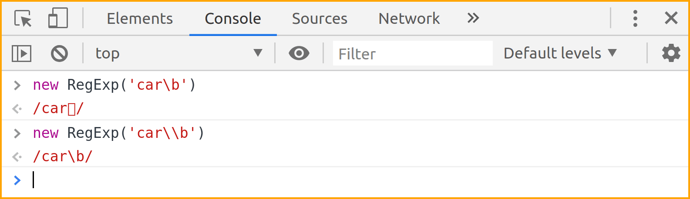

# Preface

Scripting and automation tasks often need to extract particular portions of text from input data or modify them from one format to another. This book will help you learn Regular Expressions as implemented in JavaScript. Regular expressions can be considered as a mini-programming language in itself and is well suited for a variety of text processing needs.

The book heavily leans on examples to present features of regular expressions one by one. It is recommended that you manually type each example and experiment with them. Understanding both the nature of sample input string and the output produced is essential. As an analogy, consider learning to drive a bike or a car — no matter how much you read about them or listen to explanations, you need to practice a lot and infer your own conclusions. Should you feel that copy-paste is ideal for you, [code snippets are available chapter wise on GitHub](https://github.com/learnbyexample/learn_js_regexp/tree/master/code_snippets).

## Prerequisites

A good understanding of basic-level programming concepts and prior experience working with JavaScript. Should also know functional programming concepts like `map` and `filter`.

## Conventions

* The examples presented here have been tested on Chrome/Chromium console (version 78+) and includes features not available in other browsers and platforms
* Code snippets shown are copy pasted from console and modified for presentation purposes. Some commands are preceded by comments to provide context and explanations. Blank lines have been added to improve readability and output is skipped when it is `undefined` or otherwise unnecessary to be shown
* Unless otherwise noted, all examples and explanations are meant for *ASCII* characters
* External links are provided for further reading throughout the book. Not necessary to immediately visit them. They have been chosen with care and would help, especially during rereads
* The [learn_js_regexp](https://github.com/learnbyexample/learn_js_regexp) repo has all the code snippets and exercises and other details related to the book. Click the **Clone or download** button to get the files

## Acknowledgements

* [MDN: Regular Expressions](https://developer.mozilla.org/en-US/docs/Web/JavaScript/Guide/Regular_Expressions) — documentation and examples
* [stackoverflow](https://stackoverflow.com/) — for getting answers to pertinent questions on JavaScript and regular expressions
* [tex.stackexchange](https://tex.stackexchange.com/) — for help on `pandoc` and `tex` related questions
* Cover image: [LibreOffice Draw](https://www.libreoffice.org/discover/draw/) and [regulex](https://jex.im/regulex)
* [Warning](https://commons.wikimedia.org/wiki/File:Warning_icon.svg) and [Info](https://commons.wikimedia.org/wiki/File:Info_icon_002.svg) icons by [Amada44](https://commons.wikimedia.org/wiki/User:Amada44) under public domain

## Feedback and Errata

I would highly appreciate if you'd let me know how you felt about this book, it would help to improve this book as well as my future attempts. Also, please do let me know if you spot any error or typo.

Issue Manager: [https://github.com/learnbyexample/learn_js_regexp/issues](https://github.com/learnbyexample/learn_js_regexp/issues)

Goodreads: https://www.goodreads.com/book/show/49090622-javascript-regexp

E-mail: learnbyexample.net@gmail.com

Twitter: https://twitter.com/learn_byexample

## Author info

Sundeep Agarwal is a freelance trainer, author and mentor. His previous experience includes working as a Design Engineer at Analog Devices for more than 5 years. You can find his other works, primarily focused on Linux command line, text processing, scripting languages and curated lists, at [https://github.com/learnbyexample](https://github.com/learnbyexample). He has also been a technical reviewer for [Command Line Fundamentals](https://www.packtpub.com/application-development/command-line-fundamentals) book and video course published by Packt.

List of books: https://learnbyexample.github.io/books/

## License

This work is licensed under a [Creative Commons Attribution-NonCommercial-ShareAlike 4.0 International License](https://creativecommons.org/licenses/by-nc-sa/4.0/)

Code snippets are available under [MIT License](https://github.com/learnbyexample/learn_js_regexp/blob/master/LICENSE)

Resources mentioned in Acknowledgements section above are available under original licenses.

## Book version

1.0

See [Version_changes.md](https://github.com/learnbyexample/learn_js_regexp/blob/master/Version_changes.md) to track changes across book versions.

# What's so special about Regular Expressions?

Regular Expressions is a versatile tool for text processing. You'll find them included in standard library of most programming languages that are used for scripting purposes. If not, you can usually find a third-party library. Syntax and features of regular expressions vary from language to language. JavaScript's syntax is similar to that of Perl language, but there are significant feature differences.

The [String object](https://developer.mozilla.org/en-US/docs/Web/JavaScript/Reference/Global_Objects/String) in JavaScript supports variety of methods to deal with text. So, what's so special about regular expressions and why would you need it? For learning and understanding purposes, one can view regular expressions as a mini programming language in itself, specialized for text processing. Parts of a regular expression can be saved for future use, analogous to variables. There are ways to perform AND, OR, NOT conditionals. Operations similar to range and repetition and so on.

Here's some common use cases:

* Sanitizing a string to ensure that it satisfies a known set of rules. For example, to check if a given string matches password rules.
* Filtering or extracting portions on an abstract level like alphabets, numbers, punctuation and so on.
* Qualified string replacement. For example, at the start or the end of a string, only whole words, based on surrounding text, etc.

**Further Reading**

* [The true power of regular expressions](https://nikic.github.io/2012/06/15/The-true-power-of-regular-expressions.html) — it also includes a nice explanation of what *regular* means in this context
* [softwareengineering: Is it a must for every programmer to learn regular expressions?](https://softwareengineering.stackexchange.com/questions/133968/is-it-a-must-for-every-programmer-to-learn-regular-expressions)
* [softwareengineering: When you should NOT use Regular Expressions?](https://softwareengineering.stackexchange.com/questions/113237/when-you-should-not-use-regular-expressions)
* [codinghorror: Now You Have Two Problems](https://blog.codinghorror.com/regular-expressions-now-you-have-two-problems/)
* [wikipedia: Regular expression](https://en.wikipedia.org/wiki/Regular_expression) — this article includes discussion on regular expressions as a formal language as well as details on various implementations

# RegExp introduction

This chapter will get you started with defining RegExp objects and using them inside string methods. To keep it simple, the examples will not use special characters related to regular expressions. The main focus will be to get you comfortable with syntax and text processing examples. Two methods will be introduced in this chapter. The `test` method to search if the input contains a string and the `replace` method to substitute a portion of the input with something else.

> This book will use **regular expressions** and **regexp** interchangeably. When specifically referring to a JavaScript object, **RegExp** will be used.

## Console

As mentioned in the preface, examples presented in this book have been tested on Chrome/Chromium console. Other browsers based on Chromium may also work. Use `Ctrl+Shift+J` shortcut from a new tab to open a console. Some variable names are same across different chapters, so open another tab in such cases. See [MDN: Regular Expressions](https://developer.mozilla.org/en-US/docs/Web/JavaScript/Guide/Regular_Expressions) for documentation, examples and feature compatibility details.

## test method

First up, a simple example to test whether a string is part of another string or not. Normally, you'd use the `includes` method and pass a string as argument. For regular expressions, use the `test` method on a RegExp object, which is defined by the search string enclosed within `//`.

```js
> let sentence = 'This is a sample string'

// check if 'sentence' contains the given string argument
> sentence.includes('is')
< true
> sentence.includes('z')
< false

// check if 'sentence' matches the pattern as described by the regexp
> /is/.test(sentence)
< true
> /z/.test(sentence)
< false
```

Here's some examples of using the `test` method in conditional expressions.

```js
> let report = 'string theory'

> if (/ring/.test(report)) {
      console.log('mission success')
  }
< mission success

> if (!/fire/.test(report)) {
      console.log('mission failed')
  }
< mission failed
```

And here's some array processing examples.

```js
> let words = ['cat', 'attempt', 'tattle']

// get all elements that contain 'tt'
> words.filter(w => /tt/.test(w))
< ["attempt", "tattle"]

// check if all the elements contain 'at'
> words.every(w => /at/.test(w))
< true

// check if any element contains 'stat'
> words.some(w => /stat/.test(w))
< false
```

## Flags

Some of the regular expression functionality is enabled by passing flags, represented by an alphabet character. If you have used command line, flags are similar to command options, for example `grep -i` will perform case insensitive matching.

In this chapter, two flags will be discussed:

* `i` flag to ignore case while matching alphabets (default is case sensitive matching)
* `g` flag to match all occurrences (by default only the first one is matched)

Examples for `i` flag is shown below. `g` flag will be discussed in [replace method](#replace-method) section later in this chapter.

```js
> /cat/.test('CaT')
< false
> /cat/i.test('CaT')
< true

> ['Cat', 'cot', 'CATER', 'SCat', 'ScUtTLe'].filter(w => /cat/i.test(w))
< ["Cat", "CATER", "SCat"]
```

## RegExp constructor and reuse

The RegExp object can be saved in a variable. This helps to improve code clarity, enable reuse, etc.

```js
> const pet = /dog/

> pet.test('They bought a dog')
< true
> pet.test('A cat crossed their path')
< false
```

RegExp objects can also be constructed using the `RegExp()` constructor. The first argument is either a string or a RegExp object. The second argument is used to specify one or more flags.

```js
> const pat = new RegExp('dog')
> pat
< /dog/

// if flags are needed, specify them as the second argument
> new RegExp('dog', 'i')
< /dog/i
```

The main advantage of the constructor over `//` literal is the ability to dynamically construct the regexp using `${}` to insert content of other variables or the result of an expression.

```js
> let greeting = 'hi'

> const pat1 = new RegExp(`${greeting} there`)
> pat1
< /hi there/

> new RegExp(`${greeting.toUpperCase()} there`)
< /HI there/
```

> Both strings and RegExp objects support special escape sequences. Some sequences like `\t` and `\n` mean the same but sequences like `\b` have completely different meaning. To avoid unexpected behavior, use `\\` instead of `\`.

```js
> new RegExp('123\tabc')
< /123	abc/

> new RegExp('123\\tabc')
< /123\tabc/
```

Here's a console screenshot of another example.



## replace method

The `replace` string method is used for search and replace operations.

```js
// change only first match
> '1,2,3,4'.replace(/,/, '-')
< "1-2,3,4"

// change all matches by adding 'g' flag
> '1,2,3,4'.replace(/,/g, '-')
< "1-2-3-4"

// multiple flags can be combined
> 'cArT PART tart mArt'.replace(/art/ig, '2')
< "c2 P2 t2 m2"
```

> A common mistake is forgetting that strings are immutable. If you want to save changes to the same variable, you need to explicitly assign the result back to that variable.

```js
> let word = 'cater'
// this will return a string but won't modify the 'word' variable
> word.replace(/cat/, 'hack')
< "hacker"
> word
< "cater"

// need to explicitly assign the result for in-place modification
> word = word.replace(/cat/, 'hack')
< "hacker"
> word
< "hacker"
```

## Cheatsheet and Summary

| Note    | Description |
| ------- | ----------- |
| [MDN: Regular Expressions](https://developer.mozilla.org/en-US/docs/Web/JavaScript/Guide/Regular_Expressions) | MDN documentation for JavaScript regular expressions |
| `/pat/` | a RegExp object |
| `const p1 = /pat/` | save regexp in a variable for reuse, clarity, etc |
| `/pat/.test(s)` | Check if given pattern is present anywhere in input string |
| | returns `true` or `false` |
| `i` | flag to ignore case when matching alphabets |
| `g` | flag to match all occurrences |
| `new RegExp('pat', 'i')` | construct RegExp from a string |
| | second argument specifies flags |
| | use backtick strings with `${}` for interpolation |
| `s.replace(/pat/, 'repl')` | method for search and replace |

This chapter introduced how to define RegExp objects and use them with `test` and `replace` methods. You also learnt how to use flags to change the default behavior of regexps. The examples presented were more focused on introducing text processing concepts. Next chapter onwards, you'll learn regular expression syntax and features.

## Exercises

> All the exercises are also collated together in one place at [Exercises.md](https://github.com/learnbyexample/learn_js_regexp/blob/master/Exercises.md).

**a)** Check if the given input strings contain `two` irrespective of case.

```js
> let s1 = 'Their artwork is exceptional'
> let s2 = 'one plus tw0 is not three'
> let s3 = 'TRUSTWORTHY'

> const p1 =        // add your solution here

> p1.test(s1)
< true
> p1.test(s2)
< false
> p1.test(s3)
< true
```

**b)** For the given multiline input string, filter all lines NOT containing the string `2`.

```js
> let purchases = `items qty
apple 24
mango 50
guava 42
onion 31
water 10`

> const num =       // add your solution here

> console.log(purchases.split('\n')
                       .filter()        // add your solution here
                       .join('\n'))
< items qty
  mango 50
  onion 31
  water 10
```

> You'd be able to solve this using just `replace` method by the end of [Dot metacharacter and Quantifiers](#dot-metacharacter-and-quantifiers) chapter.

**c)** Replace all occurrences of `0xA0` with `0x50` for the given input string.

```js
> let h1 = 'start address: 0xA0, end address: 0xA0B'
> h1.replace()      // add your solution here
< "start address: 0x50, end address: 0x50B"
```

# Anchors

In this chapter, you'll be learning about qualifying a pattern. Instead of matching anywhere in the given input string, restrictions can be specified. For now, you'll see the ones that are already part of regular expression features. In later chapters, you'll learn how to define your own rules for restriction.

These restrictions are made possible by assigning special meaning to certain characters and escape sequences. The characters with special meaning are known as **metacharacters** in regexp parlance. In case you need to match those characters literally, you need to escape them with a `\` (discussed in [Escaping metacharacters](#escaping-metacharacters) chapter).

## String anchors

This restriction is about qualifying a regexp to match only at start or end of an input string. These provide functionality similar to the string methods `startsWith` and `endsWith`. First up is `^` metacharacter, which restricts the matching to the start of string.

```js
// ^ is placed as a prefix to the pattern
> /^cat/.test('cater')
< true
> /^cat/.test('concatenation')
< false

> /^hi/.test('hi hello\ntop spot')
< true
> /^top/.test('hi hello\ntop spot')
< false
```

To restrict the match to the end of string, `$` metacharacter is used.

```js
// $ is placed as a suffix to the pattern
> /are$/.test('spare')
< true
> /are$/.test('nearest')
< false

> let words = ['surrender', 'unicorn', 'newer', 'door', 'empty', 'eel', 'pest']
> words.filter(w => /er$/.test(w))
< ["surrender", "newer"]
> words.filter(w => /t$/.test(w))
< ["pest"]
```

Combining both the start and end string anchors, you can restrict the matching to the whole string. Similar to comparing strings using the `==` operator.

```js
> /^cat$/.test('cat')
< true
> /^cat$/.test('cater')
< false
```

The anchors can be used by themselves as a pattern. Helps to insert text at the start or end of string, emulating string concatenation operations. These might not feel like useful capability, but combined with other regexp features they become quite a handy tool.

```js
> 'live'.replace(/^/, 're')
< "relive"
> 'send'.replace(/^/, 're')
< "resend"

> 'cat'.replace(/$/, 'er')
< "cater"
> 'hack'.replace(/$/, 'er')
< "hacker"
```

## Line anchors

A string input may contain single or multiple lines. The newline character `\n` is used as the line separator. When the `m` flag is used, the `^` and `$` anchors will match the start and end of every line respectively.

```js
// check if any line in the string starts with 'top'
> /^top/m.test('hi hello\ntop spot')
< true

// check if any line in the string ends with 'er'
> /er$/m.test('spare\npar\nera\ndare')
< false

// check if any complete line in the string is 'par'
> /^par$/m.test('spare\npar\nera\ndare')
< true
```

Just like string anchors, you can use the line anchors by themselves as a pattern.

```js
> let items = 'catapults\nconcatenate\ncat'

> console.log(items.replace(/^/gm, '* '))
< * catapults
  * concatenate
  * cat

> console.log(items.replace(/$/gm, '.'))
< catapults.
  concatenate.
  cat.
```

> If there is a newline character at the end of string, there is an additional start/end of line match after the newline.

```js
// 'foo ' is inserted three times
> '1\n2\n'.replace(/^/mg, 'foo ')
< "foo 1
  foo 2
  foo "

> '1\n2\n'.replace(/$/mg, ' baz')
< "1 baz
  2 baz
   baz"
```

> If you are dealing with Windows OS based text files, you'll have to convert `\r\n` line endings to `\n` first. Otherwise, you'll get end of line matches for both `\r `and `\n` characters. You can also handle this case in regexp by making `\r` as optional character with quantifiers (see [Greedy quantifiers](#greedy-quantifiers) section).

## Word anchors

The third type of restriction is word anchors. Alphabets (irrespective of case), digits and the underscore character qualify as word characters. You might wonder why there are digits and underscores as well, why not only alphabets? This comes from variable and function naming conventions — typically alphabets, digits and underscores are allowed. So, the definition is more oriented to programming languages than natural ones.

The escape sequence `\b` denotes a word boundary. This works for both the start of word and end of word anchoring. Start of word means either the character prior to the word is a non-word character or there is no character (start of string). Similarly, end of word means the character after the word is a non-word character or no character (end of string). This implies that you cannot have word boundary `\b` without a word character.

```js
> let sample = 'par spar apparent spare part'

// replace 'par' irrespective of where it occurs
> sample.replace(/par/g, 'X')
< "X sX apXent sXe Xt"
// replace 'par' only at the start of word
> sample.replace(/\bpar/g, 'X')
< "X spar apparent spare Xt"
// replace 'par' only at the end of word
> sample.replace(/par\b/g, 'X')
< "X sX apparent spare part"
// replace 'par' only if it is not part of another word
> sample.replace(/\bpar\b/g, 'X')
< "X spar apparent spare part"
```

You can get lot more creative with using word boundary as a pattern by itself.

```js
// sample = 'par spar apparent spare part'
// space separated words to double quoted csv
// note that 'replace' method is used twice here
> console.log(sample.replace(/\b/g, '"').replace(/ /g, ','))
< "par","spar","apparent","spare","part"

// make a programming statement more readable
// shown for illustration purpose only, won't work for all cases
> 'foo_baz=num1+35*42/num2'.replace(/\b/g, ' ')
< " foo_baz = num1 + 35 * 42 / num2 "
// excess space at start/end of string can be trimmed off
// later you'll learn how to add a qualifier so that trim is not needed
> 'foo_baz=num1+35*42/num2'.replace(/\b/g, ' ').trim()
< "foo_baz = num1 + 35 * 42 / num2"
```

The word boundary has an opposite anchor too. `\B` matches wherever `\b` doesn't match. This duality will be seen with some other escape sequences too. Negative logic is handy in many text processing situations. But use it with care as you might end up matching things you didn't intend!

```js
// sample = 'par spar apparent spare part'

// replace 'par' if it is not start of word
> sample.replace(/\Bpar/g, 'X')
< "par sX apXent sXe part"
// replace 'par' at the end of word but not whole word 'par'
> sample.replace(/\Bpar\b/g, 'X')
< "par sX apparent spare part"
// replace 'par' if it is not end of word
> sample.replace(/par\B/g, 'X')
< "par spar apXent sXe Xt"
// replace 'par' if it is surrounded by word characters
> sample.replace(/\Bpar\B/g, 'X')
< "par spar apXent sXe part"
```

Here's some standalone pattern usage to compare and contrast the two word anchors.

```js
> 'copper'.replace(/\b/g, ':')
< ":copper:"
> 'copper'.replace(/\B/g, ':')
< "c:o:p:p:e:r"

> '-----hello-----'.replace(/\b/g, ' ')
< "----- hello -----"
> '-----hello-----'.replace(/\B/g, ' ')
< " - - - - -h e l l o- - - - - "
```

## Cheatsheet and Summary

| Note    | Description |
| ------- | ----------- |
| metacharacter | characters with special meaning in regexp |
| `^` | restricts the match to start of string |
| `$` | restricts the match to end of string |
| `\n` | line separator, dos-style files may need special attention |
| | as they use `\r\n` as line endings |
| `m` | flag to match the start/end of line with `^` and `$` anchors |
| `\b` | restricts the match to start/end of words |
|  | word characters: alphabets, digits, underscore |
| `\B` | matches wherever `\b` doesn't match |

In this chapter, you've begun to see building blocks of regular expressions and how they can be used in interesting ways. But at the same time, regular expression is but another tool in the land of text processing. Often, you'd get simpler solution by combining regular expressions with normal string methods. Practice, experience and imagination would help you construct creative solutions. In coming chapters, you'll see more applications of anchors with other regexp features.

## Exercises

**a)** Check if the given input strings contain `is` or `the` as whole words.

```js
> let str1 = 'is; (this)'
> let str2 = "The food isn't good"
> let str3 = 'the2 cats'
> let str4 = 'switch on the light'

> const p1 =        // add your solution here
> const p2 =        // add your solution here

> p1.test(str1) || p2.test(str1)
< true
> p1.test(str2) || p2.test(str2)
< false
> p1.test(str3) || p2.test(str3)
< false
> p1.test(str4) || p2.test(str4)
< true
```

**b)** For the given input string, change only whole word `red` to `brown`

```js
> let s1 = 'bred red spread credible red;'

> s1.replace()      // add your solution here
< "bred brown spread credible brown;"
```

**c)** For the given input array, filter all elements that contains `42` surrounded by word characters.

```js
> let a1 = ['hi42bye', 'nice1423', 'bad42', 'cool_42a', 'fake4b']

> a1.filter()       // add your solution here
< ["hi42bye", "nice1423", "cool_42a"]
```

**d)** For the given input list, filter all elements that start with `den` or end with `ly`

```js
> let a2 = ['lovely', '1\ndentist', '2 lonely', 'eden', 'fly away', 'dent']

> a2.filter()       // add your solution here
< ["lovely", "2 lonely", "dent"]
```

**e)** For the given input string, change whole word `mall` to `1234` only if it is at the start of line.

```js
> let para = `ball fall wall tall
mall call ball pall
wall mall ball fall
mallet wallet malls`

> console.log(para.replace())       // add your solution here
< ball fall wall tall
  1234 call ball pall
  wall mall ball fall
  mallet wallet malls
```

# Alternation and Grouping

Many a times, you want to check if the input string matches more than one pattern. For example, whether a car color is *green* or *blue* or *red*. In programming terms, you need to perform OR conditional. This chapter will discuss various ways to build a single regexp to match an input string against multiple conditions.

## OR conditional

In a conditional expression, you can use the logical operators to combine multiple conditions. With regular expressions, the `|` metacharacter is similar to logical OR. The regexp will match if any of the expression separated by `|` is satisfied. Each of these alternations is a full regexp. For example, anchors are specific to that particular alternation.

```js
// match either 'cat' or 'dog'
> const pets = /cat|dog/
> pets.test('I like cats')
< true
> pets.test('I like dogs')
< true
> pets.test('I like parrots')
< false

// replace either 'cat' at start of string or 'cat' at end of word
> 'catapults concatenate cat scat'.replace(/^cat|cat\b/g, 'X')
< "Xapults concatenate X sX"

// replace either 'cat' or 'dog' or 'fox' with 'mammal'
> 'cat dog bee parrot fox'.replace(/cat|dog|fox/g, 'mammal')
< "mammal mammal bee parrot mammal"
```

## Grouping

Often, there are some common things among the regexp alternatives. It could be common characters or regexp qualifiers like the anchors. In such cases, you can group them using a pair of parentheses metacharacters. Similar to `a(b+c)d = abd+acd` in maths, you get `a(b|c)d = abd|acd` in regular expressions.

```js
// without grouping
> 'red reform read arrest'.replace(/reform|rest/g, 'X')
< "red X read arX"
// with grouping
> 'red reform read arrest'.replace(/re(form|st)/g, 'X')
< "red X read arX"

// without grouping
> 'par spare part party'.replace(/\bpar\b|\bpart\b/g, 'X')
< "X spare X party"
// taking out common anchors
> 'par spare part party'.replace(/\b(par|part)\b/g, 'X')
< "X spare X party"
// taking out common characters as well
// you'll later learn a better technique instead of using empty alternate
> 'par spare part party'.replace(/\bpar(|t)\b/g, 'X')
< "X spare X party"
```

## Precedence rules

There's some tricky situations when using alternation. If it is used for testing a match to get `true/false` against a string input, there is no ambiguity. However, for other things like string replacement without `g` flag, it depends on a few factors. Say, you want to replace either `are` or `spared` — which one should get precedence? The bigger word `spared` or the substring `are` inside it or based on something else?

The regexp alternative which matches earliest in the input string gets precedence.

```js
> let words = 'lion elephant are rope not'

// starting index of 'on' < index of 'ant' for given string input
// so 'on' will be replaced irrespective of order of alternations
> words.replace(/on|ant/, 'X')
< "liX elephant are rope not"
> words.replace(/ant|on/, 'X')
< "liX elephant are rope not"
```

So, what happens if two or more alternatives match on same index? The precedence is then left to right in the order of declaration.

```js
> let mood = 'best years'

// starting index for 'year' and 'years' will always be same
// so, which one gets replaced depends on the order of alternations
> mood.replace(/year|years/, 'X')
< "best Xs"
> mood.replace(/years|year/, 'X')
< "best X"
```

Another example with `replace` to drive home the issue.

```js
> let sample = 'ear xerox at mare part learn eye'

// this is going to be same as: replace(/ar/g, 'X')
> sample.replace(/ar|are|art/g, 'X')
< "eX xerox at mXe pXt leXn eye"
// this is going to be same as: replace(/are|ar/g, 'X')
> sample.replace(/are|ar|art/g, 'X')
< "eX xerox at mX pXt leXn eye"
// phew, finally this one works as expected
> sample.replace(/are|art|ar/g, 'X')
< "eX xerox at mX pX leXn eye"
```

## Cheatsheet and Summary

| Note    | Description |
| ------- | ----------- |
| `pat1\|pat2\|pat3` | multiple regexp combined as OR conditional |
|   | each alternative can have independent anchors  |
| `()` | group pattern(s) |
| `a(b\|c)d` | same as `abd\|acd` |
| Alternation precedence | pattern which matches earliest in the input gets precedence |
|   | tie-breaker is left to right if patterns have same starting location |

So, this chapter was about specifying one or more alternate matches within the same regexp using `|` metacharacter. Which can further be simplified using `()` grouping if there are common aspects. Among the alternations, earliest matching pattern gets precedence. Left to right ordering is used as a tie-breaker if multiple alternations match starting from the same location. In the next chapter, you'll learn how to construct alternation from an array of strings taking care of precedence rules. Grouping has various other uses too, which will be discussed in coming chapters.

## Exercises

**a)** For the given input list, filter all elements that start with `den` or end with `ly`

```js
> let a1 = ['lovely', '1\ndentist', '2 lonely', 'eden', 'fly away', 'dent']

> a1.filter()       // add your solution here
< ["lovely", "2 lonely", "dent"]
```

**b)** For the given input strings, replace all occurrences of `removed` or `reed` or `received` or `refused` with `X`.

```js
> let s1 = 'creed refuse removed read'
> let s2 = 'refused reed redo received'

> const p1 =        // add your solution here

> s1.replace(p1, 'X')
< "cX refuse X read"
> s2.replace(p1, 'X')
< "X X redo X"
```

**c)** For the given input strings, replace `late` or `later` or `slated` with `A`.

```js
> let str1 = 'plate full of slate'
> let str2 = "slated for later, don't be late"

> const p2 =        // add your solution here

> str1.replace(p2, 'A')
< "pA full of sA"
> str2.replace(p2, 'A')
< "A for A, don't be A"
```

# Escaping metacharacters

You have seen a few metacharacters and escape sequences that help to compose a RegExp literal. There's also the `/` character used as a delimiter for RegExp objects. This chapter will discuss how to remove the special meaning of such constructs. Also, you'll learn how to take care of special characters when you are building a RegExp literal from normal strings.

To match the metacharacters literally, i.e. to remove their special meaning, prefix those characters with a `\` character. To indicate a literal `\` character, use `\\`.

```js
// even though ^ is not being used as anchor, it won't be matched literally
> /b^2/.test('a^2 + b^2 - C*3')
< false
// escaping will work
> /b\^2/.test('a^2 + b^2 - C*3')
< true

> '(a*b) + c'.replace(/\(|\)/g, '')
< "a*b + c"

> '\\learn\\by\\example'.replace(/\\/g, '/')
< "/learn/by/example"
```

## Dynamically escaping metacharacters

When you are defining the regexp yourself, you can manually escape the metacharacters where needed. However, if you have strings obtained from elsewhere and need to match the contents literally, you'll have to somehow escape all the metacharacters while constructing the regexp. The solution of course is to use regular expressions! Usually, the programming language itself would provide an in-built method for such cases. JavaScript doesn't, but [MDN: Regular Expressions doc](https://developer.mozilla.org/en-US/docs/Web/JavaScript/Guide/Regular_Expressions) has it covered in the form of a function as shown below.

```js
> function escapeRegExp(string) {
    return string.replace(/[.*+?^${}()|[\]\\]/g, '\\$&')
  }
```

There are many things in the above regexp that you haven't learnt yet. They'll be discussed in coming chapters. For now, it is enough to know that this function will automatically escape all the metacharacters. Examples are shown below.

```js
// sample input on which regexp will be applied
> let eqn = 'f*(a^b) - 3*(a^b)'
// sample string obtained from elsewhere which needs to be matched literally
> const usr_str = '(a^b)'

// case 1: replace all matches
// escaping metacharacters using 'escapeRegExp' function
> const pat = new RegExp(escapeRegExp(usr_str), 'g')
> pat
< /\(a\^b\)/g
> eqn.replace(pat, 'c')
< "f*c - 3*c"

// case 2: replace only at the end of string
> eqn.replace(new RegExp(escapeRegExp(usr_str) + '$'), 'c')
"f*(a^b) - 3*c"
```

## Dynamically building alternation

Examples in previous chapter showed cases where a single regexp can contain multiple patterns combined using `|` metacharacter. Often, you have an array of strings and you need to match any of their content literally. To do so, you need to escape all the metacharacters before combining the strings with `|` metacharacter. The function shown below uses the `escapeRegExp` function introduced in the previous section.

```js
> function unionRegExp(arr) {
    return arr.map(w => escapeRegExp(w)).join('|')
  }
```

And here's some examples with `unionRegExp` function used to construct the required regexp.

```js
// here, order of alternation wouldn't matter
// and assume that other regexp features aren't needed
> let w1 = ['c^t', 'dog$', 'f|x']
> const p1 = new RegExp(unionRegExp(w1), 'g')
> p1
< /c\^t|dog\$|f\|x/g
> 'c^t dog$ bee parrot f|x'.replace(p1, 'mammal')
< "mammal mammal bee parrot mammal"

// here, alternation precedence rules needs to be applied first
// and assume that the terms have to be matched as whole words
> let w2 = ['hand', 'handy', 'handful']
// sort by string length, longest first
> w2.sort((a, b) => b.length - a.length)
< ["handful", "handy", "hand"]
> const p2 = new RegExp(`\\b(${unionRegExp(w2)})\\b`, 'g')
> p2
< /\b(handful|handy|hand)\b/g
// note that 'hands' and 'handed' isn't replaced
> 'handful handed handy hands hand'.replace(p2, 'X')
< "X handed X hands X"
```

> The [XRegExp](https://github.com/slevithan/xregexp) utility provides [XRegExp.escape](http://xregexp.com/api/#escape) and [XRegExp.union](http://xregexp.com/api/#union) methods. The union method has additional functionality of allowing a mix of string and RegExp literals and also takes care of renumbering [backreferences](#backreferences).

## source and flags properties

If you need the contents of a RegExp object, you can use `source` and `flags` properties to get the pattern string and flags respectively. These methods will help you to build a RegExp object using contents of another RegExp object.

```js
> const p3 = /\bpar\b/
> const p4 = new RegExp(p3.source + '|cat', 'g')

> p4
< /\bpar\b|cat/g
> console.log(p4.source)
< \bpar\b|cat
> p4.flags
< "g"

> 'cater cat concatenate par spare'.replace(p4, 'X')
< "Xer X conXenate X spare"
```

## Escaping delimiter

Another character to keep track for escaping is the delimiter used to define the RegExp literal. Or depending upon the pattern, you can use the `new RegExp` constructor to avoid escaping.

```js
> let path = '/foo/123/foo/baz/ip.txt'

// this is known as 'leaning toothpick syndrome'
> path.replace(/^\/foo\/123\//, '~/')
< "~/foo/baz/ip.txt"

// using 'new RegExp' improves readability and can reduce typos
> path.replace(new RegExp(`^/foo/123/`), '~/')
< "~/foo/baz/ip.txt"
```

## Cheatsheet and Summary

| Note    | Description |
| ------- | ----------- |
| `\` | prefix metacharacters with `\` to match them literally |
| `\\` | to match `\` literally |
| `source` | property to convert RegExp object to string |
| | helps to insert a RegExp inside another RegExp |
| `flags` | property to get flags of a RegExp object |
| `` RegExp(`pat`) `` | helps to avoid or reduce escaping the `/` delimiter character |
| Alternation precedence | tie-breaker is left to right if patterns have same starting location |
|   | robust solution: sort the alternations based on length, longest first |

## Exercises

**a)** Transform given input strings to expected output using same logic on both strings.

```js
> let str1 = '(9-2)*5+qty/3'
> let str2 = '(qty+4)/2-(9-2)*5+pq/4'

> const p1 =        // add your solution here
> str1.replace(p1, '35')
< "35+qty/3"
> str2.replace(p1, '35')
< "(qty+4)/2-35+pq/4"
```

**b)** Replace any matching item from given array with `X` for the given input strings.

```js
> let items = ['a.b', '3+n', 'x\\y\\z', 'qty||price', '{n}']
> const p2 =        // add your solution here

> '0a.bcd'.replace(p2, 'X')
< "0Xcd"
> 'E{n}AMPLE'.replace(p2, 'X')
< "EXAMPLE"
> '43+n2 ax\\y\\ze'.replace(p2, 'X')
< "4X2 aXe"
```

# Dot metacharacter and Quantifiers

This chapter introduces several more metacharacters. Similar to the `repeat` string method, quantifiers allow to repeat a portion of regular expression pattern and thus make it compact and improve readability. Quantifiers can also be specified as both bounded and unbounded ranges to match varying quantities of the pattern. Previously, you used alternation to construct OR conditional. Adding dot metacharacter and quantifiers to the mix, you can construct AND conditional.

## Dot metacharacter

The dot metacharacter serves as a placeholder to match any character except `\r` and `\n` characters. The [s flag](#s-flag) section will show how to include those characters as well.

```js
// matches character 'c', any character and then character 't'
> 'tac tin cat abc;tuv acute'.replace(/c.t/g, 'X')
< "taXin X abXuv aXe"

// matches character 'r', any two characters and then character 'd'
> 'breadth markedly reported overrides'.replace(/r..d/g, 'X')
< "bXth maXly repoX oveXes"

// matches character '2', any character and then character '3'
> '42\t33'.replace(/2.3/, '8')
< "483"
```

## Greedy quantifiers

Quantifiers helps you to repeat a portion of regexp. They can be applied to literal characters, groupings and other features that you'll learn later. Apart from ability to specify exact quantity and bounded range, these can also match unbounded varying quantities. If the input string can satisfy a pattern with varying quantities in multiple ways, you can choose among two types of quantifiers to narrow down the possibilities. In this section, **greedy** type of quantifiers is covered.

First up, the `?` metacharacter which quantifies a character or group to match `0` or `1` times. This helps to define optional patterns and build terser regexps.

```js
// same as: /ear|ar/g
> 'far feat flare fear'.replace(/e?ar/g, 'X')
< "fX feat flXe fX"

// same as: /\bpar(t|)\b/g
> 'par spare part party'.replace(/\bpart?\b/g, 'X')
< "X spare X party"

// same as: /\b(re.d|red)\b/
> ['red', 'ready', 're;d', 'redo', 'reed'].filter(w => /\bre.?d\b/.test(w))
< ["red", "re;d", "reed"]

// same as: /part|parrot/g
> 'par part parrot parent'.replace(/par(ro)?t/g, 'X')
< "par X X parent"
// same as: /part|parrot|parent/g
> 'par part parrot parent'.replace(/par(en|ro)?t/g, 'X')
< "par X X X"
```

The `*` metacharacter quantifies a character or group to match `0` or more times. There is no upper bound, more details will be discussed later in this section.

```js
// match 't' followed by zero or more of 'a' followed by 'r'
> 'tr tear tare steer sitaara'.replace(/ta*r/g, 'X')
< "X tear Xe steer siXa"

// match 't' followed by zero or more of 'e' or 'a' followed by 'r'
> 'tr tear tare steer sitaara'.replace(/t(e|a)*r/g, 'X')
< "X X Xe sX siXa"

// match zero or more of '1' followed by '2'
> '3111111111125111142'.replace(/1*2/g, 'X')
< "3X511114X"
```

The `split` method separates the string based on given pattern and returns an array of strings. See [Non-capturing groups](#non-capturing-groups) section if you need the string matched by the separator pattern as well in the output.

```js
// last element is empty because there is nothing after '2' at the end of string
> '3111111111125111142'.split(/1*2/)
< ["3", "511114", ""]

// note how '25' and '42' gets split, there is '1' zero times in between them
> '3111111111125111142'.split(/1*/)
< ["3", "2", "5", "4", "2"]
```

The `+` metacharacter quantifies a character or group to match `1` or more times. Similar to `*` quantifier, there is no upper bound. More importantly, this doesn't have surprises like matching empty string.

```js
> 'tr tear tare steer sitaara'.replace(/ta+r/g, 'X')
< "tr tear Xe steer siXa"
> 'tr tear tare steer sitaara'.replace(/t(e|a)+r/g, 'X')
< "tr X Xe sX siXa"

> '3111111111125111142'.replace(/1+2/g, 'X')
< "3X5111142"
> '3111111111125111142'.split(/1+/)
< ["3", "25", "42"]
```

You can specify a range of integer numbers, both bounded and unbounded, using `{}` metacharacters. There are three ways to use this quantifier as listed below.

| Pattern | Description |
| ------- | ----------- |
| `{m,n}` | match `m` to `n` times |
| `{m,}`  | match at least `m` times |
| `{n}`   | match exactly `n` times |

```js
> let demo = ['abc', 'ac', 'abbc', 'xabbbcz', 'bc', 'abbbbbc']

> demo.filter(w => /ab{1,4}c/.test(w))
< ["abc", "abbc", "xabbbcz"]
> demo.filter(w => /ab{0,2}c/.test(w))
< ["abc", "ac", "abbc"]

> demo.filter(w => /ab{3,}c/.test(w))
< ["xabbbcz", "abbbbbc"]

> demo.filter(w => /ab{3}c/.test(w))
< ["xabbbcz"]
```

> The `{}` metacharacters have to be escaped to match them literally. However, unlike `()` metacharacters, these have lot more leeway. For example, escaping `{` alone is enough, or if it doesn't conform strictly to any of the forms listed above, escaping is not needed at all.

Next up, how to construct AND conditional using dot metacharacter and quantifiers.

```js
// match 'Error' followed by zero or more characters followed by 'valid'
> /Error.*valid/.test('Error: not a valid input')
< true

> /Error.*valid/.test('Error: key not found')
< false
```

To allow matching in any order, you'll have to bring in alternation as well. That is somewhat manageable for 2 or 3 patterns. [Lookarounds](#and-conditional) provide a comparatively easier approach.

```js
> /cat.*dog|dog.*cat/.test('cat and dog')
< true
> /cat.*dog|dog.*cat/.test('dog and cat')
< true

// if you just need true/false result, this would be a scalable approach
> let patterns = [/cat/, /dog/]
> patterns.every(p => p.test('cat and dog'))
< true
> patterns.every(p => p.test('dog and cat'))
< true
```

So, how much do these greedy quantifiers match? When you are using `?` how does JavaScript decide to match `0` or `1` times, if both quantities can satisfy the regexp? For example, consider `'foot'.replace(/f.?o/, 'X')` — should `foo` be replaced or `fo`? It will always replace `foo`, because these are **greedy** quantifiers.

```js
> 'foot'.replace(/f.?o/, 'X')
< "Xt"

// a more practical example
// prefix '<' with '\' if it is not already prefixed
> console.log('blah < foo \\< bar < baz'.replace(/\\?</g, '\\<'))
< blah \< foo \< bar \< baz

// say goodbye to /handful|handy|hand/ shenanigans
> 'hand handy handful'.replace(/hand(y|ful)?/g, 'X')
< "X X X"
```

But wait, how did the `/Error.*valid/` example work? Shouldn't `.*` consume all the characters after `Error`? Good question. The regexp engine actually does consume all the characters. Then realizing that the regexp fails, it gives back one character from end of string and checks again if regexp is satisfied. This process is repeated until a match is found or failure is confirmed. In regular expression parlance, this is called **backtracking**.

```js
> let sentence = 'that is quite a fabricated tale'

// t.*a will always match from first 't' to last 'a'
> sentence.replace(/t.*a/, 'X')
< "Xle"
> 'star'.replace(/t.*a/, 'X')
< "sXr"

// matching first 't' to last 'a' for t.*a won't work for these cases
// the regexp engine backtracks until .*q matches and so on
> sentence.replace(/t.*a.*q.*f/, 'X')
< "Xabricated tale"
> sentence.replace(/t.*a.*u/, 'X')
< "Xite a fabricated tale"
```

> Backtracking can be quite time consuming for certain corner cases. Or even catastrophic (see [cloudflare: Details of the Cloudflare outage on July 2, 2019](https://blog.cloudflare.com/details-of-the-cloudflare-outage-on-july-2-2019/)).

## Non-greedy quantifiers

As the name implies, these quantifiers will try to match as minimally as possible. Also known as **lazy** or **reluctant** quantifiers. Appending a `?` to greedy quantifiers makes them non-greedy.

```js
> 'foot'.replace(/f.??o/, 'X')
< "Xot"

> 'frost'.replace(/f.??o/, 'X')
< "Xst"

> '123456789'.replace(/.{2,5}?/, 'X')
< "X3456789"
```

Like greedy quantifiers, lazy quantifiers will try to satisfy the overall regexp.

```js
// sentence = 'that is quite a fabricated tale'
// t.*?a will always match from first 't' to first 'a'
> sentence.replace(/t.*?a/, 'X')
< "Xt is quite a fabricated tale"
> 'star'.replace(/t.*?a/, 'X')
< "sXr"

// matching first 't' to first 'a' for t.*?a won't work for this case
// so, regexp engine will move forward until .*?f matches and so on
> sentence.replace(/t.*?a.*?f/, 'X')
< "Xabricated tale"
```

## s flag

Use `s` flag to allow `.` metacharacter to match `\r` and `\n` characters as well.

```js
// by default, the . metacharacter doesn't match newline
> 'Hi there\nHave a Nice Day'.replace(/the.*ice/, 'X')
< "Hi there
  Have a Nice Day"
// 's' flag will allow newline character to be matched as well
> 'Hi there\nHave a Nice Day'.replace(/the.*ice/s, 'X')
< "Hi X Day"
```

> Not yet supported in Firefox. Use `[^]` instead of `.` metacharacter and `s` flag as a workaround. See [Character class](#character-class) chapter for `[]` explanation.

## Debugging and Visualization tools

As your regexp gets complicated, it can get difficult to debug if you run into issues. Building your regexp step by step from scratch and testing against input strings will go a long way in correcting the problem. To aid in such a process, you could use [various online regexp tools](https://news.ycombinator.com/item?id=20614847).

[regex101](https://regex101.com/r/HSeO0z/1) is a popular site to test your regexp. You'll have first choose the flavor as JavaScript. Then you can add your regexp, input strings, choose flags and an optional replacement string. Matching portions will be highlighted and explanation is offered in separate panes. There's also a quick reference and other features like sharing, code generator, quiz, etc.


Another useful tool is [jex: regulex](https://jex.im/regulex/#!flags=&re=%5Cbpar(en%7Cro)%3Ft%5Cb) which converts your regexp to a rail road diagram, thus providing a visual aid to understanding the pattern.


## Cheatsheet and Summary

| Note    | Description |
| ------- | ----------- |
| `.` | match any character except `\r` and `\n` characters |
| `s` | flag to match `\r` and `\n` characters with `.` metacharacter |
| greedy | match as much as possible |
| `?` | greedy quantifier, match `0` or `1` times |
| `*` | greedy quantifier, match `0` or more times |
| `+` | greedy quantifier, match `1` or more times |
| `{m,n}` | greedy quantifier, match `m` to `n` times |
| `{m,}`  | greedy quantifier, match at least `m` times |
| `{n}`   | greedy quantifier, match exactly `n` times |
| `pat1.*pat2` | any number of characters between `pat1` and `pat2` |
| `pat1.*pat2\|pat2.*pat1` | match both `pat1` and `pat2` in any order |
| non-greedy | append `?` to greedy quantifier |
| | match as minimally as possible |
| `s.split(/pat/)` | split a string based on regexp |
| debugging | use tools like [regex101](https://regex101.com) and [jex: regulex](https://jex.im/regulex) |

This chapter introduced the concept of specifying a placeholder instead of fixed string. Combined with quantifiers, you've seen a glimpse of how a simple regexp can match wide range of text. If the regexp gets too complicated, you can debug it with the help of [various online regexp tools](https://news.ycombinator.com/item?id=20614847). In coming chapters, you'll learn how to create your own restricted set of placeholder characters.

## Exercises

> Some exercises are intentionally designed to be complicated to solve with regular expressions alone. Try to use normal string methods, break down the problem into multiple steps, etc. Some exercises will become easier to solve with techniques presented in chapters to come. Going through the exercises a second time after finishing entire book will be fruitful as well.

**a)** Use regular expression to get the output as shown for the given strings.

```js
> let eqn1 = 'a+42//5-c'
> let eqn2 = 'pressure*3+42/5-14256'
> let eqn3 = 'r*42-5/3+42///5-42/53+a'

> const expr =      // add your solution here

> eqn1              // add your solution here
< ["a+", "-c"]
> eqn2              // add your solution here
< ["pressure*3+", "-14256"]
> eqn3              // add your solution here
< ["r*42-5/3+42///5-", "3+a"]
```

**b)** For the given strings, construct a regexp to get output as shown.

```js
> let str1 = 'a+b(addition)'
> let str2 = 'a/b(division) + c%d(#modulo)'
> let str3 = 'Hi there(greeting). Nice day(a(b)'
> const remove_parentheses =        // add your solution here

> str1.replace(remove_parentheses, '')
< "a+b"
> str2.replace(remove_parentheses, '')
< "a/b + c%d"
> str3.replace(remove_parentheses, '')
< "Hi there. Nice day"
```

**c)** Remove leading/trailing whitespaces from all the individual fields of these csv strings.

```js
> let csv1 = ' comma  ,separated ,values '
> let csv2 = 'good bad,nice  ice  , 42 , ,   stall   small'

> csv1          // add your solution here
< "comma,separated,values"
> csv2          // add your solution here
< "good bad,nice  ice,42,,stall   small"
```

**d)** Correct the given regexp to get the expected output.

```js
> let str4 = 'plink incoming tint winter in caution sentient'

// wrong output
> const pat1 = /int|in|ion|ing|inco|inter|ink/g
> str4.replace(pat1, 'X')
"plXk XcomXg tX wXer X cautX sentient"

// expected output
> const pat2 =      // add your solution here
> str4.replace(pat2, 'X')
"plX XmX tX wX X cautX sentient"
```

**e)** For the given greedy quantifiers, what would be the equivalent form using `{m,n}` representation?

* `?` is same as
* `*` is same as
* `+` is same as

**f)** `(a*|b*)` is same as `(a|b)*` — true or false?

**g)** Delete from the string `start` if it is at beginning of a line up to the next occurrence of the string `end` at end of a line. Match these keywords irrespective of case.

```js
> let para = `good start
start working on that
project you always wanted
to, do not let it end
hi there
start and end the end
42
Start and try to
finish the End
bye`

> const pat3 =      // add your solution here
> console.log(para.replace(pat3, ''))
< good start
  
  hi there
  
  42
  
  bye
```

# Working with matched portions

Having seen a few regexp features that can match varying text, you'll learn how to extract and work with those matching portions in this chapter.

## match method

The `match` method can be used in different ways. When `g` flag isn't used and the regexp succeeds, you get an array object containing various details of the first matching portion.

```js
// note that 'g' flag isn't used
> 'abc ac adc abbbc'.match(/ab*c/)
< ["abc", index: 0, input: "abc ac adc abbbc", groups: undefined]

// to get only the matching portion
> 'abc ac adc abbbc'.match(/ab*c/)[0]
< "abc"

// non-regexp object will get processed as: RegExp(object)
> 'abc ac adc abbbc'.match('ab*c')
< ["abc", index: 0, input: "abc ac adc abbbc", groups: undefined]
```

The `index` property gives the starting location of matched portion. The `input` property gives the input string on which the `match` method was used. If the given regexp fails, the output is `null` and not an empty array. The `groups` property will be discussed in [Named capture groups](#named-capture-groups) section. See [MDN: match](https://developer.mozilla.org/en-US/docs/Web/JavaScript/Reference/Global_Objects/String/match) for more details and examples.

```js
> let s1 = 'cat and dog'

> s1.match(/dog/).index
< 8
> s1.match(/dog/).input
< "cat and dog"

> s1.match(/xyz/)
< null
```

## search method

The `search` method gives the index of first matching portion. If the regexp fails, it returns `-1` as output.

```js
// same as: match(/dog/).index
> 'cat and dog'.search(/dog/)
< 8
// cannot use match(/xyz/).index here
// as 'match' returns 'null' if regexp doesn't match
> 'cat and dog'.search(/xyz/)
< -1
```

## Capture groups

The regexp grouping inside `()` is also known as a **capture group**. It has multiple uses, one of which is the ability to work with matched portions of those groups. When capture groups are used with `match` method, the matched portions of those groups will also be part of the array output. The first element is always the entire matched portion followed by portions of capture groups. The leftmost `(` will get group number `1`, second leftmost `(` will get group number `2` and so on.

```js
// there are two capture groups used here
> 'abc ac adc abbbc'.match(/a(.*)d(.*a)/)
< ["abc ac adc a", "bc ac a", "c a", index: 0,
   input: "abc ac adc abbbc", groups: undefined]

// entire matched portion
> 'abc ac adc abbbc'.match(/a(.*)d(.*a)/)[0]
< "abc ac adc a"

// capture group portions
> 'abc ac adc abbbc'.match(/a(.*)d(.*a)/)[1]
< "bc ac a"
> 'abc ac adc abbbc'.match(/a(.*)d(.*a)/)[2]
< "c a"
```

## Getting all matched portions

The `match` method returns all the matched portions when the `g` flag is used. Capture group portions and the three properties won't be part of the output.

```js
> 'abc ac adc abbbc'.match(/ab*c/g)
< ["abc", "ac", "abbbc"]

> 'abc ac adc abbbc'.match(/ab+c/g)
< ["abc", "abbbc"]

> 'par spar apparent spare part'.match(/\bs?pare?\b/g)
< ["par", "spar", "spare"]

// entire matching portion is returned even if capture group is used
> 'par spar apparent spare part'.match(/\bs?par(e|t)\b/g)
< ["spare", "part"]
```

It is a useful method for debugging purposes as well, for example to see what is going on under the hood before using `replace` method.

```js
> 'that is quite a fabricated tale'.match(/t.*a/g)
< ["that is quite a fabricated ta"]

> 'that is quite a fabricated tale'.match(/t.*?a/g)
< ["tha", "t is quite a", "ted ta"]
```

## matchAll method

If you need capture group portions and properties for every match with `g` flag active, use the `matchAll` method. The return value is an iterator.

```js
> 'abc ac adc abbbc'.matchAll(/ab*c/g)
< RegExpStringIterator {}

// convert the iterator result to array of arrays
> let arr = [...'abc ac adc abbbc'.matchAll(/ab*c/g)]
> arr
< (3) [Array(1), Array(1), Array(1)]
  0: ["abc", index: 0, input: "abc ac adc abbbc", groups: undefined]
  1: ["ac", index: 4, input: "abc ac adc abbbc", groups: undefined]
  2: ["abbbc", index: 11, input: "abc ac adc abbbc", groups: undefined]
  length: 3
  __proto__: Array(0)

// get array with details for first match
> arr[0]
< ["abc", index: 0, input: "abc ac adc abbbc", groups: undefined]
// get index for second match
> arr[1].index
< 4
```

You can also use [Array.from()](https://developer.mozilla.org/en-US/docs/Web/JavaScript/Reference/Global_Objects/Array/from) to convert the iterator to array object. `Array.from` allows you to provide a mapping function as second argument.

```js
// same as: match(/ab*c/g)
> Array.from('abc ac adc abbbc'.matchAll(/ab*c/g), m => m[0])
< ["abc", "ac", "abbbc"]
// get index for each match
> Array.from('abc ac adc abbbc'.matchAll(/ab*c/g), m => m.index)
< [0, 4, 11]

// get only capture group portions as an array for each match
> Array.from('xx:yyy x: x:yy :y'.matchAll(/(x*):(y*)/g), m => m.slice(1))
< (4) [Array(2), Array(2), Array(2), Array(2)]
  0: (2) ["xx", "yyy"]
  1: (2) ["x", ""]
  2: (2) ["x", "yy"]
  3: (2) ["", "y"]
  length: 4
  __proto__: Array(0)
```

> Before the introduction of `matchAll` method, `exec` method had to be used. See [MDN: exec](https://developer.mozilla.org/en-US/docs/Web/JavaScript/Reference/Global_Objects/RegExp/exec) details and examples.

## Using function in replacement section

Sometimes, simple replacement string isn't enough and you need to do some processing on the matched portion. For such cases, you can use function in the replacement section. The arguments available to the function are similar to the details provided by `match` method. The first one is entire matched portion. If capture groups are used, portions matched by those groups will be next. Then comes index of matched portion and finally the input string. Depending on the complexity, you can use fully defined function or arrow function expressions.

```js
> function titleCase(m) {
      return m[0].toUpperCase() + m.substr(1).toLowerCase()
  }

// only function name is enough as second argument
// the matched portion details will be passed automatically to the function
// in this example, 'titleCase' is using only the entire matched portion
> 'aBc ac ADC aBbBC'.replace(/a.*?c/ig, titleCase)
< "Abc Ac Adc Abbbc"

// can also use arrow function expressions for simple cases
> 'abc ac adc abbbc'.replace(/ab*c/g, m => m.toUpperCase())
< "ABC AC adc ABBBC"

// \d will be covered later
// for now, it is enough to know that it will match all digits
> '1 42 317'.replace(/\d+/g, m => m*2)
< "2 84 634"
```

Here's an example with capture groups. See also [MDN: replace](https://developer.mozilla.org/en-US/docs/Web/JavaScript/Reference/Global_Objects/String/replace) for more details.

```js
> function titleCase(m, g1, g2) {
        return g1.toUpperCase() + g2.toLowerCase()
  }
> 'aBc ac ADC aBbBC'.replace(/(a)(.*?c)/ig, titleCase)
< "Abc Ac Adc Abbbc"
```

## Using dictionary in replacement section

Sometimes, the functionality you need in replacement section can be simplified to using a dictionary. The matched portion acts as the key to get corresponding value from the dictionary.

```js
// one to one mappings
> let h = { '1': 'one', '2': 'two', '4': 'four' }

> '9234012'.replace(/1|2|4/g, k => h[k])
< "9two3four0onetwo"

// providing a default value if the matched text doesn't exist as a key
> '9234012'.replace(/\d/g, k => k in h ? h[k] : 'X')
< "XtwoXfourXonetwo"
```

For swapping two or more strings without using intermediate result, using a dictionary is recommended.

```js
> let swap = { 'cat': 'tiger', 'tiger': 'cat' }

> 'cat tiger dog tiger cat'.replace(/cat|tiger/g, k => swap[k])
< "tiger cat dog cat tiger"
```

For a dictionary that has many entries and likely to undergo changes during development, building alternation list manually is not a good choice. Also, recall that as per precedence rules, longest length string should come first. The `unionRegExp` function, introduced in [Dynamically building alternation](#dynamically-building-alternation) section, is helpful here.

```js
> let d = { 'hand': 1, 'handy': 2, 'handful': 3 }

> const p = unionRegExp(Object.keys(d).sort((a, b) => b.length - a.length))
> console.log(p)
< handful|handy|hand
> 'handful hand pin handy'.replace(new RegExp(p, 'g'), k => d[k])
< "3 1 pin 2"
```

## Cheatsheet and Summary

| Note    | Description |
| ------- | ----------- |
| `m = s.match(/pat/)` | assuming `g` flag isn't used and regexp succeeds, |
| | returns an array with matched portion and 3 properties |
| | `index` property gives the starting location of the match |
| | `input` property gives the input string `s` |
| | `groups` property gives dictionary of [named capture groups](#named-capture-groups) |
| `m[0]` | for above case, gives entire matched portion |
| `m[1]` | matched portion of first capture group |
| `m[2]` | matched portion of second capture group and so on |
| `s.match(/pat/g)` | returns only the matched portions, no properties |
| | capture group doesn't affect the output |
| | `match` returns `null` if regexp fails |
| `s.matchAll(/pat/g)` | returns an iterator containing details for |
| | each matched portion and its properties |
| | use `[...]` or `Array.from` to convert to array |
| | `Array.from` also allows mapping function |
| `s.replace(/pat/, func)` | you can use a function to provide replacement string |
| | each matched portion details gets passed as arguments |
| | similarly, dictionary can be used for replacement |
| `s.search(/pat/)` | gives starting location of the match if regexp succeeds |
| | `-1` if regexp fails |

This chapter introduced `match` and `matchAll` methods, which allows you to work with various matching portions of input string. The `replace` method allows you to use a function as replacement, which helps to process the matching portions before being used as replacement string. You can also use a dictionary to provide replacement string based on matched portion as key. You learnt about capture groups and you'll see even more uses of groupings in coming chapters.

## Exercises

**a)** For the given strings, extract the matching portion from first `is` to last `t`

```js
> let str1 = 'What is the biggest fruit you have seen?'
> let str2 = 'Your mission is to read and practice consistently'

> const p1 =        // add your solution here
> str1.match()      // add your solution here
< "is the biggest fruit"
> str2.match()      // add your solution here
< "ission is to read and practice consistent"
```

**b)** Transform the given input strings to expected output as shown.

```js
> let row1 = '-2,5 4,+3 +42,-53 '
> let row2 = '1.32,-3.14 634,5.63 '

> Array.from(row1)      // add your solution here
< [3, 7, -11]

> Array.from(row2)      // add your solution here
< [-1.82, 639.63]
```

**c)** Write a string function that changes given input to alternate case. The first alphabet should be changed to lowercase, the next one to uppercase and then lowercase and so on. Characters other than alphabets should be left alone and not affect case changing.

```js
> function aLtErNaTeCaSe(ip) {
      // add your solution here
  }

> aLtErNaTeCaSe('HI THERE!')
< "hI tHeRe!"
> aLtErNaTeCaSe('good morning')
< "gOoD mOrNiNg"
> aLtErNaTeCaSe('Sample123string42with777numbers')
< "sAmPlE123sTrInG42wItH777nUmBeRs"
```

**d)** Replace the string `par` with `spar`, `spare` with `extra` and `park` with `garden`

```js
> let str3 = 'apartment has a park'
> let str4 = 'do you have a spare cable'
> let str5 = 'write a parser'

> let d1 =          // add your solution here
> const p2 =        // add your solution here

> str3.replace(p2, k => d1[k])
< "aspartment has a garden"
> str4.replace(p2, k => d1[k])
< "do you have a extra cable"
> str5.replace(p2, k => d1[k])
< "write a sparser"
```

# Character class

This chapter will discuss how to create your own custom placeholders to match limited set of characters and various metacharacters applicable inside character classes. You'll also learn about escape sequences for predefined character sets.

## Custom character sets

Characters enclosed inside `[]` metacharacters is a character class (or set). It will result in matching any one of those characters once. It is similar to using single character alternations inside a grouping, but without the additional effects of a capture group. In addition, character classes have their own versions of metacharacters and provide special predefined sets for common use cases. Quantifiers are applicable to character classes as well.

```js
// same as: /cot|cut/ or /c(o|u)t/
> ['cute', 'cat', 'cot', 'coat', 'cost'].filter(w => /c[ou]t/.test(w))
< ["cute", "cot"]

// same as: /(a|e|o)+t/g
> 'meeting cute boat site foot'.replace(/[aeo]+t/g, 'X')
< "mXing cute bX site fX"

> 'Sample123string42with777numbers'.match(/[0123456789]+/g)
< ["123", "42", "777"]
```

## Character class metacharacters

Character classes have their own metacharacters to help define the sets succinctly. Metacharacters outside of character classes like `^`, `$`, `()` etc either don't have special meaning or have completely different one inside the character classes. First up, the `-` metacharacter that helps to define a range of characters instead of having to specify them all individually.

```js
// all digits
> 'Sample123string42with777numbers'.match(/[0-9]+/g)
< ["123", "42", "777"]

// whole words made up of lowercase alphabets and digits only
> 'coat Bin food tar12 best'.match(/\b[a-z0-9]+\b/g)
< ["coat", "food", "tar12", "best"]

// whole words made up of lowercase alphabets, but starting with 'p' to 'z'
> 'coat tin food put stoop best'.match(/\b[p-z][a-z]*\b/g)
< ["tin", "put", "stoop"]

// whole words made up of only 'a' to 'f' and 'p' to 't' lowercase alphabets
> 'coat tin food put stoop best'.match(/\b[a-fp-t]+\b/g)
< ["best"]
```

Character classes can also be used to construct numeric ranges.

```js
// numbers between 10 to 29
> '23 154 12 26 98234'.match(/\b[12][0-9]\b/g)
< ["23", "12", "26"]

// numbers >= 100
> '23 154 12 26 98234'.match(/\b[0-9]{3,}\b/g)
< ["154", "98234"]
// numbers >= 100 if there are leading zeros
> '0501 035 154 12 26 98234'.match(/\b0*[1-9][0-9]{2,}\b/g)
< ["0501", "154", "98234"]
```

However, it is easy to miss corner cases and some ranges are complicated to design. In such cases, it is better to match all the numbers and then add code to use actual numeric operations.

```js
// numbers < 350
> '45 349 651 593 4 204'.match(/[0-9]+/g).filter(n => n < 350)
< ["45", "349", "4", "204"]
> '45 349 651 593 4 204'.replace(/[0-9]+/g, m => m < 350 ? 0 : 1)
< "0 0 1 1 0 0"
// numbers between 200 and 650
> '45 349 651 593 4 204'.match(/[0-9]+/g).filter(n => n >= 200 && n <= 650)
< ["349", "593", "204"]
```

The `^` metacharacter has to specified as the first character of the character class. It negates the set, so all characters other than those specified will be matched.

```js
// all non-digits
> 'Sample123string42with777numbers'.match(/[^0-9]+/g)
< ["Sample", "string", "with", "numbers"]

// deleting characters from start of string based on a delimiter
> 'foo=42; baz=123'.replace(/^[^=]+/, '')
< "=42; baz=123"
> 'foo:123:bar:baz'.replace(/^([^:]+:){2}/, '')
< "bar:baz"

// deleting characters at end of string based on a delimiter
> 'foo=42; baz=123'.replace(/=[^=]+$/, '')
< "foo=42; baz"
```

As highlighted earlier, handle negative logic with care, as you might end up matching more than you wanted. Sometimes, it is easier to use positive character class and inverting the test condition instead of using negated character class.

```js
> let words = ['tryst', 'fun', 'glyph', 'pity', 'why']

> words.filter(w => /^[^aeiou]+$/.test(w))
< ["tryst", "glyph", "why"]
> words.filter(w => !/[aeiou]/.test(w))
< ["tryst", "glyph", "why"]
```

Similar to other metacharacters, prefix `\` to character class metacharacters to match them literally. Some of them can be achieved by different placement as well.

```js
// - should be first or last character or escaped using \
> 'ab-cd gh-c 12-423'.match(/\b[a-z-]{2,}\b/g)
< ["ab-cd", "gh-c"]
> 'ab-cd gh-c 12-423'.match(/\b[a-z\-0-9]{2,}\b/g)
< ["ab-cd", "gh-c", "12-423"]

// ^ should be other than first character or escaped using \
> 'f*(a^b) - 3*(a+b)'.match(/a[+^]b/g)
< ["a^b", "a+b"]
> 'f*(a^b) - 3*(a+b)'.match(/a[\^+]b/g)
< ["a^b", "a+b"]

// [ doesn't need escaping, but you can escape it if you wish
// ] and \ should be escaped using \
> 'words[5] = tea'.match(/[a-z[\]0-9]+/)[0]
< "words[5]"
> console.log('5ba\\babc2'.match(/[a\\b]+/)[0])
< ba\bab
```

## Escape sequence character sets

Commonly used character sets have predefined escape sequences:

* `\w` is similar to `[A-Za-z0-9_]` for matching word characters (recall the definition for word boundaries)
* `\d` is similar to `[0-9]` for matching digit characters
* `\s` is similar to `[ \t\r\n\f\v]` for matching whitespace characters

These escape sequences can be used as a standalone sequence or inside a character class. As mentioned before, the examples and description will assume input made up of ASCII characters only. Use `\W`, `\D` and `\S` respectively for their negated set.

```js
> 'Sample123string42with777numbers'.split(/\d+/)
< ["Sample", "string", "with", "numbers"]

> 'sea eat car rat eel tea'.match(/\b\w/g).join('')
< "secret"

> 'tea sea-pit sit-lean bean'.match(/[\w\s]+/g)
< ["tea sea", "pit sit", "lean bean"]

> 'Sample123string42with777numbers'.replace(/\D+/g, '-')
< "-123-42-777-"

> '   1..3  \v\f  foo_baz 42\tzzz   \r\n1-2-3  '.match(/\S+/g)
< ["1..3", "foo_baz", "42", "zzz", "1-2-3"]
```

## Cheatsheet and Summary

| Note    | Description |
| ------- | ----------- |
| `[ae;o]` | match **any** of these characters once |
| | quantifiers are applicable to character classes too |
| `[3-7]` | **range** of characters from `3` to `7` |
| `[^=b2]` | **negated set**, match other than `=` or `b` or `2` |
| `[a-z-]` | `-` should be first/last or escaped using `\` to match literally |
| `[+^]` | `^` shouldn't be first character or escaped using `\` |
| `[\]\\]` | `]` and `\` should be escaped using `\` |
| | `[` doesn't need escaping, but `\[` can also be used |
| `\w` | similar to `[A-Za-z0-9_]` for matching word characters |
| `\d` | similar to `[0-9]` for matching digit characters |
| `\s` | similar to `[ \t\n\r\f\v]` for matching whitespace characters |
| | assumes input encoding is ASCII |
| | use `\W`, `\D`, and `\S` for their opposites respectively |

This chapter focused on how to create custom placeholders for limited set of characters. Grouping and character classes can be considered as two levels of abstractions. On the one hand, you can have character sets inside `[]` and on the other, you can have multiple alternations grouped inside `()` including character classes. As anchoring and quantifiers can be applied to both these abstractions, you can begin to see how regular expressions is considered a mini-programming language. In coming chapters, you'll even see how to negate groupings similar to negated character class in certain scenarios.

## Exercises

**a)** Delete all pair of parentheses, unless they contain a parentheses character.

```js
> let str1 = 'def factorial()'
> let str2 = 'a/b(division) + c%d(#modulo) - (e+(j/k-3)*4)'
> let str3 = 'Hi there(greeting). Nice day(a(b)'

> const remove_parentheses =        // add your solution here
> str1.replace(remove_parentheses, '')
< "def factorial"
> str2.replace(remove_parentheses, '')
< "a/b + c%d - (e+*4)"
> str3.replace(remove_parentheses, '')
< "Hi there. Nice day(a"
```

**b)** Output true/false depending upon input string containing any number sequence that is greater than `624`

```js
> let n1 = 'hi0000432abcd'
> let n2 = '42_624 0512'
> let n3 = '3.14 96 2 foo1234baz'

> n1.match()        // add your solution here
< false
> n2.match()        // add your solution here
< false
> n3.match()        // add your solution here
< true
```

**c)** Split the given strings based on consecutive sequence of digit or whitespace characters.

```js
> let s1 = 'lion \t Ink32onion Nice'
> let s2 = '**1\f2\n3star\t7 77\r**'

> const p1 =        // add your solution here
> s1.split(p1)
< ["lion", "Ink", "onion", "Nice"]
> s2.split(p1)
< ["**", "star", "**"]
```

**d)** Extract all hex character sequences, with optional `0x` prefix. Match the characters case insensitively, and sequences surrounded by other word characters shouldn't be matched.

```js
> const hex_seq =       // add your solution here

> '128A foo 0xfe32 34 0xbar'.match(hex_seq)
< ["128A", "0xfe32", "34"]

> '0XDEADBEEF lace 0x0ff1ce bad'.match(hex_seq)
< ["0XDEADBEEF", "0x0ff1ce", "bad"]
```

**e)** For the given string, surround all whole words with `{}` except for whole words `par` and `cat`.

```js
> let w1 = 'part; cat {super} rest_42 par scatter'

> w1.replace()          // add your solution here
< "{part}; cat {{super}} {rest_42} par {scatter}"
```

# Groupings and backreferences

You've been patiently hearing more awesome stuff to come regarding groupings. Well, here they come in various forms. And some more will come in next chapter!

## Backreferences

First up, how to refer to capture group portions directly in regexp definition and replacement section. You have already seen how to refer to text captured by groups with `match` and `matchAll` methods. You've also seen how to pass captured portions to a function in `replace` method. More directly, you can use backreference `\N` (within the regexp definition) and `$N` (replacement section), where `N` is the capture group you want. What's more, you can also apply quantifiers to backreferences when used in regexp definition. All the various forms is listed below:

* in replacement section, use `$1`, `$2`, etc to refer to the corresponding capture group
* in replacement section, use `$&` to refer to entire matched portion
    * `` $` `` gives string before the matched portion
    * `$'` gives string after the matched portion
* within regexp definition, use `\1`, `\2`, etc to refer to the corresponding capture group

```js
// remove square brackets that surround digit characters
> '[52] apples and [31] mangoes'.replace(/\[(\d+)\]/g, '$1')
< "52 apples and 31 mangoes"

// replace __ with _ and delete _ if it is alone
> '_foo_ __123__ _baz_'.replace(/(_)?_/g, '$1')
< "foo _123_ baz"

// swap words that are separated by a comma
> 'good,bad 42,24'.replace(/(\w+),(\w+)/g, '$2,$1')
< "bad,good 24,42"
```

Here's some examples for using backreferences available by default without needing capture groups.

```js
// add something around the entire matched portion
> '52 apples and 31 mangoes'.replace(/\d+/g, '($&)')
< "(52) apples and (31) mangoes"
> 'Hello world'.replace(/.*/, 'Hi. $&. Have a nice day')
< "Hi. Hello world. Have a nice day"

// duplicate first field and add it as last field
> 'fork,42,nice,3.14'.replace(/,.+/, '$&,$`')
< "fork,42,nice,3.14,fork"
```

And here's some examples for using backreferences within regexp definition.

```js
// elements that have at least one consecutive repeated word character
> let words = ['moon', 'mono', 'excellent', 'poll']
> words.filter(w => /(\w)\1/.test(w))
< ["moon", "excellent", "poll"]

// remove any number of consecutive duplicate words separated by space
// note the use of quantifier on backreference
> 'aa a a a 42 f_1 f_1 f_13.14'.replace(/\b(\w+)( \1)+\b/g, '$1')
< "aa a 42 f_1 f_13.14"
```

## Backreference oddities

Since `$` is special in replacement section, there's an issue to place it literally if followed by numbers. Usually, escaping is used for such purposes, but here you need to use `$$`.

```js
// no capture group used, so '$1' is inserted literally
> 'cat'.replace(/a/, '{$1}')
< "c{$1}t"
// capture group used, '\$1' is same as '$1' here
> 'cat'.replace(/(a)/, '{\$1}')
< "c{a}t"

// use '$$' to avoid backreference and insert '$' literally
> 'cat'.replace(/(a)/, '{$$1}')
< "c{$1}t"
```

Another issue is how to avoid ambiguity when you have normal digits immediately following a backreference? It'll depend on how many backreferences are present in the pattern and whether you need to avoid ambiguity in regexp definition or replacement section. For example, if there are less than 10 groups, then something like `$12` will refer to 1st capture group and `2` as a character. If there are no capture groups, then something like `$5` will get inserted literally as `$` and `5`.

On the other hand, if you have more than `9` but less than `100` groups, then there would be an issue if you want to refer to single digit group followed by literal digit characters. The workaround is to prefix `0` such that number of digits after `$` equals the number of digits required for the highest capture group. So, if you have more than `9` but less than `100` groups, `$05` will refer to 5th capture group and any digit after that will be treated literally.

```js
// for illustration purposes, 12 capture groups have been defined here
// if you want to reference 2-digit group, there's no issue
> 'abcdefghijklmn'.replace(/(.)(.)(.)(.)(.)(.)(.)(.)(.)(.)(.)(.)/, '$11')
< "kmn"

// what if you wanted to reference 1st group followed by '1' as a character?
// using \x31 wouldn't work as it still results in $11
> 'abcdefghijklmn'.replace(/(.)(.)(.)(.)(.)(.)(.)(.)(.)(.)(.)(.)/, '$1\x31')
< "kmn"
// prefix a '0' so that '$01' becomes the reference and '1' becomes character
> 'abcdefghijklmn'.replace(/(.)(.)(.)(.)(.)(.)(.)(.)(.)(.)(.)(.)/, '$011')
< "a1mn"
```

The workaround is simpler in regexp definition. The `0` prefix trick doesn't work, but using ASCII code with `\xhh` works. For example, `\1\x31` will refer to 1st capture group followed by `1` as a character.

```js
> 'abcdefghijklmna1d'.replace(/(.)(.)(.)(.)(.)(.)(.)(.)(.)(.)(.)(.).*\1\x31/, 'X')
< "Xd"
```

## Non-capturing groups

Grouping has many uses like applying quantifier on a regexp portion, creating terse regexp by factoring common portions and so on. It also affects the output of `split` method.

```js
// without capture group
> 'Sample123string42with777numbers'.split(/\d+/)
< ["Sample", "string", "with", "numbers"]

// use capture group to include the portion that caused the split as well
> 'Sample123string42with777numbers'.split(/(\d+)/)
< ["Sample", "123", "string", "42", "with", "777", "numbers"]

// unlike similar methods in other languages, match method with 'g' flag
// isn't affected by capture groups and returns entire matched portions
> 'effort flee facade oddball rat tool'.match(/\b\w*(\w)\1\w*\b/g)
< ["effort", "flee", "oddball", "tool"]
```

When backreferencing is not required, you can use a non-capturing group to avoid behavior change of `split` method. It also helps to avoid keeping a track of capture group numbers when that particular group is not needed for backreferencing. The syntax is `(?:pat)` to define a non-capturing group, where `pat` is an abbreviation for a portion of regular expression pattern. More such special groups starting with `(?` syntax will be discussed later on.

```js
// here, grouping is needed to take out common portion and apply quantifier
// but using capture group will not give expected output
> '123hand42handy777handful500'.split(/hand(y|ful)?/)
< ["123", undefined, "42", "y", "777", "ful", "500"]
// non-capturing group to the rescue
> '123hand42handy777handful500'.split(/hand(?:y|ful)?/)
< ["123", "42", "777", "500"]

// with normal grouping, need to keep track of all the groups
> '1,2,3,4,5,6,7'.replace(/^(([^,]+,){3})([^,]+)/, '$1($3)')
< "1,2,3,(4),5,6,7"
// using non-capturing groups, only relevant groups have to be tracked
> '1,2,3,4,5,6,7'.replace(/^((?:[^,]+,){3})([^,]+)/, '$1($2)')
< "1,2,3,(4),5,6,7"
```

Referring to text matched by a capture group with a quantifier will give only the last match, not entire match. Use a capture group around the grouping and quantifier together to get the entire matching portion. In such cases, the inner grouping is an ideal candidate to use non-capturing group.

```js
// '$1' here contains only the fourth field
> 'so:cat:rest:in:put:to'.replace(/^([^:]+:){4}/, '($1)')
< "(in:)put:to"

// '$1' will now contain the entire matching portion
> 'so:cat:rest:in:put:to'.replace(/^((?:[^:]+:){4})/, '($1)')
< "(so:cat:rest:in:)put:to"
```

## Named capture groups

Regexp can get cryptic and difficult to maintain, even for seasoned programmers. There are a few constructs to help add clarity. One such is naming the capture groups and using that name for backreferencing instead of plain numbers. The syntax is `(?<name>pat)` for naming the capture groups, `\k<name>` for backreferencing in regexp definition and `$<name>` in replacement section.

```js
> let row = 'today,2008-03-24,food,2008-03-24,nice,2018-10-25,5632'
// same as: /(\d{4}-\d{2}-\d{2}).*\1/
> row.match(/(?<date>\d{4}-\d{2}-\d{2}).*\k<date>/)[0]
< "2008-03-24,food,2008-03-24"

// giving names to first and second captured words
// same as: replace(/(\w+),(\w+)/g, '$2,$1')
> 'good,bad 42,24'.replace(/(?<fw>\w+),(?<sw>\w+)/g, '$<sw>,$<fw>')
< "bad,good 24,42"
```

Named capture groups are also accessible via the `groups` property.

```js
> let m = '2018-10-25,car'.match(/(?<date>[^,]+),(?<product>[^,]+)/)

> m.groups
< {date: "2018-10-25", product: "car"}
> m.groups.date
< "2018-10-25"
> m.groups.product
< "car"
```

## Cheatsheet and Summary

| Note    | Description |
| ------- | ----------- |
| Backreference | gives matched portion of Nth capture group |
|  | use `$1`, `$2`, `$3`, etc in replacement section |
|  | `$&` gives entire matched portion |
|  | `` $` `` gives string before the matched portion |
|  | `$'` gives string after the matched portion |
|  | use `\1`, `\2`, `\3`, etc within regexp definition |
| `$$` | insert `$` literally in replacement section |
| `$0N` | same as `$N`, allows to separate backreference and other digits |
| `\N\xhh` | allows to separate backreference and digits in regexp definition |
| `(?:pat)` | non-capturing group |
| `(?<name>pat)` | named capture group |
| | use `\k<name>` for backreferencing in regexp definition |
| | use `$<name>` for backreferencing in replacement section |
| | named captures are also accessible via `groups` property |

This chapter covered many more features related to grouping — backreferencing to get matched portion of capture groups and naming the groups to add clarity. When backreference is not needed for a particular group, use non-capturing group. You'll see more such special groups in the next chapter.

## Exercises

**a)** The given string has fields separated by `:` and each field has a floating point number followed by a `,` and a string. If the floating point number has only one digit precision, append `0` and swap the strings separated by `,` for that particular field.

```js
> let row = '3.14,hi:42.5,bye:1056.1,cool:00.9,fool'

> row.replace()         // add your solution here
< "3.14,hi:bye,42.50:cool,1056.10:fool,00.90"
```

**b)** Check if given input strings have at least two consecutive repeated alphabets irrespective of case. For example, words like `stillnesS` and `Committee` should return `true` but words like `root` or `readable` or `rotational` should return `false`. Consider word to be as defined in regular expression parlance.

```js
> let s1 = 'readable COMMItTEe'
> let s2 = 'rotational sti1lness _foot_'
> let s3 = 'needed repeated'
> let s4 = 'offsh00t'

> const p1 =        // add your solution here

> p1.test(s1)
true
> p1.test(s2)
false
> p1.test(s3)
false
> p1.test(s4)
true
```

**c)** Convert the given **markdown** headers to corresponding **anchor** tag. Consider the input to start with one or more `#` characters followed by space and word characters. The `name` attribute is constructed by converting the header to lowercase and replacing spaces with hyphens. Can you do it without using a capture group?

```js
> let header1 = '# Regular Expressions'
> let header2 = '## Named capture groups'

> function hyphenify(m) {
      // add your solution here
  }

> header1.replace()         // add your solution here
< "# <a name='regular-expressions'></a>Regular Expressions"
> header2.replace()         // add your solution here
< "## <a name='named-capture-groups'></a>Named capture groups"
```

**d)** Convert the given **markdown** anchors to corresponding **hyperlinks**.

```js
> let anchor1 = "# <a name='regular-expressions'></a>Regular Expressions"
> let anchor2 = "## <a name='subexpression-calls'></a>Subexpression calls"
> const hyperlink =         // add your solution here

> anchor1.replace()         // add your solution here
< "[Regular Expressions](#regular-expressions)"
> anchor2.replace()         // add your solution here
< "[Subexpression calls](#subexpression-calls)"
```

**e)** Use appropriate regular expression method to get the expected output for given string.

```js
> let str1 = 'price_42 roast: :-ice==cat east'

> str1.split()          // add your solution here
< ["price_42", " ", "roast", ": :-", "ice", "==", "cat", " ", "east"]
```

# Lookarounds

Having seen how to create custom character classes and various avatars of groupings, it is time for learning how to create custom anchors and add conditions to a pattern within regexp definition. These assertions are also known as **zero-width patterns** because they add restrictions similar to anchors and are not part of matched portions. Also, you will learn how to negate a grouping similar to negated character sets.

## Negative lookarounds

Lookaround assertions can be added to a pattern in two ways — as a prefix known as **lookbehind** and as a suffix known as **lookahead**. Syntax wise, these two ways are differentiated by adding a `<` for the lookbehind version. Lookarounds can be used to construct both positive and negative assertions. Negative lookarounds use `!` and `=` is used for positive lookarounds. Complete syntax for negative assertions is:

* `(?!pat)` for negative lookahead assertion
* `(?<!pat)` for negative lookbehind assertion

As mentioned earlier, lookarounds are not part of matched portions and do not capture the matched text.

```js
// change 'foo' only if it is not followed by a digit character
// note that end of string satisfies the given assertion
// 'foofoo' has two matches as the assertion doesn't consume characters
> 'hey food! foo42 foot5 foofoo'.replace(/foo(?!\d)/g, 'baz')
< "hey bazd! foo42 bazt5 bazbaz"

// change 'foo' only if it is not preceded by _
// note how 'foo' at start of string is matched as well
> 'foo _foo 42foofoo'.replace(/(?<!_)foo/g, 'baz')
< "baz _foo 42bazbaz"

// overlap example
// 'foot' doesn't match because it is preceded by '_'
// the '_' before 'foot' was considered even though it got replaced
> 'food _fool 42foo_foot'.replace(/(?<!_)foo./g, 'baz')
< "baz _fool 42bazfoot"
```

Can be mixed with anchors and other regexp features to define truly powerful restrictions.

```js
// change whole word only if it is not preceded by : or --
> ':cart apple --rest ;tea'.replace(/(?<!:|--)\b\w+/g, 'X')
< ":cart X --rest ;X"

// add space to word boundaries, but not at start or end of string
// similar to: replace(/\b/g, ' ').trim()
> 'foo_baz=num1+35*42/num2'.replace(/(?<!^)\b(?!$)/g, ' ')
< "foo_baz = num1 + 35 * 42 / num2"
```

> Lookbehind isn't supported in Firefox yet. See [this Q&A](https://stackoverflow.com/questions/50011366/javascript-regex-negative-lookbehind-not-working-in-firefox) for a workaround.

## Positive lookarounds

Positive lookaround syntax uses `=` similar to `!` for negative lookaround. The complete syntax looks like:

* `(?=pat)` for positive lookahead assertion
* `(?<=pat)` for positive lookbehind assertion

```js
// extract digits only if it is followed by ,
// note that end of string doesn't qualify as this is positive assertion
> '42 foo-5, baz3; x83, y-20; f12'.match(/\d+(?=,)/g)
< ["5", "83"]
// extract digits only if it is preceded by - and followed by , or ;
> '42 foo-5, baz3; x83, y-20; f12'.match(/(?<=-)\d+(?=[;,])/g)
< ["5", "20"]

// same as: match(/\b\w/g).join('')
> 'sea eat car rat eel tea'.replace(/(?<=\b\w)\w*\W*/g, '')
< "secret"
```

Lookarounds are quite handy in dealing with field based processing.

```js
// except first and last fields
> '1,two,3,four,5'.match(/(?<=,)[^,]+(?=,)/g)
< ["two", "3", "four"]

// replace empty fields with NA
// note that in this example, order of lookbehind and lookahead doesn't matter
> ',1,,,two,3,,'.replace(/(?<=^|,)(?=,|$)/g, 'NA')
< "NA,1,NA,NA,two,3,NA,NA"
// same thing with negative lookarounds
> ',1,,,two,3,,'.replace(/(?![^,])(?<![^,])/g, 'NA')
< "NA,1,NA,NA,two,3,NA,NA"

// there is an extra empty string match at end of non-empty columns
> ',cat,tiger'.replace(/[^,]*/g, '{$&}')
< "{},{cat}{},{tiger}{}"
// lookarounds to the rescue
> ',cat,tiger'.replace(/(?<=^|,)[^,]*/g, '{$&}')
< "{},{cat},{tiger}"
```

Even though lookarounds are not part of matched portions, capture groups can be used inside positive lookarounds.

```js
> console.log('a b c d e'.replace(/(\S+\s+)(?=(\S+)\s)/g, '$1$2\n'))
< a b
  b c
  c d
  d e
```

## AND conditional

As promised earlier, here's how lookarounds make it simpler to construct AND conditionals.

```js
> let words = ['sequoia', 'subtle', 'questionable', 'exhibit', 'equation']

// words containing 'b' and 'e' and 't' in any order
// same as: /b.*e.*t|b.*t.*e|e.*b.*t|e.*t.*b|t.*b.*e|t.*e.*b/
> words.filter(w => /(?=.*b)(?=.*e).*t/.test(w))
< ["subtle", "questionable", "exhibit"]
// words containing all vowels in any order
> words.filter(w => /(?=.*a)(?=.*e)(?=.*i)(?=.*o).*u/.test(w))
< ["sequoia", "questionable", "equation"]
```

## Variable length lookbehind

In some of the implementations of regular expressions, lookbehind doesn't work if the pattern can match varying number of characters. For example, `(?<=foo\d+)` is looking behind for `foo` followed by one or more of digit characters. As far as I've tested on the console, there's no such restriction in JavaScript. Here's some examples that were tested.

```js
// positive lookbehind examples
> '=314not :,2irk ,:3cool =42,error'.match(/(?<=[:=]\d+)[a-z]+/g)
< ["not", "cool"]
// replace only 3rd occurrence of 'cat'
> 'cat scatter cater scat'.replace(/(?<=(cat.*?){2})cat/, 'X')
< "cat scatter Xer scat"

// negative lookbehind examples
// match only if 'cat' doesn't occur before 'dog'
> /(?<!cat.*)dog/.test('fox,cat,dog,parrot')
< false
// match only if 'parrot' doesn't occur before 'dog'
> /(?<!parrot.*)dog/.test('fox,cat,dog,parrot')
< true
```

## Negated grouping

You've seen a few cases where negated character class was useful than a positive set. For example, in field based processing, it is needed to match the field contents by creating a negated character set of the delimiter character. In a similar manner, there are cases where you need to negate a regexp pattern. This is made possible by using negative lookahead and advancing one character at a time as shown below.

```js
// cannot use /at(?<!go)par/ as lookarounds do not consume characters
> /at((?!go).)*par/.test('fox,cat,dog,parrot')
< true
> /at((?!do).)*par/.test('fox,cat,dog,parrot')
< false
// if it gets confusing, use 'match' method to see the matching portion
> 'fox,cat,dog,parrot'.match(/at((?!go).)*par/)[0]
< "at,dog,par"
```

## Cheatsheet and Summary

| Note    | Description |
| ------- | ----------- |
| lookarounds | allows to create custom positive/negative assertions |
| | zero-width like anchors and not part of matching portions |
| `(?!pat)` | negative lookahead assertion |
| `(?<!pat)` | negative lookbehind assertion |
| `(?=pat)` | positive lookahead assertion |
| `(?<=pat)` | positive lookbehind assertion |
| | variable length lookbehind is allowed |
| `(?!pat1)(?=pat2)` | multiple assertions can be specified next to each other in any order |
|  | as they mark a matching location without consuming characters |
| `((?!pat).)*` | Negates a regexp pattern |

In this chapter, you learnt how to use lookarounds to create custom restrictions and also how to use negated grouping. With this, most of the powerful features of regexp have been covered. The next chapter will give a brief introduction to working with unicode characters.

## Exercises

**a)** Remove leading and trailing whitespaces from all the individual fields of these csv strings. This time use regular expressions instead of chaining normal string methods.

```js
> let csv1 = ' comma  ,separated ,values '
> let csv2 = 'good bad,nice  ice  , 42 , ,   stall   small'

> const trim_whitespace =       // add your solution here
> csv1.replace(trim_whitespace, '')
< "comma,separated,values"
> csv2.replace(trim_whitespace, '')
< "good bad,nice  ice,42,,stall   small"
```

**b)** Filter all elements that satisfy all of these rules:

* should have at least two alphabets
* should have at least 3 digits
* should have at least one special character among `%` or `*` or `#` or `$`
* should not end with a whitespace character

```js
> let pwds = ['hunter2', 'F2h3u%9', '*X3Yz3.14\t', 'r2_d2_42', 'A $B C1234']

> pwds.filter()         // add your solution here
< ["F2h3u%9", "A $B C1234"]
```

**c)** Match strings if it contains `qty` followed by `price` but not if there is **whitespace** or the string `error` between them.

```js
> let str1 = '23,qty,price,42'
> let str2 = 'qty price,oh'
> let str3 = '3.14,qty,6,errors,9,price,3'
> let str4 = '42\nqty-6,apple-56,price-234,error'
> let str5 = '4,price,3.14,qty,4'

> const neg =           // add your solution here
> neg.test(str1)
< true
> neg.test(str2)
< false
> neg.test(str3)
< false
> neg.test(str4)
< true
> neg.test(str5)
< false
```

**d)** For the given string, surround all whole words with `{}` except for whole words `par` and `cat`. Can you solve it with lookarounds and not having to use function in replacement section?

```js
> let w1 = 'part; cat {super} rest_42 par scatter spar'

> w1.replace()          // add your solution here
< "{part}; cat {{super}} {rest_42} par {scatter} {spar}"
```

**e)** Simulate string partitioning to get an array of three elements — string before separator, portion matched by separator and string after separator. For the first case, split the given input string on first occurrence of digits. For the second case, split based on last occurrence of digits.

```js
> let w2 = 'Sample123string42with777numbers'

> w2.split()            // add your solution here
< ["Sample", "123", "string42with777numbers"]

> w2.split()            // add your solution here
< ["Sample123string42with", "777", "numbers"]
```

**Bonus**: Can you solve this exercise without lookarounds?

```js
// w2 = 'Sample123string42with777numbers'

> w2.match()            // add your solution here
< ["Sample", "123", "string42with777numbers"]

> w2.match()            // add your solution here
< ["Sample123string42with", "777", "numbers"]
```

# Unicode

So far in the book, all examples were meant for strings made up of ASCII characters only. A few years back that would've been sufficient for most of the use cases. These days it would be rare to encounter ASCII only project. This chapter will briefly discuss unicode matching.

## Unicode character sets and u flag

Similar to escape sequence character sets, the `\p{}` construct offers various predefined sets to work with unicode. For negated sets, use `\P{}`. You'll also need to set the `u` flag.

```js
// extract all consecutive letters
> 'fox:αλεπού,eagle:αετός'.match(/\p{L}+/gu)
< ["fox", "αλεπού", "eagle", "αετός"]

// delete all characters other than letters
> 'φοο12,βτ_4,foo'.replace(/\P{L}+/gu, '')
< "φοοβτfoo"

// extract whole words not surrounded by punctuation marks
> 'tie. ink east;'.match(/(?<!\p{P})\b\w+\b(?!\p{P})/gu)
< ["ink"]
```

> See [MDN: Unicode property escapes](https://developer.mozilla.org/en-US/docs/Web/JavaScript/Guide/Regular_Expressions/Unicode_Property_Escapes) for more details and list of `\p{}` sets. See also [regular-expressions: unicode](https://www.regular-expressions.info/unicode.html) for an overview of challenges with unicode matching.

## Codepoints

You can also use codepoints inside `\u{}` construct to specify unicode characters. This is similar to how `\xhh` can be used to specify ASCII characters with two hexadecimal digits.

```js
// to get codepoints in hexadecimal from given string
> Array.from('fox:αλεπού', c => c.codePointAt().toString(16))
< ["66", "6f", "78", "3a", "3b1", "3bb", "3b5", "3c0", "3bf", "3cd"]

// using codepoint to represent a character
> '\u{3b1}'
< "α"

// character range for lowercase alphabets using \u{}
// note that \u{} will work with 'u' flag only
> 'fox:αλεπού,eagle:αετός'.match(/[\u{61}-\u{7a}]+/gu)
< ["fox", "eagle"]
```

> See also [stackoverflow: Unicode string to hex](https://stackoverflow.com/questions/21647928/javascript-unicode-string-to-hex).

## Cheatsheet and Summary

| Note    | Description |
| ------- | ----------- |
| `u` | flag to enable unicode matching |
| `\p{}` | Unicode character sets |
| `\P{}` | negated unicode character sets |
| | see [MDN: Unicode property escapes](https://developer.mozilla.org/en-US/docs/Web/JavaScript/Guide/Regular_Expressions/Unicode_Property_Escapes) for details |
| `\u{}` | specify unicode characters using codepoints |

A comprehensive discussion on regexp usage with Unicode characters is out of scope for this book. Resources like [regular-expressions: unicode](https://www.regular-expressions.info/unicode.html) and [Programmers introduction to Unicode](http://reedbeta.com/blog/programmers-intro-to-unicode/) are recommended for further study.

## Exercises

**a)** Check if given input strings are made up of ASCII characters only. Consider the input to be non-empty strings and any character that isn't part of 7-bit ASCII set should result in `false` as output.

```js
> let str1 = '123 × 456'
> let str2 = 'good fοοd'
> let str3 = 'happy learning!'

> const p1 =        // add your solution here

> p1.test(str1)
< false
> p1.test(str2)
< false
> p1.test(str3)
< true
```

**b)** Retain only punctuation characters for the given string.

```js
> let s1 = '❨a❩❪1❫❬b❭❮2❯❰c❱❲3❳❴xyz❵⟅123⟆⟨like⟩⟪3.14⟫'

> s1.replace()      // add your solution here
< "❨❩❪❫❬❭❮❯❰❱❲❳❴❵⟅⟆⟨⟩⟪.⟫"
```

**c)** Is the following code snippet showing the correct output?

```js
> 'fox:αλεπού'.match(/\w+/g)
< ["fox"]
```

# Further Reading

Note that some of these resources are not specific to JavaScript, so use them with caution and check if they apply to JavaScript's syntax and features.

* [regex101](https://regex101.com/) — visual aid and online testing tool for regular expressions, select flavor as JavaScript before use
* [regulex](https://jex.im/regulex) — for visualization of regexp as rail road diagrams
* [XRegExp](https://github.com/slevithan/xregexp) — utility with features like metacharacter escaping, recursive matching, etc
* [CommonRegexJS](https://github.com/talyssonoc/CommonRegexJS) — collection of common regular expressions
* [randexp.js](https://github.com/fent/randexp.js) — Generate strings that match a given regular expression
* [stackoverflow: JavaScript regexp](https://stackoverflow.com/questions/tagged/javascript+regex?sort=votes&pageSize=15)
* [stackoverflow: regex FAQ](https://stackoverflow.com/questions/22937618/reference-what-does-this-regex-mean)
    * [stackoverflow: regex tag](https://stackoverflow.com/questions/tagged/regex) is a good source of exercise questions
* [rexegg](https://www.rexegg.com/) — tutorials, tricks and more
* [regular-expressions](https://www.regular-expressions.info/) — tutorials and tools
* [regexcrossword](https://regexcrossword.com/) — tutorials and puzzles
* [swtch](https://swtch.com/~rsc/regexp/regexp1.html) — stuff about regular expression implementation engines
* [news.ycombinator: collection of regexp related resources](https://news.ycombinator.com/item?id=20614847)

Here's some links for specific topics:

* [rexegg: best regex trick](https://www.rexegg.com/regex-best-trick.html)
* [regular-expressions: matching numeric ranges](https://www.regular-expressions.info/numericranges.html)
* [regular-expressions: Zero-Length Matches](https://www.regular-expressions.info/zerolength.html)
* [stackoverflow: Greedy vs Reluctant vs Possessive Quantifiers](https://stackoverflow.com/questions/5319840/greedy-vs-reluctant-vs-possessive-quantifiers)
* [cloudflare: Details of the Cloudflare outage on July 2, 2019](https://blog.cloudflare.com/details-of-the-cloudflare-outage-on-july-2-2019/) — see appendix for details about CPU exhaustion caused due to regular expression backtracking

